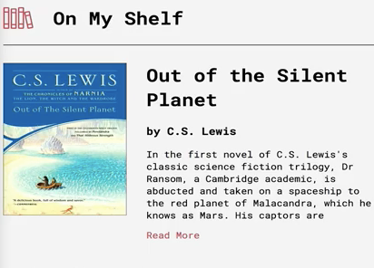

[00:01] We'll start by adding some strings in different languages to our messages file. I've chosen to create nested objects under each language because I like how it provides structure and readability. However, React Intl expects a completely flat object to be provided to its `messages` prop.

```javascript
export default {
  'en-US': {
    detail: {
      toggle: 'Toggle',
      purchase: 'Purchase this book from:',
      reviewsHeading: 'Reviews',
    }
  },
  'es-ES': {
    detail: {
      toggle: 'Palanca',
      purchase: 'Compre este libro de:',
      reviewsHeading: 'Comentarios',
    }
  },
  'fr-FR': {
    detail: {
      toggle:'Basculer',
      purchase: 'Achetez ce livre à partir de:',
      reviewsHeading: 'Avis',
    }
  }
}
```

[00:21] For example, it would expect to see `detail.toggle` like so, or it could be structured such as `detailToggle` as camel case. I found that the deeper the nested structure goes, the more unreadable it becomes, such as `detailToggleButtonText`.

```javascript
export default {
  'en-US': {
    'detail.toggle': 'Toggle',
    'detailToggle': 'Toggle',
    'detailToggleButtonText'
    }
  },
  ```

[00:45] However, I've found that you lose the collapsibility and the nested structure by doing that, so I'm going to keep this nested structure. In order to use that, we'll have use a utility, and we're going to call it `flattenMessages`. I'm going to go ahead and add a new file, and I'll just call it `utils.js`.

[01:06] I'm going to paste in a function called `flattenMessages`, and this function is taken directly from the React Intl documentation. 

```javascript
export function flattenMessages(nestedMessages, prefix = '') {
  return Object.keys(nestedMessages).reduce((messages, key) => {
    let value = nestedMessages[key];
    let prefixedKey = prefix ? `${prefix}.${key}` : key;

    if (typeof value === 'string') {
      messages[prefixedKey] = value;
    } else {
      Object.assign(messages, flattenMessages(value, prefixedKey));
    }

    return messages;
  }, {});
}
```

If we hop back to our `messages.js` file, it's actually going to produce a key of `detail.toggle` with a value of `toggle`, but it allows us to use standard JSON notation with keys and values that are nested.

```javascript
'detail.toggle': 'Toggle'
```

[01:36] Inside of our source `index.js` file, which is the entry point of our app, I'm going ahead and import the utility file now, so I'll say import `flattenMessages` from utils, and we'll use it inside of this `messages` prop, inside of the Intl provider.

```javascript
import { flattenMessages } from './utils';
```

[01:58] We're going to take all of those `messages` and we'll wrap that whole thing in `flattenMessages`, so now the key that corresponds with `locale` that we found, is going to take all those `messages` and run them through the `flattenMessages` function. With that in place, we can start to translate our app.

```javascript
  ReactDOM.render(
    <IntlProvider locale={locale} messages={flattenMessages(messages[locale])}>
      <App />
    </IntlProvider>,
    document.getElementById('root')
  );
}
```

[02:16] Let's hop over to our source component's `bookDetail` view, and the first thing we'll do is we're going to swap out the `readMore` text here underneath the book's description.



[02:29] In our component, I'm going to import from ReactINTL and we're going to destructure that import and say `formattedMessage`. 

```javascript
import { FormattedMessage} from 'react-intl';
```

Let's find the `readMore` label, and that's right here.

[02:44] I'm going to take that out, and I'm going to include a `formattedMessage` component. I'm going to pass it an `id` prop, and this `id` is going to directly correlate to the messages key that we defined earlier.

```HTML
<label className="BookDetail-descriptionToggle" htmlFor="toggle">
<FormattedMessage id="detail.toggle"/>
</label>
```

[03:00] It's going to expect `detailToggle`, I'm changing `readMore` to toggle here. Back in `bookDetail` that `id` prop is going to be `detail.toggle`. If we refresh, in each of our different languages, we've got toggle, and the French translation, and the Spanish translation.


[03:23] Let's do this for a couple more pieces of this view. We'll replace the `purchaseThisBookFrom` header, and `thisReviews` header, so let's go ahead and do that now. We'll take out this `purchaseThisBookFrom`, we'll add a formatted message with an `id` of `detail.purchase`, and the same thing for reviews here.

```HTML
<h3 className="BookDetail-merchantHeading">
<FormattedMessage id="detail.purchase"/>
</h3>
```      

[03:51] I'll add another formatted message, an `id` prop that's `detail.reviewsHeading`. 

```HTML
<h2>
<FormattedMessage id="detail.reviewsHeading"/>
</h2>
```

You can see this `purchaseThisBookFrom` is now translated in each different language, as well as the reviews heading.

