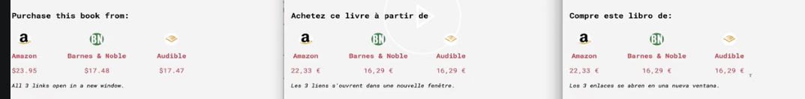

[00:01] We'll start by importing `FormattedNumber` from react-intl. We'll be formatting the prices of the book, ensuring that value separators and currency symbols are added in the appropriate places.

```javascript
import {
  FormattedMessage,
  FormattedHTMLMessage,
  FormattedDate,
  FormattedTime,
  FormattedRelative,
  FormattedNumber,
} from 'react-intl';
```

[00:14] First, let's take a look at some changes I've made to the mock data that's populating each book detail view. Instead of a single price, I've changed the price value to be an object with keys that correspond to the different languages that our app supports.

```javascript
{
  "name": "Amazon",
  "price": {
    "en-US": "16.19",
    "es-ES": "15.09",
    "fr-FR": "15.09"
  },
}
```

[00:30] The value of each is the price in their respective country. I'm going to get the same function to grab the user's locale as in our index file. 

```javascript
let locale = (navigator.languages && navigator.languages[0])
  || navigator.language
  || navigator.userLanguage
  || 'en-US';
```

We'll set that in our component. I'll just get rid of this merchant price text that we have set right now, and I'll replace that with a formatted number.

[00:56] Into the `value` prop, I'll add 'merchant.price'. Since 'merchant.price' is now an object, we need to look up the `locale`, so I'll provide the bracket notation and pass `locale` to it; `price[local]` here, in the bracket notation, will correspond to the locale that we're grabbing off the navigator object and will find the locale that corresponds to the price object in our book data file.

```HTML
<FormattedNumber value={merchant.price[locale]} />
```          

[01:27] Next, let's pass a prop of 'style'. We'll give it a value of 'currency'. We'll pass a 'currency' display prop with a value of 'symbol' to display the correct currency symbol. Finally, we need a 'currency' prop, and this will tell react-intl which currency to display the price in.

[01:49] Since we want that dynamic display of the currency, we need to add a ternary operator, so I'll say `locale === 'en-US'`. If that's true, we want to return the currency of `USD`.

[02:06] Otherwise, we want to return the currency of `EUR`. If you had more locales or currencies to support, you could provide this prop a function that returns the correct currency, instead of just a ternary operator.

```HTML
<FormattedNumber
  value={merchant.price[intl.locale]}
  style="currency"
  currency={intl.locale === 'en-US' ? 'USD' : 'EUR'}
  currencyDisplay="symbol" 
/>
```

[02:21] That's it. You can see each language is now displaying the correct price and currency symbols.



