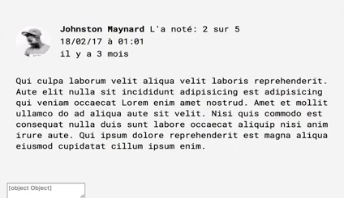
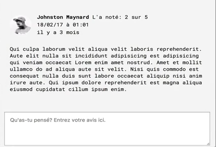

[00:00] Let's add a place where a user can enter a review by adding a text area below the reviews. I'll just add a text area. I would also like to add a `placeholder` attribute to let the user know what this field is for, but it needs to be rendered in the correct language.

```HTML
 <textarea placeholder=""></textarea>
```

[00:19] I'll add the `placeholder` to each language in the `messages.js` file. I'll give it a key of `inputplaceholder`, and I'll pass the value. I'll just do this for the other languages, as well. 

```javascript
export default {
  'en-US': {
    detail: {

      ...

      inputPlaceholder: 'What did you think? Enter your review here.'
    }
  },
  ...
 ```

Back in our text area, initially you may think to render the `placeholder` prop with a `FormattedMessage` component. Let's take a look, and see what happens if we do that.

[00:46] I'll add a `formattedMessage` and I'll give it an `id` prop of `details.inputplaceholder`. 

```HTML
 <textarea placeholder={<formatMessage id:= "detail.inputPlaceholder" />}> </textarea>
 ```

Looking in the browser, we can see our text area placeholder renders object object. The reason this happens is because the `FormattedMessage` component doesn't actually render when it's inside of the HTML placeholder attribute.



[01:11] To fix this, we need to use the React-Intl `injectIntl` higher-order component. Let's go ahead and import that higher order component from React-Intl. 

```javascript
import {
  FormattedMessage,
  FormattedHTMLMessage,
  FormattedDate,
  FormattedTime,
  FormattedRelative,
  FormattedNumber,
  injectIntl
} from 'react-intl';
```

Next, in the props declaration of this `BookDetail`, I'll add an Intl prop, as this will be passed in from the Intl provider parent component.

```javascript
const BookDetail = ({ match , intl}) => {
  ...
}
```

[01:35] Now, let's go back to our text area, and we'll change that text area `placeholder` prop. We'll start by referencing the Intl prop and we'll call `formatMessage()`. That's a method, so we're going to instantiate that.

[01:54] As an argument to this method, I'll pass an object and I'll provide a key of `id` and a value of `detail.inputPlaceholder`. Using the Intl `formatMessage()` method is actually the underlying API that the formatted message component uses, but we bypass the React component creation step and just get the string at `detail.inputPlaceholder` in the messages file.

```HTML
 <textarea placeholder={intl.formatMessage({id: 'detail.inputPlaceholder' })}></textarea>
 ```

[02:25] One final thing, we'll also need to wrap the book detail export in an inject Intl higher-order component. We'll add that, and to that method, we'll pass our `BookDetail`. 

```javascript
export default injectIntl(BookDetail);
```

With those changes, our text area now renders the correct string in each language.



[02:46] One other benefit to including the Intl prop in our component declaration here is that we can get the user's locale without doing the navigator lookup in this file, because we're already doing it in the index.js file when we set up our Intl provider component.

[03:05] I'm going to go ahead and delete this locale code here and I'll update where we're searching for locale in this formatted number. We'll just grab locale off of Intl. We'll do the same here. 

```HTML
<FormattedNumber
  value={merchant.price[intl.locale]}
  style="currency"
  currencyDisplay="symbol" 
  currency={intl.locale === 'en-US' ? 'USD' : 'EUR'}
  />
```

Great. Our app hasn't changed, and we're now reducing code duplication as well.
