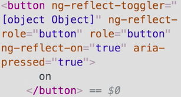

Instructor: 00:01 This `toggler` directive adds a role of switch and an aria-checked attribute based on this `on` state. 

#### app.component.html
```html
<toggle>
  <ng-template let-on="on" let-fns="fns">
    <button toggler [on]="on" (click)="fns.toggle()">
      {{on ? 'on' : 'off'}}
    </button>
  </ng-template>
</toggle>
```

Now, let's say the parent component would prefer to have a role of button and an aria-pressed attribute.

00:18 Let's configure the toggler directive to do that for us. We'll add an `@Input` decorator to `TogglerDirective` class. 

#### toggler.directive.ts
```ts
export class TogglerDirective {
  @Input()
  ...
}
```

Now if we go back to `app.component.html`, we can specify a `role` of `'button'`. We'll add a binding to the `[aria-pressed]` attribute and tie that to the `on` state.

#### app.component.html
```html
<toggle>
  <ng-template let-on="on" let-fns="fns">
    <button toggler [on]="on" [role]="'button'" [attr.aria-pressed]="on" (click)="fns.toggle()">
      {{on ? 'on' : 'off'}}
    </button>
  </ng-template>
</toggle>

```

00:47 Now if we inspect here, we have a role of button. 


If we click it, we have aria-pressed true, and click again, aria-pressed false, but you'll notice that aria-checked is also on this element, and that could confuse people.

01:06 We need a way to override that aria-checked attribute. Let's go to `toggler.directive.ts`. We'll need a separate property for the `ariaChecked` attribute. Then, we need to change the aria-checked property any time the `OnChanges` property.

#### toggler.directive.ts
```ts
export class TogglerDirective implements OnChanges {
  @Input() toggler: Partial<TogglerDirective>;

  @Input()
  @HostBinding('attr.role') role = 'switch';

  @HostBinding('attr.aria-checked') ariaChecked;
  ...
}
```

01:27 We'll do this by registering an `ngOnChanges` function. Then whenever the `on` property changes, we'll set the `ariaChecked` attribute to the new `on` value. 

```ts
ngOnChanges(changes: SimpleChanges) {
  const { on } = changes;
  if (on) {
    this.ariaChecked = on.currentValue;
  }
}
```

Now these changes, all these do is get us back to the original functionality.

01:46 Now, we're going to do a little trick. We're going to make a new property called `toggler`, which you'll note is the same as the selector for the directive. We're going to give it a type of `Partial<ToggleDirective>`.

02:06 Now what this does is, says that any property on the toggler directive can be specified in here, but they don't all have to be specified. This toggler property here will be used as an override for all of these internal properties.

02:22 We'll drop in some code to wire up these changes. For every change, the toggler override property will check each internal property of the toggler directive. If it's being overridden, then we'll set that internal property.

02:36 We'll do this role and for aria-checked. Then if the `on` state changes, we only want to update the `ariaChecked` value, if `this.toggler.ariaChecked` is `undefined`. 

```ts
ngOnChanges(changes: SimpleChanges) {
  const { on, toggler } = changes;
  if (toggler) {
    if (this.toggler.role) {
      this.role = this.toggler.role;
    }
    if (this.toggler.ariaChecked) {
      this.ariaChecked = this.toggler.ariaChecked;
    }
  }
  if (on) {
    if (this.toggler.ariaChecked === undefined) {
      this.ariaChecked = on.currentValue;
    }
  }
}
```

Now, let's go back to `app.component.ts`.

02:56 We'll set the `toggler` value to `ariaChecked: false`. 

#### app.component.html
```html
<toggle>
  <ng-template let-on="on" let-fns="fns">
    <button [toggler]="{ ariaChecked: false }" [on]="on" [role]="'button'" [attr.aria-pressed]="on" (click)="fns.toggle()">
      {{on ? 'on' : 'off'}}
    </button>
  </ng-template>
</toggle>
```

Now, let's see if that worked. We see we have a role of button and we click it ON, we have `aria-pressed` true, but no `aria-checked`. 



We are successfully created a configurable toggler directive.