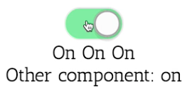

Instructor: 00:00 We have a new requirement for this compound `toggle` component. We need to support having multiple `<toggle-on>` and `<toggle-off>` child components inside of it, so let's see if that works. Looks like only one of the `toggle-on` and `toggle-off` components is actually being updated.

#### app.component.html
```html
<toggle (toggle)="onToggle($event)">
  <toggle-button></toggle-button>
  <toggle-on>On</toggle-on>
  <toggle-off>Off</toggle-off>
  <toggle-on>On</toggle-on>
  <toggle-off>Off</toggle-off>
  <toggle-on>On</toggle-on>
  <toggle-off>Off</toggle-off>
</toggle>
```

00:15 We actually have another requirement as well. We've been handed this `other.component.ts` over here that contains its own toggle-on and `toggle-off` component. That should be able to be included here and receive its state from the `ToggleComponent`. However, it looks like that's not updating either.

```html
<toggle (toggle)="onToggle($event)">
  <toggle-button></toggle-button>
  <toggle-on>On</toggle-on>
  <toggle-off>Off</toggle-off>
  <toggle-on>On</toggle-on>
  <toggle-off>Off</toggle-off>
  <toggle-on>On</toggle-on>
  <toggle-off>Off</toggle-off>
  <other-component></other-component>
</toggle>
```

00:39 One way to fix having multiple child components is to go into the `toggle.component.ts` file here and change from `@ContentChild` to `@ContentChildren`. Then you would get a query list of `toggle-on` components and you could iterate through those, but that wouldn't solve the problem with the other component.

00:58 We're going to rewire the communication between the parts of this compound component to use dependency injection instead of content-child or content-children.

01:06 First, let's take a look at the `toggle.on.component.ts`. Instead of having its own internal state, we will use the `constructor` to inject an instance of the parent `ToggleComponent`. Then we can simply use the `toggle` component's state inside of this child `toggle-on` component, and we'll fix the imports here.

#### toggle.on.component.ts
```ts
import { Component, Input } from '@angular/core';
import { ToggleComponent } from './toggle.component';

@Component({
  selector: 'toggle-on',
  template: '<ng-content *ngIf="toggle.on"></ng-content>',
})
export class ToggleOnComponent {
  constructor(public toggle: ToggleComponent) { }
}
```

01:37 Next, we'll do the same thing with the `toggle.off.component.ts`. We're injecting the parent `ToggleComponent` and we're using the state from that component in our template here. 

#### toggle.off.component.ts
```ts
import { Component } from '@angular/core';

import { ToggleComponent } from './toggle.component';

@Component({
  selector: 'toggle-off',
  template: '<ng-content *ngIf="!toggle.on"></ng-content>',
})
export class ToggleOffComponent {
  constructor(public toggle: ToggleComponent) { }
}
```

The last child component is the `toggle.button` component.

01:52 Once again, we're replacing the `@Inputs` and `@Outputs` with a reference to the parent `ToggleComponent`. 

#### toggle.button.component.ts
```ts
import { Component } from '@angular/core';

import { ToggleComponent } from './toggle.component';

@Component({
  selector: 'toggle-button',
  template: '<switch [on]="toggle.on" (click)="onClick()" ></switch>',
})
export class ToggleButtonComponent  {
  constructor(public toggle: ToggleComponent) {}

  onClick() {
    this.on = !this.on;
    this.toggle.emit(this.on);
  }
```

In the template, we're using that parent `ToggleComponent` state but we need to do something different in this `onClick` method here. All of this logic needs to be moved up to the parent `ToggleComponent`.

02:13 We'll call the `ToggleComponent`s `setOnState` function with a new value based on the previous `ToggleComponent`s `on` state. 

```ts
onClick() {
  this.toggle.setOnState(!this.toggle.on);
}
```

Now this `setOnState` has not been defined yet, so let's go write that in `toggle.component.ts`.

02:37 There's actually a lot of complexity in this component that we can just get rid of. It no longer needs a reference to its child components, doesn't need any of this stuff down here. All we need is the `setOnState` function that takes a `boolean` value and updates the internal state and then `emit` a new value, and I'll clean up here.

#### toggle.compononet.ts
```ts
import { Component, Input, Output, EventEmitter } from '@angular/core';

@Component({
  selector: 'toggle',
  template: '<ng-content></ng-content>',
})
export class ToggleComponent {
  @Input() on: boolean;
  @Output() toggle: EventEmitter<boolean> = new EventEmitter();

  setOnState(on: boolean) {
    this.on = on;
    this.toggle.emit(this.on);
  }
}
```

03:10 Now if we go back to our `app.component.html`, we have multiple copies of `toggle-on` and `toggle-off`. We have an other component that has `toggle-on` and `toggle-off` inside of it. Let's see if this works.



03:22 You see that all the `toggle-on` and `toggle-off` components, no matter how deeply nested they are, are receiving their state from the top-level `ToggleComponent`.