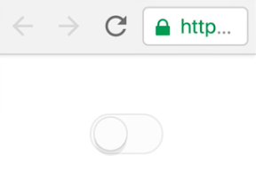
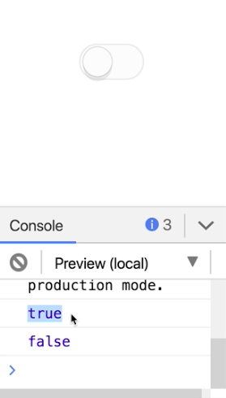

Instructor: 00:00 Here we have `<toggle>` UI component. It is completely reusable. We could copy and paste it. We can put it anywhere on the page that we want. However, it's not very useful.

#### app.component.html
```html
<toggle></toggle>
```

00:16 The problem is that all of the decisions have been made for us inside of this `ToggleComponent`, and the parent component has no way of accessing anything going on inside of this `ToggleComponent`. What we'd really like is to have some sort of message comeback when the toggle is toggled.

```html
<toggle (toggled)="showMessage($event)"></toggle>
```



00:40 Now we don't have a `showMessage` function on our `app.component.ts`, so let's add one. We will take the `value` that comes in and we'll just display it to the console.

#### app.component.ts
```ts
export class AppComponent {
  showMessage(value) {
    console.log(value);
  }
}
```

00:57 Now if we go back to `app.component.html`, the red squiggles are gone, but the console is not logging anything on. That's because we haven't set up this output in the `ToggleComponent`. Let's go to the `toggle.component.ts`. We'll add an `@Output`, output of `toggled`. This is a type `EventEmitter` and it's going to emit a `<boolean>` value.

01:32 We'll initialize it to a `new EventEmitter`. Then every time this `ToggleComponent` is clicked, we will call `this.toggle.emit` with the value of the `on` state. 

#### toggle.component.ts
```ts
export class ToggleComponent {
  on: boolean;
  @Output() toggled: EventEmitter<boolean> = new EventEmitter();

  onClick() {
    this.on = !this.on;
    this.toggled.emit(this.on);
  }
}
```

Now if we go back to the `app.component.html` here, and we toggle, now you can see there are values being emitted and being displayed in the console.



02:02 Receiving values from the component is great but sometimes you also want to actually set an initial value. Let's see if we can make this work.

02:14 Set the initial on value to true. 

```html
<toggle [on]="true" (toggled)="showMessage($event)"></toggle>
```

Now this is throwing an error here because we don't have an on-input on this `ToggleComponent`, so let's set that up in `toggle.component.ts`.

02:23 We already have an `on` property on the `ToggleComponent`. We just need to decorate it with the `@Input` decorator. 

#### toggle.component.ts
```ts
export class ToggleComponent {
  @Input() on: boolean;
  @Output() toggled: EventEmitter<boolean> = new EventEmitter();

  ...
}
```

Now if I refresh here, you'll notice that the toggle is set to the on-state initially. Just like before, if I toggle it, you'll see the value emitted to the console.

02:51 We've gone from a `ToggleComponent` that is totally encapsulated, unable to communicate with the parent component to one that is exposing its state through inputs and outputs that the parent component can control and react to.