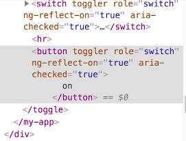

Instructor: 00:00 Here is a `<toggle>` component that uses an `<ng-template>` tag to render its UI. Now the parent component is providing two different user interfaces, one with the `<switch>`, and one with this `<button>`. You see both of them work just as expected, and they are wired up to the same state.

#### app.component.html
```html
<toggle>
  <ng-template let-on="on" let-fns="fns">
    <switch [on]="on" (click)="fns.toggle()">
    </switch>
    <hr />
    <button (click)="fns.toggle()">
      {{on ? 'on' : 'off'}}
    </button>
  </ng-template>
</toggle>
```

00:17 We want to make these a little bit more accessible. We're going to add some accessibility features. Give them both a role of `switch` and make them `aria-checked` when the `on` state is true.

```html
<switch role="switch" [attr.aria-checked]="on" [on]="on" (click)="fns.toggle()">
```

00:35 Now, the problem is that no matter how much you put this in the documentation. Most developers will not remember to put these kinds of tags on the user interface elements.

00:46 We want to do is bundle up all of this common functionality into one `toggler` directive. Then whenever developer makes their own custom user interface, they just drop this toggler directive on it, and the toggler directive will take care of adding that role attribute and the aria-checked attribute.

```html
<toggle>
  <ng-template let-on="on" let-fns="fns">
    <switch toggler [on]="on" (click)="fns.toggle()">
    </switch>
    <hr />
    <button toggler [on]="on" (click)="fns.toggle()">
      {{on ? 'on' : 'off'}}
    </button>
  </ng-template>
</toggle>
```

01:05 Let's make that in a new file, `toggler.directive.ts`. We'll set the selector to `[toggler]`. First, we'll use a `@HostBinding` decorator to set the `role` attribute to `'switch'`. Next, we need to have an `on` input, so we can know when the toggle is ON or OFF.

01:37 We'll simply add another `@HostBinding` decorator `on` that same ON attribute, and we'll bind it to the `aria-checked` attribute. Now whenever ON is true, `aria-checked` will be set to true. Whenever `ON` is false, `aria-checked` will be set to false.

#### toggler.directive.ts
```ts
import { Directive, HostBinding, Input } from '@angular/core';

@Directive({
  selector: '[toggler]'
})
export class TogglerDirective {
  @HostBinding('attr.role') role = 'switch';

  @HostBinding('attr.aria-checked')
  @Input() on;

  constructor() { }

}
```

01:57 Let's go back to the `AppComponent` here. The only thing we need to change is we need to set this `on` attribute on the button for this toggler here. This toggler up here will listen to this ON input that was already there for their switch.

#### app.component.html
```html
<toggle>
  <ng-template let-on="on" let-fns="fns">
    <switch toggler [on]="on" (click)="fns.toggle()">
    </switch>
    <hr />
    <button toggler [on]="on" (click)="fns.toggle()">
      {{on ? 'on' : 'off'}}
    </button>
  </ng-template>
</toggle>
```

02:19 Now if inspect this button, we see that the role is switch. If we toggle it, we have aria-checked true, and we toggle that OFF, aria-checked false. This toggler directive is doing what is supposed to do.

