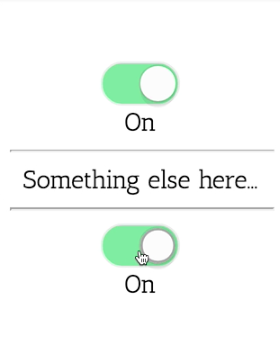

Instructor: 00:00 Here, we have a toggle compound component that leverages dependency injection to communicate between the different parts of the compound component system.

00:09 If we look at the `ToggleComponent` definition in `toggle.component.ts`, you'll notice that the `template` is simply an `<ng-content>` tag, which implies that we don't even need a template at all. A component without a template is called a directive. Let's refactor this `ToggleComponent` into a ToggleDirective.

00:28 Remove the `template`. Change it from a `@Component` to a `@Directive`. We'll update the `selector` to use the existing HTML tag selector or use an attribute selector.

#### toggle.component.ts
```ts
import { Directive, Input, Output, EventEmitter } from '@angular/core';

@Directive({
  exportAs: 'toggle',
  selector: 'toggle, [toggle]',
})
export class ToggleDirective {
  @Input() on: boolean;
  @Output() toggle: EventEmitter<boolean> = new EventEmitter();

  setOnState(on: boolean) {
    this.on = on;
    this.toggle.emit(this.on);
  }
}
```

00:42 After going through and changing all the `ToggleComponent` references to `ToggleDirective` references -- in `toggle.button.component.ts`, `toggle.module.ts`, `toggle.off.component.ts`, and `toggle.on.component.ts`, we see it's working just as it was before. We can also change the tag here to a `<div>` and put the `toggle` here as an attribute. 

#### app.component.html
```html
<div toggle #firstToggle="toggle" (toggle)="onToggle($event)">
  <toggle-button></toggle-button>
  <toggle-on>On</toggle-on>
  <toggle-off>Off</toggle-off>
</div>
```

It's also working as it was before.

01:05 Another thing you may notice about this `ToggleDirective` is that it's actually doing two jobs. The first job is receiving input and sending output to the parent component. The second job is to provide the toggle state to all the child components.

01:23 Any time you have two jobs being accomplished by one directive, you have an opportunity to split those jobs out into two different directives. Let's write a `ToggleProviderDirective` to handle the communication with the child components.

01:37 We'll create a toggle.toggle provider file, `toggle.toggleProvider.directive.ts`. We paste in some scaffolding here for a directive, call it `ToggleProviderDirective`. Let's give it the same selectors as the `ToggleDirective`.

#### toggle.toggleProvider.directive.ts
```ts
import { Directive, Input, Optional, Host, OnChanges, SimpleChanges } from '@angular/core';

import { ToggleDirective } from './toggle.directive';

@Directive({
  selector: 'toggle, [toggle]',
})
export class ToggleProviderDirective implements OnChanges {

  constructor(
  ) {}
}
```

01:59 What this will do is, any time the ToggleDirective is instantiated, Angular will also put on the `ToggleProviderDirective`. We'll have both directives in the same HTML element. In order to reference the `ToggleDirective`, we are going to inject it into the constructor like so.

```ts
constructor(
  private toggleDirective: ToggleDirective,
) {}
```

02:19 We actually only want to inject the `ToggleDirective` that's on the exact same element. Angular provides us a handy decorator called `@Host`, which says, "Only look on this element. Don't look at ancestors."

```ts
constructor(
  @Host() private toggleDirective: ToggleDirective,
) {}
```

02:33 We'll save a reference to this `ToggleDirective`, set it to the injected `toggleDirective`. 

```ts
export class ToggleProviderDirective {
  
  toggle: ToggleDirective = this.toggleDirective;

  constructor(
    @Host() private toggleDirective: ToggleDirective,
  ) {}
}
```

Now, let's update all the child components to use the `ToggleProviderDirective` instead of the ToggleDirective directly in `toggle.button.component.ts`. 

#### toggle.button.component.ts
```ts
import { Component } from '@angular/core';

import { ToggleProviderDirective } from './toggle.toggleProvider.directive';

@Component({
  selector: 'toggle-button',
  template: '<switch [on]="toggleProvider.toggle.on" (click)="onClick()" ></switch>',
})
export class ToggleButtonComponent  {
  constructor(public toggleProvider: ToggleProviderDirective) {}

  onClick() {
    this.toggleProvider.toggle.setOnState(!this.toggleProvider.toggle.on);
  }
}
```

Now that we have all that set up, our button works exactly as it did before. Wait, why did we do that? Let's look at that `ToggleProviderDirective` again.

03:11 Since the `ToggleProviderDirective` is decoupled from the actual ToggleDirective itself, we can reference it directly, giving it its own `selector` and giving `@Input` with the same name that will allow us to specify which `ToggleDirective` we want to provide.

03:38 To do this, we'll `implement` the `onChanges` lifecycle hook, add `ngOnChanges`, and when the change is coming, we will look to see if the `toggleProvider` is one of the changes. If so, we will set the `this.toggle` to the `this.toggleProvider` input if it's provided, or the `this.ToggleDirective` that is on the host element.

#### toggle.toggleProvider.directive.ts
```ts
import { Directive, Input, Optional, Host, OnChanges, SimpleChanges } from '@angular/core';

import { ToggleDirective } from './toggle.directive';

@Directive({
  selector: 'toggle, [toggle], [toggleProvider]',
})
export class ToggleProviderDirective implements OnChanges {
  @Input() toggleProvider: ToggleDirective;

  toggle: ToggleDirective = this.toggleDirective;

  constructor(
    @Host() private toggleDirective: ToggleDirective,
  ) {}

  ngOnChanges(changes: SimpleChanges) {
    const {toggleProvider} = changes;
    if(toggleProvider) {
      this.toggle = this.toggleProvider || this.toggleDirective;
    }
  }
}
```

04:28 One thing we need to watch out for is if we use this selector to reference the toggle provider, we will not have a `ToggleDirective` on the host element. We need to tell Angular that that's OK by saying this is `@Optional`.

04:42 We also need to give Angular a way to get a reference to this directive from the template, by giving it a name to `exportAs`. We'll call it `toggleProvider`, 

```ts
import { Directive, Input, Optional, Host, OnChanges, SimpleChanges } from '@angular/core';

import { ToggleDirective } from './toggle.directive';

@Directive({
  exportAs: 'toggleProvider',
  selector: 'toggle, [toggle], [toggleProvider]',
})
export class ToggleProviderDirective implements OnChanges {
  @Input() toggleProvider: ToggleDirective;

  toggle: ToggleDirective = this.toggleDirective;

  constructor(
    @Host() @Optional() private toggleDirective: ToggleDirective,
  ) {}

  ngOnChanges(changes: SimpleChanges) {
    const {toggleProvider} = changes;
    if(toggleProvider) {
      this.toggle = this.toggleProvider || this.toggleDirective;
    }
  }
}
```

and we'll export the `ToggleDirective`, in `toggle.directive.ts`, as `toggle`. 

#### toggle.directive.ts
```ts
@Directive({
  exportAs: 'toggle',
  selector: 'toggle, [toggle]`,
})
```

Now we can do some pretty interesting things in our template.

05:07 Let's say you wanted a different part of your template to be associated with the same toggle state, so `'Something else here...'`. These two toggle components are completely independent of each other, but if we use a `ToggleProviderDirective` here, and set that to the `firstToggle`, lets' make that an actual reference.

05:38 We have to name the first toggle here. 

#### app.component.html
```html
<div toggle #firstToggle="toggle" (toggle)="onToggle($event)">
  <toggle-button></toggle-button>
  <toggle-on>On</toggle-on>
  <toggle-off>Off</toggle-off>
</div>
<hr>
Something else here...
<hr>

<div [toggleProvider]="firstToggle" (toggle)="onToggle($event)">
  <toggle-button></toggle-button>
  <toggle-on>On</toggle-on>
  <toggle-off>Off</toggle-off>
</div>
```

Now both toggles are referencing the same toggle state.

