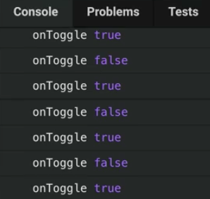

Instructor: 00:00 Let's go ahead and build this `<Toggle>` component that we're trying to render here so that I can toggle back and forth. First off, we're going to need to have `state`, that will be `on` as `false`. The `<Switch>` component accepts an `on` prop, so we'll say `this.state.on`.

#### 01.js
```javascript
class Toggle extends React.Component {
  state = {on: false}
  render() {
    return <Switch on={this.state.on} />
  }
}
```

00:17 Then we could initialize `state` to `true`. That will toggle our switch up to true, but we'll start it out as `false`.

00:24 We'll also need to pass an `onClick`, and we'll pass `this.toggle`. `toggle` will be this arrow function that calls `this.setState`.

00:34 We need to know what the `currentState` is so that we can update `on` to be `!currenState.on`. 

```javascript
class Toggle extends React.Component {
  state = {on: false}
  toggle = () => 
    this.setState(currentState => ({on: !currentState.on}))
  render() {
    return <Switch on={this.state.on} onClick={this.toggle} />
  }
}
```

Cool, now we can toggle it back and forth in our web browser. Let's go ahead and call the `onToggle` prop that they're passing us.

00:47 As a callback, we'll call `this.props.onToggle`, and `this.state.on`. 

```javascript
class Toggle extends React.Component {
  state = {on: false}
  toggle = () => 
    this.setState(
      currentState => ({on: !currentState.on}),
      () => {
        this.props.onToggle(this.state.on)
      }
    ),
  render() {
    return <Switch on={this.state.on} onClick={this.toggle} />
  }
}
```

We can still toggle that back and forth in the browser. If we check out our console, we'll see that getting along properly.



01:00 In quick review, to create this component, we rendered the `<Switch>` with the `on` and `onClick`. The `on` is being managed by the `<Toggle>` component itself in `state`, then `onClick`, the `<Toggle>` method, will update the `state` accordingly.

01:14 I'm going to go ahead and refactor this to destructure the current state, so we just grab the `on` here, and it works just as well.

```javascript
class Toggle extends React.Component {
  state = {on: false}
  toggle = () => 
    this.setState(
      ({on}) => ({on: !on}),
      () => {
        this.props.onToggle(this.state.on)
      }
    ),
  render() {
    return <Switch on={this.state.on} onClick={this.toggle} />
  }
}
```