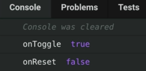

Instructor: 00:00 Often when you have a `render` prop API, it could be really useful to be able to reset the state to the initial state from within the component. In our case, we have a `reset` button. That reset button is bound to an `onClick` for reset. We're going to expect that from our state and helpers that we're passing to our children in the `Toggle` render prop API.

### 07.js
```html
<div>
  <Switch {...gettogglerProps({on})} />
  <hr />
  <button onClick={reset}>Reset</Button>
<div>
```

00:20 We'll also expect to have an `onReset` prop called. In our case, that's just going to log to the console. 

```javascript
function Usage({ 
  initialOn = false,
  ontoggle = (...args) => console.log('onToggle', ...args),
  onReset = (...args) => console.log('onReset', ...args),
})
```

Let's go ahead and implement this. We're going to add a `reset` arrow function in `Toggle`. This will simply call this `setState` with `on` as `false`. That's our initial state there.

00:39 As a callback, it will call `this.props.onReset(this.state.on)`. 

```javascript
reset = () => 
  this.setState(
    ({on}) => ({on: !on}),
    () => this.props.onReset(this.state.on),
  )
```

Next, we'll come down here and add that to our `getStateAndHelpers`, which we're calling our render prop API with. The `reset` is `this.reset`. 

```javascript
getStateAndHelpers() {
  return {
    on: this.state.on,
    toggle: this.toggle,
    reset: this.reset,
    gettogglerProps: this.getTogglerProps,
  }
}
```

With that, if we pop open the console, we click toggle on, we see that console log, and then we click reset. It resets us to the original state, and logs on reset false.



01:04 There's one other consideration here, and that is a reset handler is not necessarily required. Let's go ahead and add `static defaultProps`. `onReset` is just an empty arrow function.

```javascript
class toggle extends React.Component {
  static defaultProps ={
    onReset: () => {},
  }
  ...
}
```

01:17 With a simple `Toggle` component, it's not a huge deal to duplicate this initial state here. I don't like that, because if I were to add some state here, I'd have to remember to add that state here. In a scenario where the state object is a little bit bigger, duplicating that code is not optimal.

01:32 What I like to do is I will create an `initialState` object that will have my `on` as `false`. Then it will assign `state` to `this.initialState`. With that, I can call set `state` with `this.initialState`, and that works just fine.

```javascript
initialState = {on: false}
state = this.initialState

toggle = () => 
  this.setState(
    ({on}) => ({on: !on}),
    () => this.props.onToggle(this.state.on),
  )
reset = () => 
  this.setState(this.initialState,() => 
  this.props.onReset(this.state.on)
  )
```

01:49 In addition to this, it's a pretty common scenario where you want people to be able to initialize the state to whatever state that they want. In this use case, we want to be able to provide an `initialOn` prop so we can initialize the on state.

02:01 Let's go ahead and rather than `on` is `false`, we can say `on` is `this.props.initialOn`. 

```javascript
initialState = {on: this.props.initialOn}
```

Then users can specify the `initialOn` to be `true`, and it initializes as true. Then if we toggle it off and click reset, then it'll reset to that initial state.

02:20 Because this is not a required prop either, let's go ahead and add a default. We'll say `initialOn` is `false`. 

```javascript
static defaultProps ={
  initialOn: false,
  onReset: () => {},
}
```

Then if this prop is not provided, it will initialize to false. This is the state initializer's pattern. As a helper, we can also reset to that initial state.