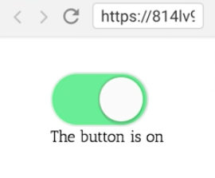

Instructor: 00:00 In this `Usage` example, we have this `<Toggle>` component and then we have this three compound components that implicitly access the state of the `<Toggle>` component and even a state updater like the toggle function.

#### 02.js
```html
function Usage ({
  onToggle = (...args) => console.log('onToggle', ...args),
}) {
  return (
    <Toggle onToggle={onToggle}>
      <Toggle.On>The button is on</Toggle.On>
      <Toggle.Off>The button isoff</Toggle.Off>
      <Toggle.Button />
    </toggle>
  )
}
```

00:12 Let's start by creating a `static On` component that will accept an `on` and `children`. If it's `on`, it will render `children`. Otherwise, it will render `null`.

```javascript
class Toggle extends React.Component {
  static On = ({on, children}) => (on ? children : null)
  state = {on: false}
  toggle = () => 
    this.setState(
      ({on}) => ({on: !on}),
      () => {
        this.props.onToggle(this.state.on)
      }
    ),
  render() {
    return <Switch on={this.state.on} onClick={this.toggle} />
  }
}
```

00:23 We'll have a very similar `off` component, which will render `null` or `children`, and then we'll have a `static Button` component which will accept `on` and `toggle`, and then it will just take the rest of the `props`.

00:36 That will render a `<Switch>` with on as `on` and `onClick` is `toggle`, and then spread the rest of the `props`. Those are the compound components.

```javascript
static On = ({on, children}) => (on ? children : null)
static Off = ({on, children}) => (on ? null : children)
static button = ({on, toggle, ...props}) => (
  <Switch on={on} onClick{toggle} {...props} />
)
```

00:45 Now they need access to the state of the toggle and even the toggle click handler, so let's go ahead and return `React.Children.map(this.props.children)` and for each of these `childElement`, we'll return a `React.cloneElement` of the `childElement`. We'll provide additional props like `on` from `state` and `toggle` from `this.toggle`.

```javascript
render() {
  return React.Children.map(this.props.children, childelement => 
    React.coneelement(childelement, {
      on: this.state.on,
      toggle: this.toggle,
    }),
  )
}
```

01:11 With that, things are functioning perfectly. 



It allows users to render things however they like, without us having to provide some sort of render configuration prop as an additional API for users to learn.

01:24 In review, to make this possible we created a couple of static compound components -- `On`, `Off`, and `Button` -- which each accesses the `toggle` state and click handler that they needed, and receive those as props implicitly in the render method of the `toggle`.

01:39 Now users of our component can render this however they like, and that state will be shared with these compound components implicitly.