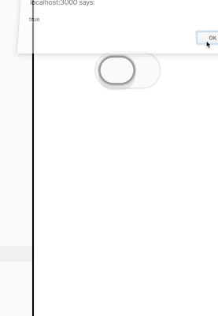
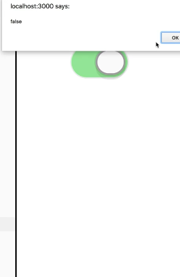

Instructor: [00:00] We're rendering this `<Switch />` component. We can change this from `false` to `true` to turn it on and then back to `false` to turn it off. But we want to be able to click on it to toggle that state. We need to keep that state somewhere and update the `onState`.

[00:12] Let's go ahead and make a React component called `<Toggle />`. Here we'll move this `return` statement to that. We'll render `<Toggle />` instead. So far, that gets us exactly what we had before. Now we need to store that state somewhere. We'll say `state = {on: false}` to initialize that. Then we'll get the state of `on` from `this.state`. We'll put on in here.


[00:37] Then we need a way to update that state. We'll make a `toggle` function here. That will call `this.setState`. We need to know what the `onState` currently is so that we can toggle it off. Then, in our `<Switch />` component, we'll add an `onClick`. This will pass in `this.toggle`. With that, we can click. It toggles on and off.

```js
class Toggle extends React.Component {
    state = {on: false}
    toggle = () => this.setState(({on}) => ({on: !on}))
    render () {
        const {on} = this.state
        return <Switch on={on} onClick={this.toggle} />
    }
}
```

[01:03] Finally, just to make things a little bit more extensible, we're going to add a callback function here that will call `this.props.onToggle(this.state.on)`. With that, we can add `onToggle={on => alert(on)}`. We get true and false.

```js
class Toggle extends React.Component {
    state = {on: false}
    toggle = () => 
        this.setState(
            ({on}) => ({on: !on})),
            () => {
                this.props.onToggle(this.state.on)
            },
    render () {
        const {on} = this.state
        return <Switch on={on} onClick={this.toggle} />
        )
    }
}

function App () {
    return <Toggle onToggle={on => alert(on)} />
}
```





[01:25] One last thing, since we added this `onToggle` prop, if we go ahead and remove that and then try to click, it breaks our entire app. That's because it's calling a function that doesn't exist. Let's go ahead and add `static defaultProps = {onToggle: () => {}}` is just an empty function that does nothing. Now if we click this, it still works. But nobody knows that the `toggle` is changed.

```js
class Toggle extends React.Component {
    static defaultProps = {onToggle: () => {}}
    state = {on: false}
    toggle = () => 
        this.setState(
            ({on}) => ({on: !on})),
            () => {
                this.props.onToggle(this.state.on)
            },
    render () {
        const {on} = this.state
        return <Switch on={on} onClick={this.toggle} />
        )
    }
}

function App () {
    return <Toggle onToggle={on => console.log('toggle', on)} />
}
```

[01:50] We're going to go ahead and add `onToggle={on => console.log('toggle', on)`. Now if we pull up our dev tools, we get that logged to the console.

