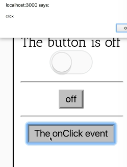

Instructor: [00:00] I added this `MyEventComponent`, which is pretty cool. It takes an `event`, and it has an `On` prop, when the event fires, that on function is going to be called. I click on this, and the alert fires, which is pretty neat.

```js
<MyEventComponent
    event="onClick"
    on={e => alert(e.type)}
/>
```



[00:12] If I go up here to `MyEventComponent`, let's say I wanted to only render this button when on is true in the toggle, so when it's toggled on. Then I want to hide it when it's toggled off. That would be pretty easy to do, because I have this `withToggle` higher order component factory that I could just wrap things up in just like this.

```js
const MyEventComponent = withToggle(function MyEventComponent({on, event}) {
    const props = {[event]: on}
    return (
        <button {...props}>The {event} event</button>
    )
})
```

[00:32] Then we'll assign that to a variable `MyEventComponent`. Then I render it, and now I have the toggle context in my component. Now, I can just say `on`, then render the button, otherwise `null`. I'll save that, and it's still rendering.

```js
const MyEventComponent = withToggle(function MyEventComponent({on, event}) {
    const props = {[event]: on}
    return on ? (
        <button {...props}>The {event} event</button>
    ) : null
})
```

[00:49] It still works, which is nice, but it doesn't change based off of the state of the Toggle component. The reason this is happening is because the `on` prop is actually already being provided for us from `MyEventComponent`.

[01:01] We're experiencing a prop-namespace clash here. If I go up to the implementation of our higher order component, it renders our component with the `...toggleContext`, which is great. That's what we're looking for.

[01:13] Then it renders it with the `...props`. That's also great. We need to have that as well, but these are sharing a namespace. If there's a `toggleContext` prop called on, which there is, then it's going to be overwritten by any `prop` that is also called on.

[01:28] That's based on the order here (last prop wins). If I change the order around, then the `...toggleContext` is going to win. That's great. Now, it's disappearing properly, but if I click on it, it's not going to work, because now `on` is a Boolean instead of a function.

[01:42] One way to get around the prop-namespace clash is by namespacing your props that your higher order component is passing to the component that it's rendering. That's what we're going to do. We'll say `toggle={toggleContext}.

```js
<Component {...props} toggle={toggleContext} />
```

[01:56] Now, everywhere that's using `withToggle`, we'll need to get all the toggle state and helper functions from the toggle prop. Let's go ahead and refactor things around a little bit. Now, we're going to say `toggle`. Then we can just say `toggle.on`.

```js
const MyEventComponent = withToggle(function MyEventComponent({toggle, on, event}) {
    const props = {[event]: on}
    return toggle.on ? (
        <button {...props}>The {event} event</button>
    ) : null
})
```

[02:12] If we say that, then pretty much everything's going to be broken, because we still need to update everywhere else that's using `withToggle`. Let's keep on going.

[02:20] These two props are both coming from the `toggleContext`, so let's pull those out. We'll destructure toggle instead, and do a nested destructuring of those two original props. Now,`MyToggle` should be working.

```js
const MyToggle = withToggle(
    ({toggle: {on, toggle}}) => (
        <button onClick={toggle}>
            {on ? 'on' : 'off'}
        </button>    
    ),
)
```

[02:33] Great, those two components are working. Let's make the rest of this work. We'll go up to the built-in components here, and `children` is still going to come from the original props, but `on` for both of these is going to come from the `toggleContext` prop.

[02:48] We'll say `toggle : {on}`. Cool, so now if I turn it on and off, that one's working. Then it's finally the `ToggleButton`. We'll pull both of these out. We'll pull out the `toggle` prop, and we'll do a nested destructuring of `on` and `toggle` from that.

```js
const ToggleOn = withToggle(({children, toggle: {on}})
```
```js
const ToggleOff = withToggle(({children, toggle: {on}}))
```

```js
const ToggleButton = withToggle(
    ({toggle: {on, toggle}, ...props}) => {
```

[03:08] Now, I can click on this, and that works. Everything's wired together properly. In review, the reason that we had to do this was because we had a prop-namespace clash. You can't really predict the types of props and types of components that people are going to want to integrate with your higher order component.

[03:25] It's a good idea to either choose props that have a namespace in themselves, or give your props a namespace. Now, there's not too much that we could do if we wanted to have this `MyEventComponent` also accept a toggle prop.

[03:39] There's still a namespace clash there, but this is a little bit better. It allows us to avoid props like common props clashing in the namespace.