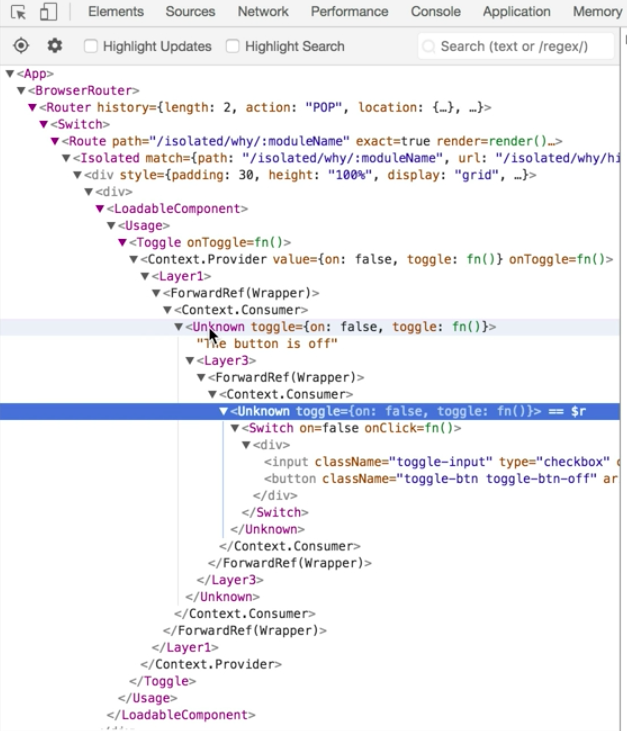
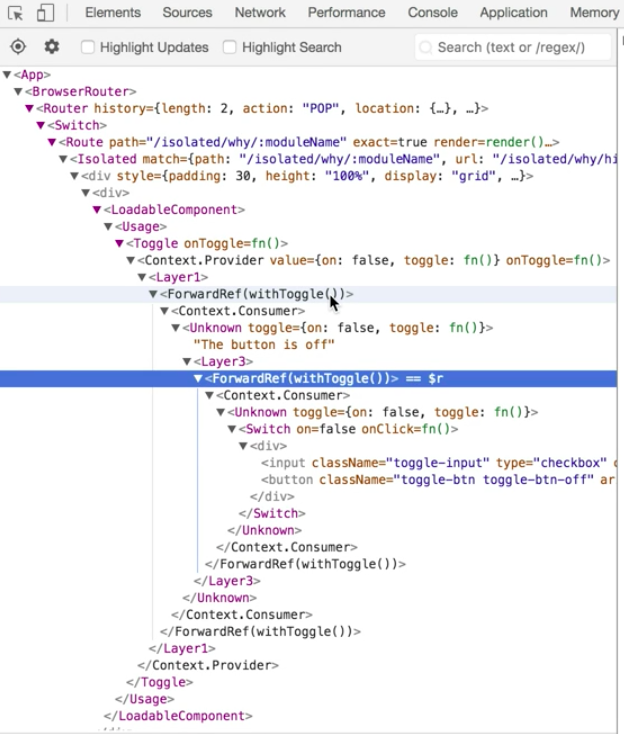

Instructor: 00:00 The first thing we're going to do is make a function called `withToggle` that's going to accept a `Component`. Here we're going to make a `Wrapper` and that'll accept `props` and return the `<Toggle.Consumer>`.

00:12 The `<Toggle.Consumer>`'s going to give us the `toggleContext`. We'll render that `<Component>` with a `toggle` prop, and we'll pass the `toggleContext`.

00:21 Then we'll forward along all the `props`. Then we'll `return Wrapper`.

#### higher-order-components.js
```javascript
function withToggle(Component) {
  const Wrapper = props => (
    <Toggle.Consumer>
      {toggleContext => (
        <Component toggle={toggleContext} {...props} />
      )}
    </Toggle.Consumer>
  )
  return Wrapper
}
```

00:28 This is the simplest form of a higher-order component that we could implement for our `Toggle`. Let's go ahead and use that for our `Layer2` and `Layer4` which are both using the `<Toggle.Consumer>`. We'll say `withToggle`, and that's going to accept our arrow function which our component.

```javascript
const Layer2 = withToggle(() => (
  <Toggle.Consumer>
    {({on}) => (
      <Fragment>
        {on ? 'The button is on' : 'The button is off'}
        <Layer3 />
      </Fragment>
    )}
  </Toggle.Consumer>
))
```

00:44 Now this arrow function is going to accept a prop that is our `toggleContext`. We'll destructure the `toggle` from props, then we'll destructure out from that the `on` property.

00:55 Then we can get rid of the `<Toggle.Consumer>` and its arrow function child. `on` is now coming from this `Wrapper` which is rendering our function component with the `toggle` prop.

```html
const Layer2 = withToggle(({toggle: {on}}) => (
  <Fragment>
    {on ? 'The button is on' : 'The button is off'}
    <Layer3 />
  </Fragment>
))
```

01:06 Let's do the same thing for `Layer4`. We'll say `withToggle`. We'll destructure `toggle` and get `on`, and the `toggle` call-back.

01:15 Then we can swap out everything with just that `<Switch>`. 

```javascript
const Layer4 = withToggle(({toggle: {on, toggle}}) => (
  <Switch on={on} onClick={toggle} />
))
```

Everything is working great.

01:22 There are a few things you need to consider when you're making a higher order component. One of them is, you want to make the fact that this `Layer2` is actually the `Wrapper` as unobservable as possible. You want your `Wrapper` to resemble the component that is being passed as much as you can.

01:39 If that component has some static properties on it, we want the `Wrapper` to have all of those same static properties. Luckily for us, there's a module for this. It's called `'hoist-non-react-statics'`. 

```javascript
import hoistNonReactStatics from 'hoist-non-react-statics'
```

Here we can simply return `hoistNonReactStatics` of the `Wrapper` and the `Component`.

```javascript
return hoistNonReactStatics(Wrapper, Component)
```

01:57 We'll put all of the same static properties that the `Component` has onto the `Wrapper` so that users of `Layer2` can assume that they're interacting with the `Component` that it's rendering. This will make the usability of higher order components a lot better.

02:11 The next thing we need to be concerned about is if someone wanted to access the instance of this `Component` with a `ref`. For example, if somebody creates a `myRef` with `react.createRef`, then they pass that to the `ref` prop of our `Layer2`.

```javascript
const myRef = React.createRef()
const Layer1 = () => <Layer2 ref={myRef} />
```

02:28 Right now that actually won't work because the `Wrapper` is what `Layer2` is, and a wrapper is a function component which doesn't have an instance. In any case, the wrapper is probably not what people are going after when they try to render `Layer2` with a `ref`.

02:42 Let's go ahead and continue to make the `Wrapper` resemble the `Component` that it is wrapping a little further by forwarding any refs that it receives. We're going to use `React.forwardRef` to the `Wrapper`.

```javascript
return hoistNonReactStatics(React.forwardRef(Wrapper), Component)
```

02:57 The way that works is our `Wrapper` is now going to accept `props` and a `ref`. Then we can say `ref` equals `ref`, and `React.forwardRef` will handle that forwarding for us.

```html
<Component toggle={toggleContext} ref={ref} {...props} />
```

03:07 The last thing that we need to consider is the display name. Here we have our `<Layer1>`, and then we have a `<ForwardRef>` for wrapper, and then a `<Context.Consumer>`, and then another `<Unknown>`.



03:20 These display names here are not very useful. Let's go ahead and make the display name of our component a little nicer.

03:26 We'll simply say, in `withToggle`, `Wrapper.displaName` equals `withToggle`. We're wrapping the `Component` and we'll use the `displayName` if it exists. Otherwise, we'll use the `Component.Name`.

```javascript
function withToggle(Component) {
  function Wrapper(props, ref) {
    return (
      <Toggle.Consumer>
        {toggleContext => (
          <Component toggle={toggleContext} {...props} ref={ref} />
        )}
      </Toggle.Consumer>
    )
  }
  Wrapper.displayName = `withToggle(${Component.displayName ||
    Component.name})`
  return hoistNonReactStatics(React.forwardRef(Wrapper), Component)
}
```

03:43 With that, now our forward ref display name is a little bit better, but we're still missing something here. 



What's going on here is the `Component` doesn't actually have a name, because it's an anonymous arrow function.

03:56 We could solve this a couple of ways. We could make this a named `function`, so we'll call it `Layer2`. Then it couldn't be an arrow function anymore. No one puts a `return`, so we'll explicitly `return` and we'll add our closing bracket.

```html
const Layer2 = withToggle(function Layer2({toggle: {on}}) => (
  return (
    <Fragment>
      {on ? 'The button is on' : 'The button is off'}
      <Layer3 />
    </Fragment>
  )
))
```

04:11 Now that's a little bit more helpful. That's a complete higher-order component.

04:15 In review, a higher-order component is a function which returns a component. It can accept a component. It could also accept options or any number of other arguments. All that it needs to be is a function that returns a component.

04:27 In our case, our `Wrapper` component accepts `props` and a `ref` from `React.forwardRef`, and then renders our `<Toggle.Consumer>` which receives the `toggleContext` and forwards that along to the underlying component that it's wrapping. It also handles refs properly with that `ref` from `forwardRef`, and it specifies a display name so the dev tools look nicer.

04:49 Then we also take all of the static properties on the component and put them directly on our `Wrapper`, so that users of the `Wrapper` from the `withToggle` higher order component can assume that the `Layer2` resembles very closely the component that it is wrapping.