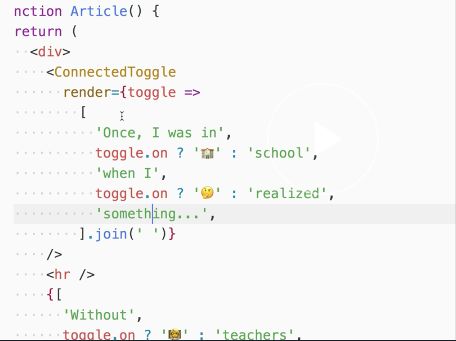

Instructor: [00:00] Now, we're using this `Toggle` component in a little app. This app has some navigation. It also has this article here. It has our Switch component with enable emoji. If I click on that, then a whole bunch of our stuff turns into emoji, which is pretty cool.


[00:17] How does this work? The way that we do is, in the root level of our app, we'll have the `Toggle` component. Then, we take the toggle utilities and state that we have from here. We `render` the rest of our app, passing along this `toggle`.

[00:32] While this is cool, the actual implementation is not. You're going to see a lot of `toggle={toggle}` all over the place. It's not very fun. In anywhere that needs to use the `toggle`, it's going to have to accept that as `props`.

[00:48] Finally, we do have the `nav switch` which accepts the `toggle`. It is able to `getTogglerProps` which will add the `onClick` handler and everything that we need to actually interact with the state.

[01:01] We're referencing this `toggle` all over our app. We have to drill our props all over the place just to get the state to the place it needs to be to accomplish this cool emoji effect. This prop drilling isn't really a huge problem in a small application like this, but it quickly becomes unwieldy. We're going to solve this problem by using a new component that we'll create called a `Provider`.

[01:23] We'll create a new component called `ToggleProvider`. This `ToggleProvider` is going to take the `children` it's given. It's going to just simply `render` those. Then, it'll take the `{...remainingProps} = this.props`. We're going to `return` our own usage of the `Toggle` component. We'll spread the `...remainingProps` over that and specify a `render` prop. This will accept the `toggle` state and utilities.


[01:49] It will render another component that will be responsible for setting up the context for this toggle state. We'll put that on the `ToggleProvider` and call it `Renderer`. We'll pass along the `toggle` state, and `helpers` and the `children`.

```js
class ToggleProvider extends React.Component {
    render() {
        const {children, ...remainingProps} = this.props
        return (
            <Toggle {...remainingProps} render={toggle => (
                <ToggleProvider.Renderer toggle={toggle} children={children} /> 

            )} />
        )
    }
}
```

[02:04] Let's go ahead and define a `static Renderer` that is a `class extends React.Component`. This will have a `render` function that's pretty simple. It just `return this.props.children`, because its job is simply to establish the context. We'll say `static childContextTypes = { [ToggleProvider.contextName]`, which we'll declare as a static member here `static contextName = '__toggle__'`.

[02:34] Something that's pretty unique, hopefully nobody will clash with that. We'll assign this to `PropTypes.object.isRequired`. We'll define `getChildContext` will return an object with `ToggleProvider.contextName: this.props.toggle`. Great.

```js
class ToggleProvider extends React.Component {
    static contextName = '__toggle__'
    static Renderer = class extends React.Component {
        static childContextTypes = { [ToggleProvider.contextName]: PropTypes.object.isRequired
    }
    getChildContext() {
        return{
            [ToggleProvider.contextName]:  this.props.toggle
        }
    }
    render() {
        return this.props.children
    }
```

[02:58] Now, we have this component called `ToggleProvider` that's able to take a `Toggle`, put the `toggle` object in context, and now we need to create a component to get that `toggle` object out of the context. This one will be pretty simple.

[03:11] It'll just be a `function ConnectedToggle()`. That'll take `(props, context)`. It'll `return props.render`. This will be a render prop. We'll get out of `(context[ToggleProvider.contextName])`. To tell React that we want the toggle provider `context`, we'll say `ConnectedToggle.contextTypes = { [ToggleProvider.contextName]: PropTypes.object.isRequired`.

```js
function ConnectedToggle(props, context) {
    return props.render(context[ToggleProvider.contextName],
    )
}
ConnectedToggle.contextTypes = { [ToggleProvider.contextName]: PropTypes.object.isRequired

    )
}
```

[03:43] Now, I'm going to take this `ToggleProvider` component and wrap my entire app inside the `<ToggleProvider>`. We'll need to do a little bit of refactoring. Instead of a `<Toggle>` here, the `<ToggleProvider>` is going to rendering our `<Toggle>`. We'll get rid of that and that. We no longer need to pass along the `toggle` here. We only need to go to the places that are using the `toggle`.

```js
function App() {
    return (
        <ToggleProvider>
            <div>
             <Header />
             <Post />
            </div>
        </ToggleProvider>

    )
}
```

[04:08] If we go to the `Post`, we see that nobody's actually using the `toggle`. We're just forwarding it along. We'll get rid of this and that. Here in the article, we are using `toggle`. Rather than getting `toggle` from `props`, we're going to get it from our `ConnectedToggle` component, which accepts a `render` prop. That's going to get us our `toggle`. Then, we can put this inside of here. That'll do it for us.

```js
function Post () {
    return (
        <div>
         <Title />
         <Article />
        </div>
    )
}
```

```js
function Article() {
    return (
        <div>
            <ConnectedToggle render={(toggle) => (

            )} />
            
    )
}
```



[04:32] Now, I saved it. It blanked out my screen. That's because things are all messed up now. I'm going to have to do a little bit more refactoring. Let's continue on here.

[04:40] We'll take this out. We'll use our `ConnectedToggle`, and our `Article` is done. Now, let's look at the `Title`. We're not going to get `toggle` from `props` anymore. We do need it right here. We can do `ConnectedToggle`. Cool. Then the `Subtitle`. We can get rid of `toggle` here. We'll `return ConnectedToggle`. `Header` is not using the `toggle` at all. We can get rid of that and get rid of these. No more prop drilling for us.

[05:12] Now, `NavSwitch` is using the `toggle`. We'll get rid of the prop. We'll say `ConnectedToggle` and returns what it had before. The `Switch` will also need to get the `ConnectedToggle`. Finally, our `Nav`, it won't get `toggle` from the props anymore. We'll wrap all of this in `ConnectedToggle` with `render`.

[05:33] It looks like I missed this. We don't need to forward on the `toggle` to `Subtitle` anymore. Great. With that refactor, everything is working just fine. We no longer need to drill props all over the app. We can just reach into context with this `ConnectedToggle` component to get and manipulate the state of the `toggle`.

[05:52] We made this work by using this `ToggleProvider`. This is called the provider pattern. It works by leveraging the context API with `childContextTypes` and `getChildContext` as part of the provider, and a component that allows you to access the `context` throughout the rest of your application.

[06:10] To do this, we just created a new component called `ToggleProvider`. We didn't have to change the `Toggle` component implementation at all. We just leveraged the `render` prop. When our `render` prop is rendered, we use a `ToggleProvider.Renderer` that forwards along the `toggle` and `children` as a prop.

[06:27] We have this `static class` defined as part of our `ToggleProvider` called `Renderer` which establishes the `childContextTypes`, renders the children, and provides the child context. We create this small component called `ConnectedToggle` which allows us to reach into context and get the `toggle` context.