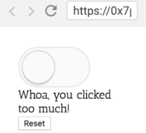

Instructor: 00:00 Our `Toggle` render prop API does a great job of giving complete control over the rendering of the `Toggle` component. What about state? In this situation, we want to be able to keep track of how many times the toggle button is clicked.

00:13 When it was clicked more than four times, we want to say, whoa, you clicked too much, and we want to prevent the toggle from being toggled on until the user clicks reset again. 



For our usage example in this one, we keep track of the `timesClicked` in our state, and every time the user clicks on the `Toggle` button, we'll increment that `timesClicked`.

#### 08.js
```javascript
initialState = {timesClicked: 0}
state = this.initialState
handleToggle = (...args) => {
  this.setState(({timesClicked}) => ({
    timesClicked: timesclicked + 1,
  }))
}
```

00:31 Then when they click on `reset`, we'll reset our states to the `initialState` times clicked is `0`, and then in our `render` method, if the `timesClicked` is greater than `4`, than we're going to render out this text, otherwise we'll render out the click count.

```html
{timesClicked > 4 ? (
  <div>
    Woah, you clicked too much!
    <br />
  </div>
) : timesClicked > 0 ? (
  <div>Click count: {timesClicked}</div>
) : null}
```

00:45 What we need to do is expose a hook into this set state mechanism for our `Toggle` component, so that before we call `setState` in the `Toggle` component, the consumer has a chance to modify the state we're about to set.

00:57 We can call this a `stateReducer`, and we'll pass in the `state` and the `changes`, and then the `stateReducer` will be responsible for returning the changes that should take place. 

```javascript
toggleStateReducer = (state, changes) => {
  if (this.state.timesClicked >= 4) {
    return{...changes, on: false}
  }
  return changes
}
```

Let's go ahead and see how we can implement this.

01:10 I'm going to create a function called `internalSetState`. This will simulate the same API as `setState`, so it'll accept the `changes` and a `callback`. Then it's going to call `this.setState` and it's going to get the current `state`.

01:25 Then, because the changes can be a function, we need to get the changes object. We'll say `const changesObject = typeof changes === 'function'`. If it is a function, then we'll call `changes` with the `state`, otherwise it'll just be the `changes`.

```javascript
internalSetState(changes, callback) {
  this.setState(state => {
    const changesObject = 
      typeof changes === 'function ' ? changes(state) : changes
  })
}
```

01:42 Next, we can pass this to our `stateReducer` for the `state` and the `changes` object. This is going to give us our `reducedChanges`. That is what we're going to return, `reducedChanges`. And then we'll call the `callback`.

```javascript
internalSetState(changes, callback) {
  this.setState(state => {
    const changesObject = 
      typeof changes === 'function ' ? changes(state) : changes
    const reducedChanges = this.props.stateReducer(
      state, 
      changesObject,
    )
    return reducedChanges
  }, callback)
}
```

01:58 Finally, anytime we call `setState` in our application, we'll instead call `internalSetState`, and with that, we can toggle and then we can stop the toggling until we click reset and we get toggling again. This is the basic `stateReducer` pattern. It allows users of your component to customize how the state is managed within the component.

02:18 This gives users incredible flexibility over how the state is managed inside your component. If we wanted to implement this kind of functionality without the `stateReducer` pattern, it would require a new prop specific to this use case and wouldn't be nearly as flexible as the `stateReducer` pattern.

02:33 In review, what we had to do to support this use case, is we created this `internalSetState` functions that accepts the changes in `callback`, the same API as the normal `setState` API. Then we call `setState` to get our current `state`, and based on that, we get the `changesObject`.

02:48 Then we call the `stateReducer` to get the reduced changes from the `state` and the changes object, and that is what we return. Then we forward the call back to `setState`. Then anywhere inside of our component, we call `internalSetState` to make sure that any of the changes that the `internalSetState` method wants to make are first passed through the `stateReducer`.

03:09 Then users of our component can pass a `stateReducer`. That `stateReducer` accepts the `state` and the `changes`, and then they can return the state that they want to have updated.

03:19 This `stateReducer`'s saying if the times clicked is greater than or equal to four, then I'm fine accepting all the changes that you want to make toggle component, but I want to make sure that `on` will stay `false`, otherwise we'll just accept any changes that are coming.