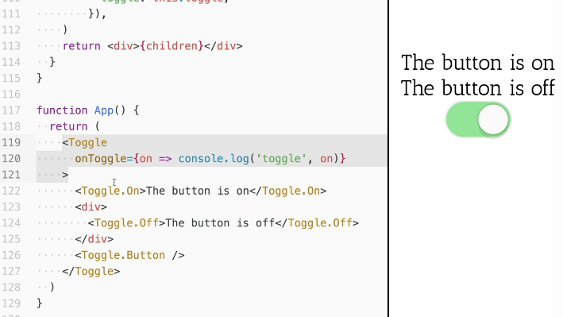

[00:00] We've given the user some flexibility. They can move the button over here if they want, or even between these two. They can order things however they like. But we don't give them structural flexibility. If I were to do a `<div>` right here and then put the `Toggle.Button` inside here and then try and click on it, nothing's going to happen.

[00:17] Even if I were to put the `Toggle.Off` inside of there and move the button out, then I click on this, that `Toggle.Off` is not going to disappear like it should. That's because at the time that this `render` function is called, we get these children. Those children only include the direct descendants of our `Toggle.Button`. That is this `div`. But it doesn't include what's inside the `div`.



[00:41] It's almost like this `toggle` component needs to set up some sort of context for this part of the tree. That's exactly what we need to do. We need to use `React Context` so that all of these components inside have access to the state of the `Toggle.Button`, so they know what to do.

[00:56] To do this, let's make this `TOGGLE_CONTEXT` variable. We'll just give it `'__toggle__'` as the value here. Then we're going to apply this context to everything under the `toggle` component. If we go down to the toggle component here, we'll say `static childContextTypes = {}`. The key is going to be that `toggle context`, and the value needs to be `PropTypes.object.isRequired`.

```js
static childContextTypes = {
    [TOGGLE_CONTEXT]: PropTypes.object.isRequired,
}
```

[01:25] Now we also need to include this `PropTypes` library. I'm going to go up here and add another `script tag` for that. We need to go back to our `toggle` component. As a class method, we'll have `getChildContext()`. This is going to `return {}`. We'll do `TOGGLE_CONTEXT`. That object is going to be the same thing that we had for our props before.

```js
getChildContext() {
    return {
        [TOGGLE_CONTEXT]: {
            on: this.state.on,
            toggle: this.toggle,
        }
    }
}
```

[01:51] We need to establish that each of these components depends on this context. We do with `.contextTypes`. Those `.contextTypes` will look just like our child context type, so I'll just copy that and paste that here.

```js
ToggleOn.contextTypes = {
    [TOGGLE_CONTEXT]: PropTypes.object.isRequired,
}
```

[02:04] We're going to do the same thing for all of these. We'll say `ToggleOff.contextTypes` and `ToggleButton.contextTypes`. Now, instead of `on` coming from the props it's going to come from `context`. We can get rid of `on` from the props.

[02:20] Then we're going to say `const {on} = context [TOGGLE_CONTEXT]`. We'll do the same thing for our `ToggleOff` and our `ToggleButton`. Instead of `on` and `toggle` coming from props, we'll just leave all the props as they are and then take `context`. Then we'll get `const {on, toggle} = context[TOGGLE_CONTEXT]`.

```js
const TOGGLE_CONTEXT = '__toggle__'
function ToggleOn({children}, context) {
    const {on} = context[TOGGLE_CONTEXT]
}
```

```js
function ToggleButton(props, context) {
    const {on, toggle} = context[TOGGLE_CONTEXT]
}
```

[02:46] The last thing we need to do is update our`render` function. We no longer need to clone any elements. We can actually just render a `<div>{this.props.children}</div>` and get rid of all this `React.cloneElement` stuff.

[02:58] Now I can click here, and everything's working. We can structure things as nested or as all over the place as we want to. All of these components will have access to the state of the `toggle` component through `context`.

[03:11] In review, what we had to do here to make this work is you define `childContextTypes`. Then you have a special key that goes on the context. That's going to share a name space with all of the other components that are using context in the tree.

[03:25] Normally it's good to give it some sort of long, odd name that you wouldn't expect to conflict with anything else. That value is going to be the `PropTypes` that are appropriate for the `context`.

[03:37] You define `getChildContext` with what value you want to have in context. Then on each of the components that need that context, they declare that they need it with `contextTypes` referencing that same key. You get the state from that context at that key for each of these components.

[03:53] Then we updated our `render` method to just render the children in a `div`. That allows us to structure things however we like inside our app.