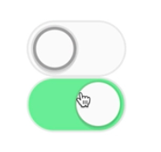

Instructor: 00:00 Here we have a simple `Toggle` component that renders a `<Switch>`, which when clicked, will switch the component on and off. What we want to be able to do is synchronize these two switches so that one is turned on, the other is also turned on, and when one is turned off, the other is also turned off.



00:15 How we want to accomplish this is whenever our on toggle prop is called, it will be called with the current `state` of `on`, and will set the state of `bothOn`. Then we'll provide that prop to both of our `<Toggle>` components, and the `<Toggle>` component should use the prop rather than internal state to determine what the state of `on` should be.

```javascript
class Usage extends React.Componenet {
  state = {bothOn: false}
  handletoggle = on => {
    this.setState({bothOn: on})
  }
  render() {
    const {bothOn} = this.state
    return(
      <div> 
        <Toggle on={bothOn} ontoggle={this.handletoggle} />
        <Toggle on={bothOn} ontoggle={this.handletoggle} />
      </div>
    )
  }
}
```

00:33 To support this API is remarkably simple -- rather than determining our `on` state based off of `internalState`, we'll just get it from `props`. 

```html
class Toggle extends React.Component {
  ...
  render() {
    return <Switch on={this.props.on} onclick={this.toggle} />
  }
}
```

Now we have exactly what we're looking for.

00:44 What we really want to do is support both, so that if one of these doesn't have an `on` prop, it still functions. To support this, we need to determine what the state actually is, whether it's coming from `internalState` or `props`.

00:57 I'm going to create a function called `getState`, and this will `return` our current state. We'll say `on` is `this.props.on !== undefined`.

01:07 If it's not undefined, then it's coming from `props`. Otherwise, it's coming from `state`.

```javascript
class Toggle extends React.Component {
  state = {on: false}
  getState() {
    return {
      on: this.props.on !== undefined ? this.props.on : this.state.on,
    }
  }
  ...
}

```

01:13 Then in our `render`, we can call `this.getState().on`. 

```html
render() {
  return <Switch on={this.getState().on} onclick={this.toggle} />
}
```

With that, we get our supported API. However, there's a further optimization that we can make here.

01:23 Because this state is controlled, we don't actually need to call `this.setState`. In our small example here, it's not really a big deal, but we could actually wind up re-rendering when it's not necessary.

01:34 We could say if `this.props.on` is not equal to `undefined`, then we know that it's controlled. We can call `this.props.onToggle` with what we suggest the state should be -- the opposite of `this.getState.on`.

01:48 Otherwise, we can call `this.setState` like we were before. Just for consistency, we'll call `this.getState().on`. 

```javascript
toggle = () => {
  if (this.props.on !== undefined) {
    this.props.ontoggle(!this.getState().on)
  } else {
    this.setState(
      ({on}) => ({on: !on}),
      () => {
        this.props.onToggle(this.getState().on)
      },
    )
  }
}
```

Now we're avoiding a potential unnecessary re-render.

02:01 Because we're repeating ourselves here, let's just refactor this to a simple method called `isControlled`. That'll take a `prop`, and will `return this.props` at that prop.

```javascript
isControlled(prop) {
  return this.props[prop] !== undefined
}
```

02:13 Then we can replace `this.props.on !== undefined` with `this.isControlled('on')`, and our API is working. If we remove the `on` prop from one of these, then it can be toggled individually from the other.