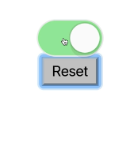

Instructor: [00:00] Right now we're initializing our toggle `state` to be on as `false`. We could change that to initialize it as `true`, but what if we wanted to make this dynamic? That's simple enough. We just turn `on` into a prop.

[00:14] We have `this.props.defaultOn`. Then we can go into here (`function App`) and say `defaultOn={true}`. Now anybody using the Toggle component can default to whatever state they want it to default to.

```js
state = {on: this.props.defaultOn}
```

```js
<Toggle
 defaultOn={true}
 
```

[00:27] Now, what if I wanted to add the ability to reset the state of the Toggle component back to whatever the default was. Let's go ahead and add that. We'll add a `<div>` here and a `<button>` that says `Reset`. Then `onClick`. We're going to want to do something with the toggle object that we get here. We'll say `toggle.reset()`. We'll do that in a callback function.

```js
<div>
  <Switch
  {...toggle.getTogglerProps({
      on:toggle.on,
  })}
  />
  <button onClick={() => toggle.reset()}>Reset</button>
  </div>
```

[00:52] Then let's go ahead and build this. (Under `render`)We'll say `reset: this.reset`. Then we'll add (under `class Toggle extends React.Component`) `reset = () => {}`. We can just say `this.setState({ on: this.props.defaultOn`. Now if we turn it off and then reset, it should update to the initial state.

```js
reset: this.reset
```

```js
reset = () => {
    this.setState({ on: this.props.defaultOn
}
```



[01:14] Now just for good measure let's go ahead and add an `onReset` callback here (`function App`). That will take `on => console.log('reset', on)`. Then (in `class Toggle extends React.Component`) when we do `this.setState`, we'll do a callback function. We'll say `this.props.onReset(this.state.on)`.

```js
reset = () => {
    this.setState({ on: this.props.defaultOn},
    () => {
        this.props.onReset(this.state.on)
    }
```

[01:35] Now if we pop open our developer tools, we can toggle that. We'll see `toggle false` and then reset. `Reset true`. Now let's go ahead and add a default prop for `onReset`, just like we have for the `onToggle`, because it's not a required prop. Let's also add a default prop for `defaultOn` to be `false`.

```js
class Toggle extends React.Component {
    static defaultProps = {
    defaultOn: false,
    onToggle: () => {}, 
    onReset: () => {},
    }
    state = {on: this.props.defaultOn}
    reset = () => {
    this.setState({ on: this.props.defaultOn},
    () => {
        this.props.onReset(this.state.on)
    }
}
```

[01:53] Let's do one last thing to make things a little bit more flexible. Right here we have the exact same duplication of code (`on: this.props.defaultOn`) and that's fine, because it's a pretty small object. If it were to be of significant size it might be kind of nice to not have to duplicate all of that code.

[02:06] What we're going to do is we'll call this`initialState` and then we'll say `state = this.initialState`. Then when we do our reset we just call `this.setState` with `this.initialState`. Everything continues to work.

```js
initialState = {on: this.props.defaultOn}
state = this.initialState
reset = () => {
    this.setState(this.initialState, () => {
        this.props.onReset(this.state.on)
    })
}
```

[02:22] This is a state initializer. It allows me to initialize the state however I want it to via props, and that initialization happens during the construction phase of our component.

[02:32] Then we expose a reset function which we can use to reset the `state` to the `initialState`, which we created based off of the default props when our component was constructed in the first place. Then we also added this handy `onReset` function and a default for that.