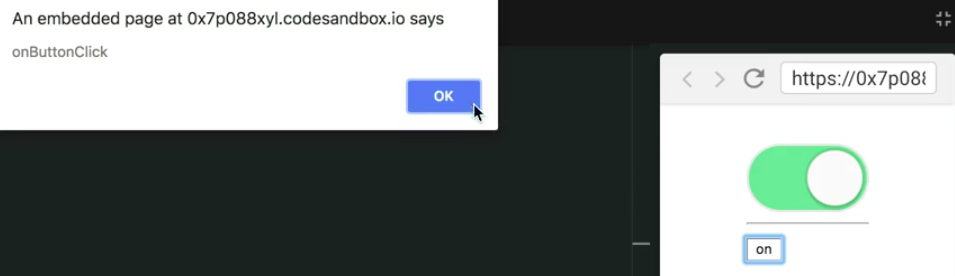

Instructor: 00:00 In this `Usage` example, we have some custom props that we're providing to the button. If I click on the button, that custom `onClick` handler is going to be called, but the toggle is not going to be called.

#### 06.js
```html
function Usage({
  onToggle = (...args) => console.log('onToggle', ...args),
  onButtonClick = () => alert('onButtonClick'),
}) {
  return (
    <Toggle onToggle={onToggle}>
      {({on, togglerProps}) => (
        <div>
          <Switch on={on} {...togglerProps} />
          <hr />
          <button
            {...togglerProps}
              'aria-label': 'custom-button',
              id="custom-button-id"
              onClick: {onButtonClick},
          >
            {on ? 'on' : 'off'}
          </button>
        </div>
      )}
    </Toggle>
  )
}
```

00:12 The reason this is happening is because the `togglerProps` that we're spreading across the button, that's intended to wire up our button to be a toggler, is providing an `onClick` handler. Then we override that onClick handler with our custom `onClick`.

00:26 We can see this behavior if we move the `onClick` above, and then we click. We're getting the toggle behavior working again, but we're missing on our custom behavior that we want to apply.

00:35 One solution to this is to in-line our function here. Then we can call `onButtonClick`, and then `togglerprops.onClick`. 

```html
<button
  {...togglerProps}
    'aria-label': 'custom-button',
    id="custom-button-id",
    onClick: {( => {
      onButtonClick()
      togglerProps.onClick()
    })},
>
```

This will handle both use cases for us, but there are a couple things that I don't like about this.

00:50 First of all, it requires this in-line function that we have to define just so we can get this button to behave like a toggler. We're already trying to do that by spreading the `togglerProps`.

01:01 The second thing I don't like is this exposes the implementation of the `togglerProps` abstraction, which could lead to problems if we ever decide to change `togglerProps` to use `onKeyPress` rather than `onClick`, or if we decide we don't need `onClick` there at all.

01:13 Any change to `togglerProps` here would result in a breaking change for anybody using it in this way. What we really want is we want to have some sort of abstraction built into the `Toggle` component that can compose the props that I want to apply the button with the props that the toggler needs to have applied to the button to wire it up properly.

01:31 Instead of `togglerProps`, we're going to expose a function called `getTogglerProps`. 

```html
return (
  <Toggle onToggle={onToggle}>
    {({on, getTogglerProps}) => (
      <div>
        <Switch on={on} {...getTogglerProps} />
        <hr />
        <button
          {...togglerProps}
            'aria-label': 'custom-button',
            id="custom-button-id",
            onClick: {( => {
              onButtonClick()
              togglerProps.onClick()
            })},
        >
          {on ? 'on' : 'off'}
        </button>
      </div>
    )}
  </Toggle>
)
```

Here, we'll call this function, and we'll pass any props that we want to have applied.

```html
<Switch {...getTogglerProps({on})} />
<hr />
<button
  {...getTogglerProps({
    'aria-label': 'custom-button',
    id="custom-button-id",
    onClick: onButtonClick
    })},
>
  {on ? 'on' : 'off'}
</button>
```

01:43 Now this is the API that we want to expose, a function which can accept an object of props, and composes that object of props with the props that are required for a button to be a toggler.

01:55 Let's go ahead and implement this. We'll create a function that accepts `props` and returns those `props`, along with any of the props that we need for our toggler to function properly.

```javascript
getTogglerProps = props => {
  return {
    'aria-pressed': this.state.on,
    onClick: this.toggle,
    ...props,
  }
}
```

02:07 Then we'll swap `togglerProps` with `this.getTogglerProps` in our `getStateAndHelpers`. 

```javascript
getStateAndHelpers() {
  return { 
    on: this.state.on,
    toggle: this.toggle,
    getTogglerProps: this.getTogglerProps,
  }
}
```

Our switch is working fine, but we're not composing our click handler properly with this custom toggle button, so let's make that happen.

02:19 We'll destructure the `onClick` from the `props` in our `getTogglerProps`. Then here, we can provide a custom arrow function that calls `onClick` with all the arguments that an `onClick` handler is called with, and then calls `this.toggle`.

```javascript
getTogglerProps = ({onClick, ...props) => {
  return {
    'aria-pressed': this.state.on,
    onClick: (...args) => {
      onClick(...args)
      this.toggle()
    },
    ...props,
  }
}
```

02:35 Now if we run that, our toggle button is broken. That's because the toggle button doesn't actually provide an `onClick`, so let's say only call this if `onClick` is defined. 

```javascript
getTogglerProps = ({onClick, ...props) => {
  return {
    'aria-pressed': this.state.on,
    onClick: (...args) => {
      onClick && onClick(...args)
      this.toggle()
    },
    ...props,
  }
}
```

Now we can toggle both our button and our switch, and everything is working great.



02:52 Let's go ahead and refactor our `onClick`, because I don't really like the way that this looks, and this is generally a pretty common use case for prop getters. I'm going to go up above `Toggle`, and we're going to create a function called `callAll`. That's going to accept any number of functions, and that'll return a function that accepts any number of arguments.

03:11 Then we'll say functions `forEach`. For each function, if that function exists, then we'll call it with the arguments.

```javascript
const callAll = (...fns) => (...args) => fns.forEach(fn => fn && fn(...args))
```

03:19 Then we can use `callAll` in our `getTogglerProps`. We'll call the `onClick`, and `this.toggle`. That's functionally equivalent to what we had before, just looks a little bit cleaner. 

```javascript
getTogglerProps = ({onClick, ...props) => {
  return {
    'aria-pressed': this.state.on,
    onClick: callAll(onclick, this.toggle),
    ...props,
  }
}
```

Now everything is working exactly as it is intended.

03:36 In review, the problem we're trying to solve is there's a common use case for rendering in the `Toggle` component, and that is to render a toggler button. Any of the users of this toggle component will probably be rendering a toggler.

03:48 We want to provide a convenience method for them so they don't have to worry themselves about implementation details. They can simply apply the `getTogglerProps`.

03:57 The problem with `togglerProps` is we couldn't compose things together without exposing implementation details. The user of the `togglerProps` shouldn't have to know that we're using an `onClick`, and that we're providing an `'aria-pressed'`.

04:08 They should just be able to spread the props that we provide them, and everything should be wired up correctly. Instead of a `togglerProps` object, we expose this `getTogglerProps` function, which they pass any of their props too. Then those props will be returned by the `getTogglerProps` component, composing the behavior that is necessary.

04:28 Another situation where this could be useful is if we wanted to apply a `className` in `gettogglerProps`. We could accept a `className`, and then we'd have our `className` be the combination of their `className` with `our-custom-class-name`. 

```javascript
getTogglerProps = ({onClick, className, ...props) => {
  return {
    'aria-pressed': this.state.on,
    onClick: callAll(onclick, this.toggle),
    className: `${className} our-custom-class-name`,
    ...props,
  }
}
```

We could do this with the style prop, and any other prop where it makes sense to compose behavior.

04:50 This API also allows people to easily override any of this behavior. If they want to override the `'aria-pressed'`, then they can provide an `'aria-pressed'` to be `null`.

05:01 If they want to completely override the built-in `onClick` behavior, then they could actually provide an `onClick`, `onButtonClick`. Now it's not wired up properly, but maybe that's exactly what they're looking for. This API gives them that flexibility.