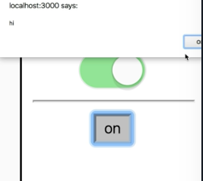

Instructor: [00:00] here I am using the `togglerProps` collection on the` <Switch /> `and the `<button>`. Now let's say that I want to be notified when this button is clicked on. I'm going to add an `onClick={() => alert('hi')}`.

```js
<button
{...togglerProps} onClick={() => alert('hi')}

{on ? 'on' : 'off'
/button>}
```

[00:17] Then I click on this. I get the alert. Oh, but the Toggle state isn't being updated. Hmm, why is that?

[00:24] The problem is that we're spreading the `togglerProps` first. Then we spread `onClick` here. `onClick` is going to override the props that I get from `togglerProps`. If I swap these, then I'm going to get the toggle functionality, but I'm not going to get my alert because now the opposite is happening.

[00:41] I need to actually compose these things together so that both of these functions are called. One thing that I could do is I'll move this `onClick` back down.

[00:49] Then I'll do my thing. I'll say `togglerProps.onClick()`. That's going to get the behavior that I'm looking for.



[00:59] The problem is that perhaps one day `onClick` gets changed to some other event like `onKeyDown` or something. Then that's going to break this because `togglerProps` will no longer have `onClick`. You could argue that knowing what `onClick` is for this `togglerProps` could be an implementation detail. All that really matters with the `togglerProps` is that it's applied to the button that's going to be doing the toggling.

[01:23] You don't want users of `togglerProps` to have to understand what the implementation details of `togglerProps` is just to make use of it. That's exactly what we're doing when users have to use `togglerProps.onClick()`. That's a bit of a leaky abstraction.

[01:35] Another way I could solve this problem is if the `Toggle`component called the `render` function with some sort of utility or something that allowed me to compose the props that I want to apply to the button, in such a way that it doesn't expose some implementation details. But it also composes the behavior that I want to apply to the button in addition to whatever it needs to do to do its job.

[01:56] To do this, we're going to change from `togglerProps` to `getTogglerProps`. This is actually going to be a function that you call. In the `switch` case, we'll just call it like a regular function with no arguments because I don't need it to do anything special. In the `button` case, I'm going to call it with an object.

[02:13] This object is going to be all of the props that I want to have applied to the button.

[02:17] `getTogglerProps` will be responsible for making sure it composes together as I would expect it to. We'll say `onClick: () => alert('hi')`. Then we'll get rid of this prop.

```js
<Switch on={on} {...getTogglerProps()}/>
<hr />
<button
{...getTogglerProps}
onClick: () => alert ('hi')
})}
```

[02:28] Then we're going to move up here (in the Toggle component). We'll switch `togglerProps` with `getTogglerProps`. I'm going to create a new property called `this.getTogglerProps`.

[02:38] Then we'll take this object. We'll move it up to that new method, `getTogglerProps`.

[02:44] This function is going to take our props, and it's going to return these new props. A part of this function's job is to make it so that people using it don't have to understand how it works, so I should be able to call the `getTogglerProps` function with any of the props that I have. It should compose those things together just perfectly without me having to know what's going on.

```js
getTogglerProps = (props) => {
  return{
    'aria-expanded': this.state.on,
    onClick: this.toggle,
  }
}
render() {
  return this.props.render({
    on: this.state.on
    toggle: this.toggle,
    getTogglerProps: this.getTogglerProps,
  })
}
```

[03:04] For example, if I wanted to add an `id` prop to this `getTogglerProps` invocation, it should apply that `id` prop to the button. In this case, it's not going to do anything special with it, but the user of this function should only know that they need to pass all of their props to it, and all of the props that they want to have applied to the button will be applied properly even if it means it's composed like in the case of `onClick`.

[03:27] Let's go ahead and make that happen by adding `...props` to spread all of the props that we don't care about across what we're returning here. That way people can add any prop that they like and it'll be forwarded on.

```js
getTogglerProps = (props) => {
  return{
    'aria-expanded': this.state.on,
    onClick: this.toggle,
    ...props,
  }
}
```

[03:38] But we do want to handle the `onClick`. We don't want that to be overridden when we spread these props. We are going to need to de-structure this to be `onClick` and then the rest of the `...props`. But sometimes people are going to call this without anything, so we'll default this to an empty object, `getToggleProps = ({onClick, ...props} = {})`.

```js
getTogglerProps = ({onClick, ...props} = {}) => {
  return{
    'aria-expanded': this.state.on,
    onClick: this.toggle,
    ...props,
  }
}
```

[03:54] Now let's go ahead and compose the `onClick` prop together. I'll make a new function. Here we'll say `this.toggle`. We'll make sure we take all the `...args` and forward it along. Now that's functionally equivalent to what we had before.

[04:08] Then we'll call `onClick` with the `...args`, and we should be good to go. Now if I click on this (the <button>), I'm going to get the alert and I'm going to get the toggle. Perfect.

```js
getTogglerProps = ({onClick, ...props} = {}) => {
  return{
    'aria-expanded': this.state.on,
    onClick: (...args) => {
      onClick(...args)
      this.toggle(...args)
    },
    ...props,
  }
}
```

[04:17] Then I click on the toggle. Uh-oh, something's going on here. The problem is that I'm calling `getTogglerProps` with nothing. I default that to an empty object `{}`. `onClick` is going to be undefined. There are a couple of ways we can solve this.

[04:31] I'm going to go ahead and say `onClick && onClick(...args)`. If `onClick` is falsey then this side of the double ampersand will never run. Then we'll just call toggle. Now everything is working.

```js
getTogglerProps = ({onClick, ...props} = {}) => {
  return{
    'aria-expanded': this.state.on,
    onClick: (...args) => {
      onClick && onClick(...args)
      this.toggle(...args)
    },
    ...props,
  }
}
```

[04:44] I'm actually going to rewrite this by making a helper function. It's going to be called `compose`. That's going to equal a function that accepts any number of functions. That's going to return a new function that accepts any number of arguments.

[04:58] Then we'll say for each of the functions, we'll take that function. If that function exists, we'll call it with args. We essentially rewrote this piece just in a more generic way.

```js
const compose = (...fns) => (...args) =>
  fns.forEach(fn => fn && fn(...args))
  ```

[05:12] Now I can say `compose(onClick, this.toggle)`. It works exactly as it had before.

```js
getTogglerProps = ({onClick, ...props} = {}) => {
  return{
    'aria-expanded': this.state.on,
    onClick: compose(onClick, this.toggle),
    ...props,
  }
}
```

[05:23] This pattern is called prop getters. It's used in combination with the render prop pattern to make it easier for common-use cases to apply the correct props based off of the state. We use a getter function so we can compose things together without the end user having to understand what exactly is going on under the hood to make the right props apply to the right elements.

[05:44] To do this, we create a function on our `Toggle` component. We accept all the props that are passed to us, defaulting it to an empty object so people can call it without any arguments. Then we return an object of all the props that we want to have applied, composing any of the event handlers that are necessary to make our job work.

[06:01] You probably want to do something similar to this with `className` prop if you had something you'd want to combine those together in a sensible way, so that users can apply their own class names as well as any class names that you want to have applied.