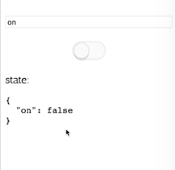
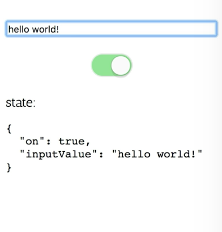

Instructor: [00:00] As fun as it is to update the state of a Boolean, that is controlled throughout our entire application using this cool `Provider` and our `ConnectedToggle` thing. It even reaches through ``shouldComponentUpdate` is `false`. That's a pretty cool accomplishment, but it's only one Boolean.



[00:17] What if we could store our entire application state in this way? The de facto for storing application state is `Redux`. We're going to create `Rendux` with this `ToggleProvider`, and the `ConnectedToggle`, and our `Toggle` component. We'll switch it over to a `Rendux` component.

[00:35] The first thing we need to do is add `Redux` to our page. Let's go ahead and add a `script` tag for`Redux`. Then I'm going to take every instance of `Toggle` on the page, and replace it with `Rendux`. We'll do the same thing for our lowercase `toggle` with `Rendux`. Let's begin our refactor.

[00:56] Instead of `defaultOn`, we're going to have `initialState`. That's going to default as an object. Our `initialState` is going to come from `this.props.initialState`. We're going to change from `onRendex` to `onUpdate`. Then let's create our store.

```js
class Rendux extends React.Component {
    static defaultProps = {
        initialState: {},
        onUpdate: () => {},
        onReset: () => {},
    }
initialState = this.props.initialState
}
```

[01:12] We'll say `store = Redux.createStore`. We're going to create our own `rootReducer`. We'll initialize it with our `initialState`. Our `rootReducer` is going to be a function that takes `state` and an `action`, and returns `this.props.reducer(state, action)`. Just for the fun of it, we'll make `reducer` a function that takes `state` and returns `state`.

```js
class Rendux extends React.Component {
    static defaultProps = {
        initialState: {},
        onUpdate: () => {},
        onReset: () => {},
        reducer: state => state,
    }
initialState = this.props.initialState
rootReducer = (state, action) => {
    return this.props.reducer(state, action)
}
store = Redux.createStore(
    this.rootReducer,
    this.initialState,
)
}
```

[01:39] Let's update the reset. Instead of `isOnControlled`, we'll change this to `isStateControlled`. Instead of `this.props.on`, we'll say `this.props.state` on our props, here and here, and then in the case that our state is controlled, we'll just call `this.props.onReset(this.initialState)`.

[02:00] If it's not controlled, then we'll call `this.store.dispatch`, with a special action with a `type: '__RENDUX_RESET__'`, and we'll get rid of this `setState` stuff. Then in our `rootReducer`, we'll handle that. We'll say `if (action.type === '__RENDUX_RESET__')`, then we will `return this.initialState`.

```js
else {
    this.store.dispatch({type: '__RENDUX_RESET__'})
}
```

```js
rootReducer = (state, action) => {
    if (action.type === '__RENDUX_RESET__') {
        return this.initialState
    }
}
```

[02:23] Luckily for us, we don't need this `toggle` function, which is now `Rendux`, or `getRendux` or `props`. We don't need those anymore. We have a mechanism for updating the state, and that's dispatch.

[02:35] One thing we do need is a `componentDidMount`. When the component mounts, we need to subscribe. We'll say `this.store.subscribe`, and every time there's an update, we'll say `this.setState(this.store.getState)`.

[02:51] We don't want a memory leak, so we'll say `this.unsubscribe =` the result of calling that function. Then we'll say `componentWillUnmount`, and call `this.unsubscribe`.

```js
componentDidMount() {
    this.unsubscribe = this.store.subscribe(() => this.setState(this.store.getState))
}
componentWillUnmount () {
    this.unsubscribe()
}
```

[03:02] Our `render` function is going to be a little bit different. We don't need these things anymore (`getRenduxrProps` and `rendux`). We do want that `reset`, and we're definitely going to want a `dispatch: this.store.dispatch`. The `state` is what we want. Instead of the `onState`, we'll just get the regular `state`. We'll get it from props if it's controlled, and if it's not, then we'll get it from the store.

```js
render () {
    return this.props.render({
        state: this.isStateControlled()
            ? this.props.state
            : this.store.getState(),
        dispatch: this.store.dispatch,
        reset: this.reset,
    })
}
```

[03:23] Let's update our `RenduxProvider`. It's rendering the `Rendux` component, accepts a `Rendux` object, and that is the value for `ReactBroadcast`. Our `ConnectedRendux` is going to subscribe to our `RenduxProvider.channel`. It accepts a `Rendux`, and renders with the `rendux`.

[03:41] Then we have the `withRendux` higher-order component. It renders a `ConnectedRendux`, and that `render` prop accepts a `Rendux`, and renders the component with `rendux`. Our `UpdateBlocker` remains unchanged.

[03:53] `MyInput` now uses `ConnectedRendux` with the `render` prop, and instead of `on`, we're actually going to just accept `rendux`. `Rendux` is going to have our `state`, and we'll set that up in our `Redux store` here in a little bit.

```js
function MyInput () {
    return (
        <ConnectedRendux
         render={(rendux) => (
             <input
              defaultValue={rendux.state.on ? 'on' : 'off' }
              placeholder="Type 'off' or 'on'"
         )}
    )
}
```

[04:08] Instead of `Rendux`, we're going to call `rendux.dispatch`. We'll make a `type: 'toggle', value:` of `true` and `false`. In my `Switch`, instead of getting `on` here, we'll get `rendux.state.on`. We'll say `rendux.dispatch({type: 'toggle', value: !rendux.state.on})`.

```js
function MyInput () {
    return (
        <ConnectedRendux
         render={(rendux) => (
             <input
              defaultValue={rendux.state.on ? 'on' : 'off' }
              placeholder="Type 'off' or 'on'"
              onChange={event => {
                  if (event.target.value === 'on') {
                      rendux.dispatch({type: 'toggle', value: true})
                  } else if (
                      event.target.value === 'off'
                  ) {
                     rendux.dispatch({type: 'toggle', value: false}) 
                  }
              }}
         
```

```js
<Switch
    on={rendux.state.on}
    onClick={() => rendux.dispatch({type: 'toggle', value: !rendux.state.on})}
/>
```

[04:36] Our `StatePrinter`, we'll get `rendux`, and it'll print out `rendux.state`. Our app uses the `RenduxProvider`. We don't need `defaultOn`. We now need `initialState`, which will initialize to `on: true`. Let's see what we broke.

```js
<RenduxProvider initialState={{on: true}}>
```

[04:52] Of course, we have a syntax error, and I knew I needed an extra parenthesis. We're getting an issue with getting state from undefined. That's because we're de-structuring `Rendux` in `MySwitch` when `rendux` is the object that we get. Cool.

[05:06] Looks like state is now getting updated. That's because we don't yet have a reducer that handles actions of these types. Let's create our reducer.

[05:15] `reducer ={(state, action)` and `return {...state,`. We'll make a `switch` statement here, with `action.type`, and if it's `'toggle'`, then we'll return an object with the `...state`, and on is going to be `action.value`. Otherwise, with the `default` case, we'll return the `state`. Now, I can toggle that on and off.

```js
function App() {
    return {
        <RenduxProvider initialState={{on: true}}
         reducer ={(state, action) => {
             switch (action.type) {}
              case 'toggle':
              return
               ...state,
               on: action.value,
         }
         defalut:
         return state

        >
    }
}
```

[05:43] For fun, let's add another `case` in our reducer `'input_change'`. This will return our `state`, and input value will be `action.value`. We'll use this action.type in our `input` at the bottom here. We'll say `rendux.dispatch ({ type: 'input_change', value: event.target.value,`.

```js
function App() {
    return {
        <RenduxProvider initialState={{on: true}}
         reducer ={(state, action) => {
             switch (action.type) {}
              case 'toggle':
              return
               ...state,
               on: action.value,
         }
         case 'input_change':
            return {
                ...state,
                inputValue: action.value
            }
         defalut:
         return state

        >
    }
```
```js
rendux.dispatch({
     type: 'input_change',
      value: event.target.value,
```

[06:13] Now, "Hello, World!" and I could store anything in here that I like, using all the nice utilities from `Redux`. This was a pretty simple straight up refactor of a `Toggle` component to a full-fledged `Redux` component.



[06:27] What this teaches us is that the patterns of render props, and state initializers, and controlled components, and the utility of `ReactBroadcast` are really powerful, and applicable in many scenarios, whether it be just a small, isolated component that you're going to reuse in multiple places, or a bigger component that controls state of the entire application.