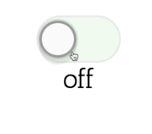

Instructor: [00:00] Let's go ahead and refactor this so that users of the `Toggle` component can have a little bit more control over what's rendered and how it's rendered.

[00:06] The first thing that we're going to do is I'm going to take what's rendered in the component itself, and I'm going to move it to a new function called `renderSwitch`. I'm going to take all of this (in the render function of the component) and move it up to `renderSwitch`.

```js
renderSwitch() {
    const {on = this.state
    return (
        <Switch on={on} onClick={this.toggle} />
    )
    }
}
```

[00:20] In my render, I'll `return this.renderSwitch()`. Cool, nothing has changed. It all works fine.

```js
render() {
    return this.renderSwitch()
}
```

[00:27] Let's make this a pure function. It accepts some arguments, and it returns the same thing given the same arguments. Instead of referencing `this.state` and `this.toggle`, I'm going to accept `on `and `toggle` as arguments. I'll get rid of `this`, and I'll get rid of `this`.

```js
renderSwitch({on, toggle}) {
    return (
        <Switch on={on} onClick={toggle} />
    )
    }
}
```

[00:46] When I call `renderSwitch`, I'm going to give it an object with `on: this.state.on`, and `toggle: this.toggle.` Cool, everything else is working. What's neat about this is now that this is totally stateless, it has no need to be on the class `Toggle` component at all.

```js
render() {
    return this.renderSwitch({
        on: this.state.on,
        toggle: this.toggle,
    })
}
```

[01:06] We could actually move this out entirely, call this `function renderSwitch`, and then no longer need to call it on `this.`. Everything still works exactly as it was before.

```js
render() {
    return renderSwitch({
        on: this.state.on,
        toggle: this.toggle,
    })
}

function renderSwitch({on, toggle}) {
    return (
        <Switch on={on} onClick={toggle} />
    )
    }
```

[01:17] What if instead of using the `renderSwitch function` that's available on the scope of this `Toggle` class, I accept that as a prop, `this.props.renderSwitch`. Then the App component could simply say `renderSwitch={renderSwitch}`.

```js
render() {
    return this.props.renderSwitch({
        on: this.state.on,
        toggle: this.toggle,
    })
```
```js
function App() {
    return(
        <Toggle
        onToggle={on => console.log('toggle', on)}
        renderSwitch={renderSwitch}
        />
    )
}
```

[01:35] Everything is still working. It's working exactly as it was before. Well, that's kind of neat.

[01:46] I have quite a bit of control. What if I inline an arrow function here or something? Then I can accept the arguments `{on, toggle}`. Now I can say, `<div> <Switch on={on} onClick={toggle} />`.

[02:07] Then I can say, if it's `{on ? 'on' : 'off'}`.  Cool, now I click, and it works.

```js
function App() {
    return(
        <Toggle
        onToggle={on => console.log('toggle', on)}
        renderSwitch={({on, toggle}) =>
        <div>
            <Switch on={on} onClick={toggle} />
            {on ? 'on' : 'off'}
        </div>
        }
        />
    )
}
```


[02:18] What's neat about this is I don't have to worry about the depth of my tree at all. It all works fine just out of the box because this is simply a function that's returning JSX and accepting the state and some functions. Now I can get rid of this `renderSwitch`.

[02:33] Maybe to make this a little bit more generic, we could call this `render`. All of a sudden, people have total and complete control. We're able to do all of this without using any weird APIs, like context or anything. It's all happening right within this Toggle component.

```js
render() {
    return this.props.render({
        on: this.state.on,
        toggle: this.toggle,
    })
```

[02:49] It's as simple as returning a function called to the `render` function that we're provided. That render function is provided the state and any helpers to make changes to that state. It's free to render whatever it wants or nothing if it doesn't want to render anything at all. This pattern is called render props, and it's super awesome.

[03:09] Before we move on, I want to compare the app with the render props solution with the app and the higher-order component and compound component solution. The first thing that bothers me with higher-order components is that I have to wrap everything.

[03:24] If I have a `MyToggle` that needs to get access to the state and the toggle helper, then I need to wrap that and create a new component, and that's the one that I render. Just this alone presents a whole lot of problems that we had to solve in our higher-order component with the `displayName`, the `WrappedComponent`, the `ReactStatics`, the `ref`.

[03:44] On top of that, we have this naming collision. If I wanted to use a toggle prop for any of the components that are using this higher-order component, that's a problem. In addition, if I were to use a `withOtherToggle` with this component, I'm going to have a name collision there as well. There's no way for React to warn me that that is going to be a problem.

[04:07] The other thing that's annoying is what if I have another prop here that says, `sayHi`. I look at the `MyToggle` component, I see that it's wrapped, and I wonder to myself, "OK. So which one of these props is coming from this `withToggle` higher-order component?" I have to look at the implementation to understand.

[04:26] I can't even look at where it's being rendered. I have to look at the implementation of the higher-order component to know which of these props are being passed from where. The problem gets aggravated if I compose higher-order components together.

[04:37] Another thing that's a little bit of a problem with higher-order components, that we're not going to go into too far, is typing with TypeScript or Flow. It's a lot harder to type a higher-order component than it is to type a render prop.

[04:49] Finally and probably the biggest point is where the composition takes place -- what composition mechanism do we have available to us with these two approaches? With higher-order components, the composition takes place statically during the construction phase of our application. We construct these components, and we compose behaviors with these components, and then we can render those things in our application.

[05:11] However, with the render prop approach, the composition happens right within React's normal composition model, during the render phase. This means that I can take advantage of React's lifecycle and the natural flow of props and state because the composition model is dynamic.