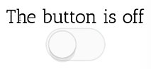
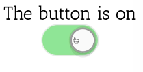

Instructor: [00:00] Now, let's say every time that I click on the toggle, I want it to tell me in text whether it's on or off. Let's say that I also want to be able to control where that text appears, but I don't want to change it right in the component `(<Switch />)`.

[00:14] I'm going to be using this component in a lot of different places. Rather than just saying `on` and `off`, and then changing it in here, I want to be able to have that configurable outside of the component by the user.

[00:27] What I really want to do is, I want to be able to provide some children to this component, where I can say `<Toggle.On>The button is on</Toggle.On>`, and `<Toggle.Off>The button is off</Toggle.Off>`. Then I want to be able to position that button anywhere that I want, so I put the `<Toggle.Button />`.

```js
<Toggle.On>The button is on</Toggle.On>
<Toggle.Off>The button is off</Toggle.Off>
<Toggle.Button />
```
[00:48] Then I can reorder these however I like. The `<Toggle />` component can be responsible for making sure that this renders when it's supposed to, this one does as well, and that this renders the `<Switch />`. Let's go ahead and make that a reality.

[00:59] We're going to make a couple function components. Say `ToggleOn`, and this will take a prop `on, children`. Then it'll `return on ? children : null`. We'll do the same thing, except for `ToggleOff`.

[01:16] Instead of the children when it's on, it'll be the children when it's off. Finally, let's make the `ToggleButton`. That'll take `on, toggle`.

```js
function ToggleOn({on, children}) {
    return on ? children : null
}
function ToggleOff({on, children}) {
    return on ? null : children
}
function ToggleButton({on, toggle})
```

[01:25] We'll take the rest of the `...props`, we'll `return <Switch on={on} onClick={toggle}`. Then we'll pass the rest of the `...props`.

```js
function ToggleButton({on, toggle, ...props}) {
    return <Switch on={on} onClick={toggle} {...props} />
}
```

[01:40] To make them accessible off of the `<Toggle />` class -- because we're going to put this in some sort of module, we want people to be able to access it right on the `<Toggle />` class -- we'll say `static On = ToggleOn`, and we'll do the same for `Off`. `static Button = ToggleButton`. Great, then we save that.

```js
class Toggle extends React.Component {
    static On = ToggleOn
    static Off = ToggleOff
    static Button = ToggleButton
}
```

[02:04] Now, what do we render here? Right now, we're still rendering the switch, because we're ignoring the children of the `<Toggle />` component. We're ignoring that prop, but we want to do something with those children.

[02:14] We're going to take those children, and we need to provide those children the props that they need to render properly. To do this, let's go ahead and make a children variable here. We'll say `React.Children`.

[02:28] This has a whole bunch of utilities that we can use. One of those is `map`.

[02:32] This will allow us to map over all these children. We'll say `this.props.children` has the things that we want to map over. For each child, we're going to `cloneElement` the child and provide additional props, like `on: this.state.on`, and `toggle: this.toggle`.

```js
render() {
    const children = React.Children.map(
        this.props.children,
        child=>
        React.cloneElement(child, {
            on: this.state.on,
            toggle: this.toggle,
        }),
    )
    return <div>{children}</div>
}
```

[02:51] Then we can get rid of `const {on} = this.state`, and we'll `return <div>{children}</div>`. I'll save that, and now we see the button is off, the button is on. I as the user of this component can move the button to the top, or I can even put the on text to be on top and the off text to be on bottom. I have total control.





[03:15] This is called compound components. We have one component here at the top level, then that component has some children components, and they share some implicit state. That implicit state is the `on` state. They can also share functionality like this button does.

[03:30] In review, what we're doing here in our `render` method is we're taking the `map` function from `React.Children` -- which by the way, is not like array.map, but it's a special map function specifically for mapping over React children elements -- and we pass it `this.props.children`.

[03:46] For every child, we're going to `clone` that. That means it's going to take the elements that I give it, it's going to make a copy of it with the props that I provide here, so I'm passing the `on` and the `toggle` prop.

[03:59] That way, these components, when they're rendered, are able to use those on and toggle props to do their job.