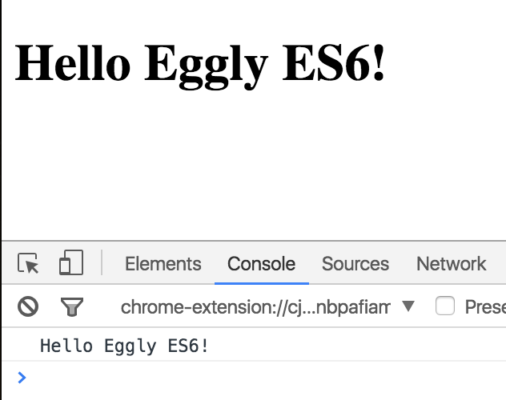

In this lesson, we are going to learn how to set up **Webpack** to convert our code into something the browser can understand. For instance, we will be using [ES6](https://egghead.io/courses/learn-es6-ecmascript-2015) in this series, and to do that safely, we need to convert our code into ES5 for the browser.

We will also make heavy use of module loading, and so we need Webpack to help us locate and resolve all of our assets, and more importantly, their dependencies. The first thing we need to do to enable Webpack in our project is to create a configuration file to tell Webpack how to run.

**terminal**
```bash
$ touch webpack.config.js
```

 We'll hop in here, and we're going to start to build out our configuration object.

The first thing that we're going to define is what we want our output to actually be. In this case, we want it to be a file with the name of `bundle.js`. From here we're going to define how we're going to load our modules. We'll define a module object, and from here we're going to create an array of loaders.

We'll start with a really simple loader, and we're just going to test for HTML files, so this is just a [regular expression](https://egghead.io/courses/regex-in-javascript) that tests for this HTML pattern. When it matches, it's going to apply this loader to it. In this case we're doing `raw`, which is a simple loader that just takes the `raw` content of the HTML file and puts it into the bundle.

**webpack.config.js**
```javascript
module.exports = {
  output: {
    filename: 'bundle.js'
  },
  module: {
    loaders: [
       { test: /\.html$/, loader: 'raw' },
    ]
  }
};
```

Let's do another one, and this is CSS. This is slightly more ambitious, because we're going to actually stack two loaders together. This reads from right to left, and we're saying take the CSS, resolve it, and then add it as a style tag into our DOM.

The next one we're going to do is the same thing, but we're adding an additional style-list loader on to the end of it. From here, we're going to just do a bit of an esoteric pattern here that's going to grab all of our external assets such as fonts, SVGs, etc., and we're going to generate a URL for it.

For the grand finale, we're going to create our JavaScript loader. We'll set up a regular expression test for that, to test for the JavaScript extension, and then from here, we're going to add one more property. That's "exclude," because we're going to exclude the `node modules`, which we do not need to process. Then we'll add in our loader, which is going to be `ng-annotate`, to help with `dependency injection`, and Babel to convert ES6 to ES5.

Let's add one more property on here to help with debugging, and that's DevTool. We're going to set this to emit SourceMap when it handles the bundle. 

**webpack.config.js**
```javascript
module.exports = {
  devtool: 'sourcemap',
  output: {
    filename: 'bundle.js'
  },
  module: {
    loaders: [
       { test: /\.js$/, exclude: [/app\/lib/, /node_modules/], loader: 'ng-annotate!babel' },
       { test: /\.html$/, loader: 'raw' },
       { test: /\.styl$/, loader: 'style!css!stylus' },
       { test: /\.css$/, loader: 'style!css' },
       { test: /\.(ttf|otf|eot|svg|woff(2)?)$/, loader: 'url' }
    ]
  }
};
```

Let's hop into our gulp file, and we're going to add Webpack into our build system. We're going to `import webpack-stream`. What this allows us to do is communicate with Webpack via streams, which is what Gulp uses.

**gulpfile.babel.js**
```javascript
'use strict';

import gulp     from 'gulp';
import webpack  from 'webpack-stream';
...
```

Let's create a new Webpack task. We're going to return a new stream that's going to start at our entry point. We'll go `pass.entry`. we'll take all of the files from that entry point, and we're going to pass them to Webpack with our Webpack configuration file we just created to be processed. Then we'll take the output of that, which is just a `bundle.js` file, and we're going to send that to our output.

Now that we've created our `Webpack task`, let's go ahead and add this to our `default Gulp task`. Since we're here, let's go ahead and add this to our `watch task` as well. 

**gulpfile.babel.js**
```javascript

...

// use webpack.config.js to build modules
gulp.task('webpack', () => {
  return gulp.src(paths.entry)
    .pipe(webpack(require('./webpack.config')))
    .pipe(gulp.dest(paths.output));
});

gulp.task('serve', () => {
  serve({
    port: process.env.PORT || 3000,
    open: false,
    server: { baseDir: root }
  });
});

gulp.task('watch', () => {
  let allPaths = [].concat([paths.js], paths.html, [paths.styl]);
  gulp.watch(allPaths, ['webpack', reload]);
});

gulp.task('default', (done) => {
  sync('webpack', 'serve', 'watch', done);
});
```


Now that we've created our Webpack and hooked it into Gulp, let's create a new JavaScript file to verify this is working.

We're going to create an `app.js` file in our app directory, and we're going to put a simple `console log` here that says, `Hello, Eggly ES6!`

**client/app/app.js**
```javascript
console.log("Hello, Eggly ES6!");
```

Let's go into our index.html file. We need to actually include our bundle.js file. 

**client/index.html**
```html
<!doctype html>
<html lang="en">
  <body>

    <h1>Hello Eggly ES6!</h1>

    <script src="bundle.js"></script>
  </body>
</html>
```

We'll take `bundle.js` here so that our file gets included, and now let's kick things off with `npm start`, and let's hop into the browser.

**terminal**
```bash 
$ npm start
```

When we reload this, we should look in the console and see `Hello, Eggly ES6.` The reason being is even though we didn't explicitly include `bundle.js`, it was wrapped up in Webpack.



Let's do a quick review. We created `webpack.config.js` with our output, and then our loaders here. 

**webpack.config.js**
```javascript
loaders: [
       { test: /\.js$/, exclude: [/app\/lib/, /node_modules/], loader: 'ng-annotate!babel' },
       { test: /\.html$/, loader: 'raw' },
       { test: /\.styl$/, loader: 'style!css!stylus' },
       { test: /\.css$/, loader: 'style!css' },
       { test: /\.(ttf|otf|eot|svg|woff(2)?)$/, loader: 'url' }
    ]
```

Our JavaScript loader, specifically, is using `ng-annotate` in Babel. We hooked this into Gulp with `webpack-stream`, and then we created a Webpack task that starts at our entry point, passes that into `Webpack`, and then puts our output into our destination pack.

**gulpfile.babel.js**
```javascript
// use webpack.config.js to build modules
gulp.task('webpack', () => {
  return gulp.src(paths.entry)
    .pipe(webpack(require('./webpack.config')))
    .pipe(gulp.dest(paths.output));
});
```

We added it to our `default tasks` and our `watch tasks`. We included `bundle.js` into our `index.html`, and then we had a `console log` in `app.js`, just to prove that it was working. This is how you add a Webpack to a project.