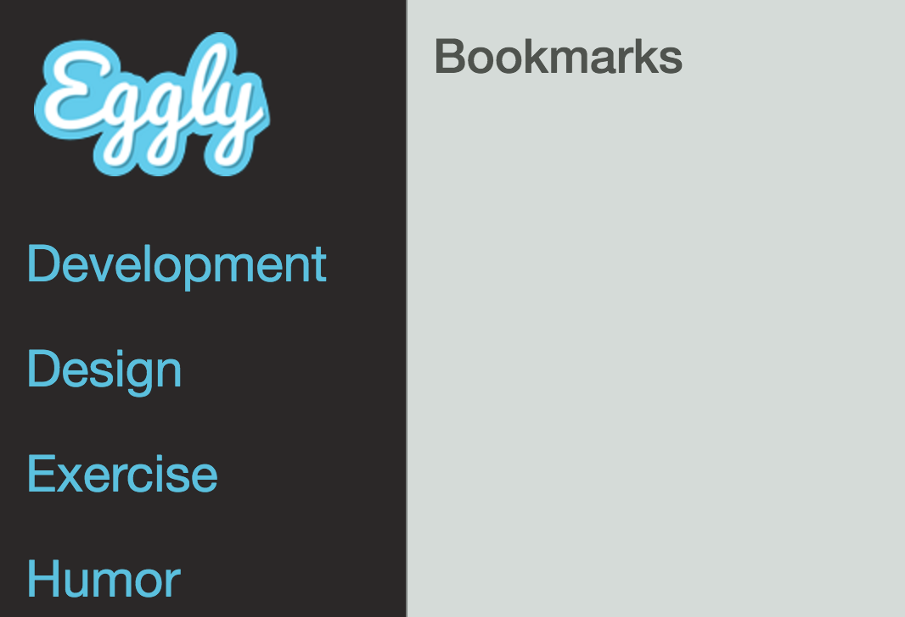

In this lesson, we are going to learn how to create a **controller** for our Angular 2 style **component**. Up to this point, we have used our components to serve as a holding pen for our templates, but what happens when we need to do real work?

Our **component configuration object** offers us quite a few additional options besides just setting the template. For instance, we could point it to a controller, set controller as, define isolated scope, etc.

For reference, let's look at an Angular 2 component real quick and compare where we are going. Using the component configuration object, we're essentially approximating the object that we send into this component metadata here, but now the class underneath serves as the component controller.

This is one of the main reasons we're using [ES6](https://egghead.io/courses/learn-es6-ecmascript-2015) for this project is because how close it resembles its Angular 2 counterpart. Let's see what I mean by creating a `CategoriesController` to see how close it resembles this Angular 2 component we just looked at.

**terminal**
```bash
$ cd client/app/components/categories
$ touch categories.controller.js
```

We're going to go ahead and create our `categories.controller.js`, and then we'll hop into that and we're going to define an ES6 class and we're going to call this `CategoriesController`. From here, we're going to define our constructor and we're going to initialize a property called `categories`.

Now, we'll just hop into our data. We'll just pull the categories JSON out of here, just copy this and paste it in. Then from here, we now have a `CategoriesController` class with a constructor that when it gets initialized will set this `categories` array with categories objects.

**categories/categories.controller.js**
```javascript
class CategoriesController {
  constructor() {
    this.categories = [
      {"id": 0, "name": "Development"},
      {"id": 1, "name": "Design"},
      {"id": 2, "name": "Exercise"},
      {"id": 3, "name": "Humor"}
    ];
  }
}

export default CategoriesController;
```

We need to export this, so `export default CategoriesController`, and then let's hop into our `categories component` and make this available to our components. So we're going to import this, `import controller from /categories controller`.

Then using the shorthand syntax that we did for [template](https://egghead.io/lessons/ecmascript-6-string-templates?course=learn-es6-ecmascript-2015), we're going to go ahead and just set controller. But then we're also going to define controller as, and because this is going to be used to display list of categories, let's do `categoriesListCtrl`.

**categories/categories.component.js**
```javascript
import template from './categories.html'
import controller from './categories.controller'
import './categories.styl';

const categoriesComponent = {
  template,
  controller,
  controllerAs: 'categoriesListCtrl'
};
```

Now, we need to hop into our categories template and update this. We'll just delete these bottom items here, and then we're going to add **ng-repeat** to this category item. So new line, ng-repeat, and then we'll go `category in categories` list controller.categories, then we're going to bind to category.name.

**categories/categories.html**
```html
<ul class="nav nav-sidebar">
  <li class="category-item"
    ng-repeat="category in categoriesListCtrl.categories">{{category.name}}</li>
</ul>
```

Let me just make sure that I did this correctly, and I did. Let's make sure that nothing is broken on the command line. Looking good. Let's hop into the browser and see if this is rendering. Here we go.

We have development, design, exercise humor. 



You can notice the similarity between the Angular 2 component and our Angular 1 controller using this ES6 class.

This is how you create and define a controller in an Angular 2 style component within your Angular 1 application.