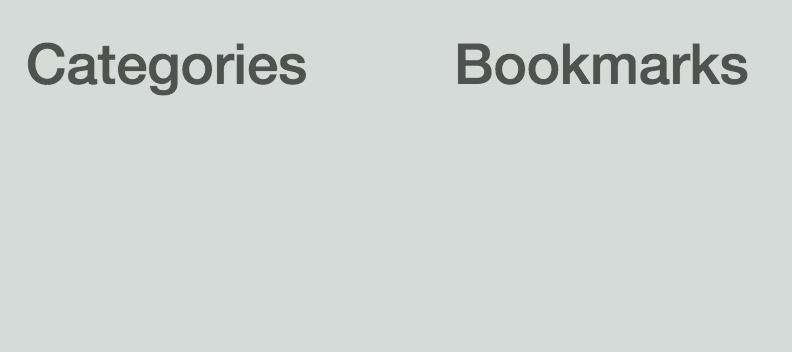

In this lesson, we are going to learn how to create our first **root level component**. In Angular 2, we no longer use **ng-app** to bootstrap our application, but rather kickoff the bootstrap process by pointing it to a single top-level component that all our other components will branch off of.

We can simulate that pattern in Angular 1 by creating a single top-level component that lives within our `index.html` file that serves as the entry point to all of our other components.

To get started with our first app component, let's create some files. We're going to hop into the command line, and we'll jump into the app directory. We're going to create our `app.html`, which is our template; `app.styl`, which will hold our css; and then `app.component.js`, which is going to hold our **component configuration object** for app component.

**bash**
```bash
$ cd client/app
$ touch app.html
$ touch app.styl
$ touch app.component.js
```
Now, let's hop into `app.html`. I'm just going to paste some HTML into here so I don't have to type it, 

**app/app.html**
```html
<div class="app">
  <div class="container-fluid">
    <div class="row">
      <div class="col-sm-3 col-md-2 sidebar">
        <h1>Categories</h1>
      </div>
      <div class="col-sm-9 col-md-10 main">
        <h1>Bookmarks</h1>
      </div>
    </div>
  </div>
</div>
```

as well as let's hop into our style, `app.styl`, and we'll paste in our styles here, as well. 

Not important to the concept that we're covering, so let's hop into our `app.component`. We're going to import our template from `app.html`. Then, we will also import our styles via `app.styl`.

From here, let's go ahead and create our component configuration objects. We're going to create an object called "appComponent." We could do template colon template, but using the new [ES6 object literal syntax](https://egghead.io/lessons/ecmascript-6-object-enhancements-in-es6?course=learn-es6-ecmascript-2015), we can just put in template and ES6 will figure it out for us.

From here, we're going to export this `appComponent` that we just created. 

**app/app.component.js**
```javascript
import template from './app.html';
import './app.style';

const appComponent = {
  template
};

export default appComponent;
```

You'll notice that we have our template and our styles. This is similar to in Angular 2 where you actually attach your template and your styles directly to the component object.

Now, let's hop into our `app.js`, and we're going to import a few utility files. Bootstrap CSS only, normalize.css, and now let's import Angular from Angular so that we can create our module. Then, we'll also `import appComponent from app.component` that we're going to use to define our component.

`Angular.module` will create our app module, no dependencies, and .component. We're going to create our component, app, which is really our selector. Then, we'll pass it in the appComponent configuration object.

**app/app.js**
```javascript
import 'bootstrap-css-only';
import 'normalize.css';

import angular from 'angular';
import appComponent from './app.component';

angular.module('app', [])
  .component('app', appComponent)
;
```

From here, let's hop onto our body tag. We're going to go `ng-app="app"`," so we're going to bootstrap to the app module. Then, we're going to do `ng-strict-di`, which just forces us to use dependency injection safe syntax, and `ng-cloak`, just to make things a bit smoother. Let's delete this tag right here.

We're going to go app, so this creates the app component or initializes it into our application. 

**client/index.html**
```html
<body ng-app="app" ng-strict-di ng-cloak>

  <app>
    Loading...
  </app>

  <script src="bundle.js"></script>
</body>
```

Now let's go `npm start` to see this in action. 

**bash**
```bash
$ npm start
```

Webpack is compiling. It looks like we're good.

Let's hop into the browser, refresh. Now, you can see we have our categories column and our bookmarks column being picked up by our appComponent that we put into our index.html.



Just to review, we created our app module, 

**app/app.js**
```javascript
angular.module('app', [])
  .component('app', appComponent)
```

which then we attached our app component to that contains our `app.html` template as well as our styling. Then, within our component, we are importing those and attaching our template to our appComponent configuration object.

**app/app.component.js**
```javascript
import template from './app.html';
import './app.styl';

const AppComponent = {
  template
};

export default AppComponent;
```

From there, once we've exported that, then we will hop into our `index.html`, and you can see that we're adding that to the page using the app element, which then renders like this in the page. This is how you create your first top-level root component.