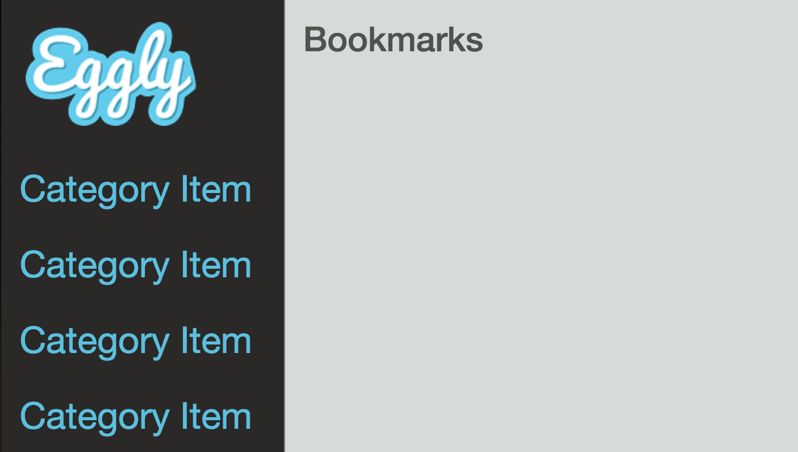

In this lesson, we are going to dig into components a bit more by creating a **subcomponent** and hooking it into our **root component**. Let's start with the organization and structure of components in an Angular 2 style. It's considered best practice to organize your components by feature. For example, we want to create a categories component.

The first thing that we're going to do is create a components directory to put all of our components. From within that, we're going to create a categories directory to put all of our categories specific files in. Then within our categories directory, we need to create a top level file that will serve as an Angular module for our feature. In this case, we're going to call it `categories.js`.

**bash**
```bash
$ cd client/app
$ mkdir components && cd components
$ mkdir categories && cd categories
$ touch categories.js
```

Let's hop into the categories directory and we'll go ahead and just create this file. Now an Angular 2 module generally contains an **ES6 class** that serves as the controller, a template and additional style. So let's go ahead and create the template. We'll create the style-list file for our styles and we'll create `categories.component.js` to hold our component configuration.

**bash**
```bash
$ touch categories.html
$ touch categories.styl
$ touch categories.component.js
```

Now let's hop into our categories template. Just paste some HTML in here. 

**categories/categories.html**
```html
<a>
  
</a>
<ul class="nav nav-sidebar">
  <li class="category-item">Category Item</li>
  <li class="category-item">Category Item</li>
  <li class="category-item">Category Item</li>
  <li class="category-item">Category Item</li>
</ul>
```

Let's go to our style-list file, paste our CSS into that, 

and then let's hop into `categories.component.js`, and we're going to import the template as well as the additional styles. Now make note that we're using ./ to indicate that we want to resolve the module in our **current directory**, not in the **node modules directory**.

Now let's go ahead and start to build out the **component configuration object**. So this is incredibly simple, we're just passing in the template so this is the most simple component that you can have. 

**categories/categories.component.js**
```javascript
import template from './categories.html';
import './categories.styl';

const categoriesComponent = {
  template
};

export default categoriesComponent;
```

Let's go ahead and export this, and then now let's hop into `categories.js` and let's define our Angular module to attach our component to so import angular.

Then we'll import the `categoriesComponent` and then let's go ahead and define our component object. So go angular.module and we'll just call this categories and it has no dependencies, and we're just going to use the .component syntax to create a new component, so we use the categories as the selector and we'll pass in `categoriesComponent`.

Now let's go ahead and export this and now that we've created our categories component with the container module, we need to create one more container module for all of our components. 

**categories/categories.js**
```javascript
import angular from 'angular';
import categoriesComponent from './categories.component';

const CategoriesModule = angular.module('categories', [])
    .component('categories', categoriesComponent)
  ;

export default CategoriesModule;
```

So we'll go up to directory and we're going to create `components.js`. From here `import angular from Angular` and we're going to import the `CategoriesModule`. This will be a dependency to our components module.

So components module and then angular.module and we'll call this components. It's going to have one dependency which is going to be the categories module so categories module.name and then we'll go ahead and export this so this is a lot of wiring up our small fine grained pieces within our application. 

**components/components.js**
```javascript
import angular from 'angular';
import CategoriesModule from './categories/categories';

let ComponentsModule = angular.module('app.components', [
  CategoriesModule.name
]);

export default ComponentsModule;
```

Now let's hop into app.js and let's add our components module to our root component, so `import ComponentsModule from components/components`.

**app/app.js**
```javascript
import 'bootstrap-css-only';
import 'normalize.css';

import angular from 'angular';
import appComponent from './app.component';
import ComponentsModule from './components/components';

angular.module('app', [
    ComponentsModule.name
  ])
  .component('app', appComponent)
;
```


Then we'll go `ComponentsModule.name`, so we'll hop into our HTML and we'll just update this to point to our categories element. 

**app/app.html**
```html
<div class="col-sm-3 col-md-2 sidebar">
  <categories></categories>
</div>
```

Let's check the console, make sure that nothing is broken. So we'll hop into our browser. We'll just refresh this for fun and you can see that our categories component is rendering. We'll just make this a bit smaller.



Let's just do a quick review of what we've done. We created a categories directory to put our categories feature. We created a categories module to hold all of our category specific stuff, including categories component which just holds our template and our styles.

From there, we created a components container that is defined as components module that we then wired up in our app component, and then we updated our `app.html` to have a reference to our categories component which we can see here. This is how you create a component in an Angular 2 style.