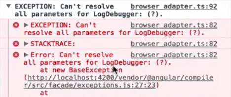

Angular's dependency injection system uses type information to find out what to inject. In our `LisCcomponent`, we have a `DataService` dependency of type `dataService`, and the type annotation that is attached to this constructive parameter is then used as a token in the provider configuration so Angular knows how to create the requested dependency.

**list/lsit.component.ts**
``` javascript
@Component({
  moduleID: module.id,
  selector: 'list-component',
  template: `
    <ul>
      <li *ngFor="let item of items">
        {{item.id}}: {{item.name}} lives in {{item.country}}
      </li>
    </ul>
  `,
  providers: [
    DataService
  ]
})
export class ListComponent implements OnInit {
  items:Array<any>

  constructor(private dataService: DataService) {}

  ngOnInit() {
    this.items = this.dataService.getItems();
  }
}
```
Sometimes, however, we have dependencies of a type that we can't or do not want to make available via DI. One example is this `LogDebugger` class. It has a `debug` method that takes a message and simply prints it out in the console, but only if `logdebugging` is `enabled`.

**app/log-debugger.ts**
``` javascript
export class LogDebugger {
  constructor(private enabled: boolean) {}

  debug(message) {
    if (this.enabled) {
      console.log(`DEBUG: ${message}`);
    }
  }
}
```
As we can see here, the debugger can be configured at creation time using the `enable` constructor parameter. We obviously have to inject a value for the `enable` parameter, and the type annotation clearly says that it's a `boolean` value, so it's either true or false.

If we go back to our `ListComponent`, add a provider for `LogDebugger`, ask for an instance, and use it in our component, we see that Angular complains that it can't resolve all parameters for `LogDebugger` dependency.

**list/lsit.component.ts**
``` javascript
@Component({
  moduleID: module.id,
  selector: 'list-component',
  template: ` ... `,
  providers: [
    DataService,
    LogDebugger
  ]
})
export class ListComponent implements OnInit {
  items:Array<any>

  constructor(private dataService: DataService, private logDebugger: LogDebugger) {}

  ngOnInit() {
    this.logDebugger.debug('Getting items...');
    this.items = this.dataService.getItems();
  }
}
```
When this error occurs, this usually means that we're requesting a dependency with a type that Angular doesn't know about. In other words, there is a provider missing for the requested type or token. In this case, we're asking for a dependency of type `boolean` in the `LogDebugger` class, and we obviously don't have a provider configured for that type.



We could try to add a provider for that type by doing `provide: boolean, useValue: true`, where its `useValue` is the thing that's injected. 

**list/list.component.ts**
``` javascript
@Component({
  moduleID: module.id,
  selector: 'list-component',
  template: ` ... `,
  providers: [
    DataService,
    LogDebugger,
    { provide: boolean, useValue: true }
  ]
})
```
However, this will not work, because `boolean` is not a custom-created type in this file, and it can only be used to add static type information to things like variables and parameters, as we do in our `LogDebugger`.

Even if that worked, with this provider, we would always inject a value `true` whenever we asked for a dependency of type `boolean`, which is probably not what we want, either.

To handle such cases, we can tell Angular to specifically call a factory function to create the dependency. Inside that factory function, we are able to simply pass a boolean value to the `LogDebugger` constructor.

Let's go ahead and remove the provide for boolean and change the provider for `LogDebugger` to `provide: LogDebugger, useFactory:`. This is where we define the factory function, which will be called by Angular when we ask for an instance of type `LogDebugger`.

We create a function in which we return new `LogDebugger`, and here we pass the `boolean` value, which is now `true`. We save the file and can see getting items is logged.

**list/list.component.ts**
``` javascript
@Component({
  moduleID: module.id,
  selector: 'list-component',
  template: ` ... `,
  providers: [
    DataService,
    {
      provide: LogDebugger,
      useFactory: () => {
        return new LogDebugger(true);
      }
    }
  ]
})
```
To demonstrate that this really works, we change `true` to `false`, save the file, and once the browser is reloaded, we see that nothing is logged anymore.

To recap, `useFactory` gets a function which returns the dependency instance we want to inject later on. Inside that function, we can manually pass objects to a dependencies constructor without making these objects automatically available via DI.