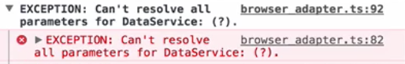

Angular uses type annotation to resolve service dependencies. This means when we're injecting a service of type `DataService` it's the type annotation that gives Angular all the information that's needed to create a dependency for that type. That's why the same type is used in the list of providers, to tell Angular what to inject and how that thing we want to inject is created.

**list/list.component.ts**
``` javascript
@Component({
  moduleID: module.id,
  selector: 'list-component',
  template: ` ... `,
  providers: [
    DataService,
    ConsoleService,
    {
      provide: LogDebugger,
      useFactory: () => {
        return new LogDebugger(consoleService, true);
      },
      deps: [ConsoleService]
    }
  ]
})
```
In this case we tell Angular to inject an instance of class `DataService`, with a dependency of type `DataService` requested. The interesting question though is how is that metadata preserved into transpiled ES5 code so that TypeScript works in the browser when we run our application.

We can easily find that out by taking a look at the transpiled file in the `dist/app/list.component.js`. This is ES5 code that is later executed in the browser. One of the interesting parts here is that the component class translates into a plain old constructor function. We can see very nicely how it asks for a parameter encoded `DataService`. Another interesting observation is that class methods end up in the constructor functions `prototype`. 

**dist/app/list.component.js**
``` javascript
function ListComponent(dataService, logDebugger) {
  this.dataService = dataService;
  this.logDebugger = logDebugger;
}
ListComponent.prototype.ngOnInit = function () {
  this.logDebugger.debug('Getting items...');
  this.items = this.dataService.getItems();
}
```
Let's take a look at the constructor again. Type annotations don't exist in ES5, and that's why we can't see them here. In order to preserve that information, types could generate two functions, `decorate` and `metadata`.

**dist/app/list.component.js**
``` javascript
var __decorate = (this && this.__decorate) || function (decorators, target, key, desc) {
  var c = arguments.length, r = c < 3 ? target : desc === null ? desc = Object.getOwnPropertyDescriptor(target, key) : desc, d;
  if (typeof Reflect === "object" && typeof Reflect.decorate === "function") r = Reflect.decorate(decorators, target, key, desc);
  else for (var i = decorators.length - 1; i>= 0 \; i--) if (d = decorators[i]) r = (c < ? d(r) : c > 3 ? d(target, key, r) : d(target, key)) || r;
    return c > 3 && Object.defineProperty(target, key, r), r;
};
var __metadata = (this && this.__metadata) || function (k, v) {
  if (typeof Reflect === "object" && typeof Reflect.metadata === "function") return Reflect.metadata(k, v);
};
```
`Decorate` attaches `metadata` generated by decorators to objects. Here we can see how it attaches the addComponent metadata to the `ListComponent`. In fact, this is all the magic that makes decoraters in TypeScript work. The `metadata` function, however, takes care of attaching type annotations of construction parameters as part of the decoration process to objects.

**dist/app/list.component.js**
``` javascript
ListComponent = __decorate([
  core_1.Component({
    moduleId: module.id,
    selector: 'list-component',
    template " ... ",
    providers: [
      data_service_1.DataService,
      console_service_1.ConsoleService,
      {
        provide: log_debugger_service_1.LogDebugger,
        useFactory: function (consoleService) {
          return new log_debugger_service_1.LogDebugger(consoleService, true);
        },
        deps: [console_service_1.ConsoleService]
      }
    ]
  }),
  __metadata('design:paramtypes', [data_service_1.DataService, log_debugger_service_1.LogDebugger])
], ListComponent);
  return ListComponent;
```
So this, for example, can be the `DataService` type that we use to annotate our `DataService` dependency. Now, down here we can see how the `metadata` function attaches that type information to our `ListComponent`. This says there can be multiple constructor parameters, this function takes a list of types whereas each type maps the constructor parameter in the order they are defined.

That's how Angular knows that the first constructor parameter is a dependency for the type `DataService`. But let's say we want to refactor our code a little bit, and call `logDebugger.debug` inside the `getItems` method, so we don't have to do it manually every time we want to debug that function call. So we go ahead and remove the `logDebugger` dependency and the `debug` call.

**list/list.component.ts**
``` javascript
export class ListComponent implements OnInit {
  
  items:Array<any>;

  constructor(private dataService: DataService) {}

  ngOnInit() {
    this.items = this.dataService.getItems();
  }
}
```
Ask for a `logDebugger` dependency in our `DataService`, and call `logDebugger.debug` whenever `getItems` is called.

**app/data.service.ts**
``` javascript
import { LogDebugger } from './log-debugger.service';

export class DataService {

  constructor(private logDebugger: LogDebugger) {}

  items:Array<any> = [ ... ];

  getItems() {
    this.logDebugger.debug('Getting items...');
    return this.items;
  }
}
```
If we save the file and reload the browser, we'll see that there's an error that Angular can't resolve all parameters for `DataService`. In fact, it seems it doesn't even know what dependency type we're asking for, hence the question mark. 



If we take a look at the generated ES5 code, we can see that `DataService` does ask for a `logDebugger` dependency. However, there's no metadata attached to the service, which is why Angular can't resolve the dependency.

**dist/app/data.service.js**
``` javascript
var DataService = (function () {
  function DataService(logDebugger) {
    this.logDebugger = logDebugger;
    this.items = [ ... ];
  }
  DataService.prototype.getItems = function () {
    this.logDebugger.debug('Getting items...');
    return this.items;
  };
  return DataService;
}());
exports.DataService = DataService;
//# sourceMappingURL=data.service.js.map
```
The reason why there's no metadata emitted by TypeScript, is because TypeScript only does that if there is at least one decorator on a class. That's why we didn't run into this problem when we injected dependencies into our `ListComponent`, it already comes with a decorator.

Going back to our `DataService` class, there's clearly no decorator. This can be easily fixed by attaching some decorator to our `DataService`. It really doesn't matter if we're using a custom decorator, or a decorator provided by Angular. Angular, however, has a decorator called `@Injectible` that we can use exactly for this scenario. So we can go ahead and `import { Injectable } from '@Angular/core'`, and attach it to our class.

**app/data.service.ts**
``` javascript
import { Injectable } from '@Angular/core'

@Injectable()
export class DataService { ... }
```
If we now take a look at the transpiled ES5 code we can see that the metadata is now properly emitted, and our application runs again.