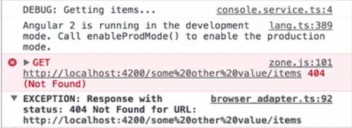

In our little application, we have a provider token for the `apiUrl`, which is just a string. It turns out that this can be problematic in case we're using, for example, a third-party library that comes with its own provider that introduces the same token.

**list/list.component.ts**
``` javascript
providers: [
    DataService,
    ConsoleService,
    {
      provideL LogDebugger,
      useFactory: (consoleService) => {
        return new LogDebugger(consoleService, true);
      },
      deps: [ConsoleService]
    },
    {
      provide 'apiUrl',
      useValue: 'http://localhost:4200/api';
    }
  ]
```
To illustrate this issue, let's fake these third-party providers by quickly creating a new file in `src/app/third-party.ts`, and export a `const THIRD_PARTY_PROVIDERS`, which is a list of providers that this imaginary third-party library introduces.

**app/third-party.ts**
``` javascript
export const THIRD_PARTY_PROVIDERS = [

];
```
We add a provider for `apiUrl` and give it some other value. Basically, this is now yet another provider that happens to have the same token that we've already introduced in our application.

**app/third-party.ts**
``` javascript
export const THIRD_PARTY_PROVIDERS = [
  {
    provide: 'apiUrl',
    useValue: 'some other value'
  }
];
```
Now let's go back to our `ListComponent` and import `THIRD_PARTY_PROVIDERS`. 

**list/list.component.ts**
``` javascript
import { THIRD_PARTY_PROVIDERS } from '../third-party';
```
We add them to our list of providers. 

**list/list.component.ts**
``` javascript
providers: [
    DataService,
    ConsoleService,
    {
      provideL LogDebugger,
      useFactory: (consoleService) => {
        return new LogDebugger(consoleService, true);
      },
      deps: [ConsoleService]
    },
    {
      provide 'apiUrl',
      useValue: 'http://localhost:4200/api';
    },
    THIRD_PARTY_PROVIDERS
  ]
```
Save the file, and we'll see that we run into an error.



Our `DataService` now tries to fetch data from a broken `apiUrl`, because the third-party library has changed the value that gets injected. This is because all providers defined on the component are flattened and normalized.

We could get around this by changing the order of providers, so that our `apiUrl` comes last. However, this is obviously not an option. We shouldn't care in which order we define our providers. In fact, we often don't even know what tokens our third-party library introduces. There has to be a better way.

Angular has the concept of **opaque tokens**, which ensure that **tokens are always unique**. Let's create such a unique token for our `apiUrl` and create a new file in `src/app.tokens.ts`.

Here we `import { OpaqueToken } from '@angular/core'`, and export a new constant `apiUrl`, which is an instance of `new OpaqueToken` for the string `apiUrl`. `apiUrl` is now an actual class instance, not just a simple string. Class instance are always unique.

**app/app.tokens.ts**
``` javascript
import { OpaqueToken } from '@angular/core'

export const API_URL = new OpaqueToken('apiUrl');
```
We can now go back to our `ListComponent` and import `API_URL`, and use that as a token for our provider. 

**list/list.component.ts**
``` javascript
import { API_URL } from '../app.tokens';
@Component({ 

  ...

  providers: [
      DataService,
      ConsoleService,
      {
        provideL LogDebugger,
        useFactory: (consoleService) => {
          return new LogDebugger(consoleService, true);
        },
        deps: [ConsoleService]
      },
      {
        provide API_URL,
        useValue: 'http://localhost:4200/api';
      },
      THIRD_PARTY_PROVIDERS
    ]
)}
```
Last but not least, we have to make sure that the same token is used in our `DataService` to actually inject the dependency.

We go to our `DataService`, import the `apiUrl` token, and pass that to `@Inject`. 

**app/data.service.ts**
``` javascript
import { API_URL } from './app.tokens';

@Injectable()
export class DataService {
  constructor(private logDebugger: LogDebugger, private http: Http, @Inject(API_URL) private apiUrl) {}

  getItems() { ... }
}
```
We save, reload the browser, and even though we're using a third-party library that introduces its own `apiUrl` token, we don't see the error anymore.

This is because **class instance are always unique**. We can even go ahead and change the third-party to also use an opaque token. We import opaque token, create a token, and use that to register the provider.

**app/third-party.ts**
``` javascript
import { OpaqueToken } from `@angular/core';

const API_URL = new OpaqueToken('apiUrl);

export const THIRD_PARTY_PROVIDERS = {
  {
    provide: API_URL,
    useValue: 'some other value'
  }
}
```
Our application still runs as expected. As a general rule, always create `OpaqueToken` when using string tokens for providers.