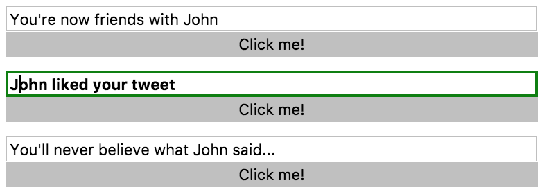

While CSS has `focus`, `active`, and other things that would handle most of the Events on the dom, there are some more complex scenarios. We're going to handle those with `ngClass`, to conditionally apply Classes. The syntax for that is `ngClass`, wrapped into square brackets because we're going to evaluate the right side of this.

**simple-form.component.ts**
``` javascript
@Component({
  selector: 'app-simple-form',
  template: `
<input 
  #myInput 
  type="text" 
  [(ngModel)]="message"
  [ngClass]="{}"
  >
<button (click)="update.emit({text:message})">Click me!</button>
`,
  styles: [`
    :host{
      display: flex;
      flex-direction: column;
    }
    input:focus{
      font-weight: bold;
      outline: none;
    }
    button{
      border: none;
    }
  `]
})
```
Remember if you don't put the square brackets in, it just treats this as a string. We're going to evaluate this side. We're going to pass in an object, where the key is a name of a Class. We're going to call this Class `mousedown`, and on `mousedown` we're going to set the `border: 2px solid green`.

**simple-form.component.ts**
``` javascript
styles: [`
:host{
  display: flex;
  flex-direction: column;
}
.mousedown{
  border: 2px solid greeen;
}
input:focus{
  font-weight: bold;
  outline: none;
}
button{
  border: none;
}
`]
```
That means in our `ngClass`, that the left-hand side or key of this is going to be called `mousedown`, because this Class relates to this. The right-hand side of this, so the value of this object, is going to be a `true` or `false` statement based on whether or not we want to apply this Class.

**simple-form.component.ts**
``` javascript
<input 
  #myInput 
  type="text" 
  [(ngModel)]="message"
  [ngClass]="{mousedown:isMousedown}"
  >
```
We're going to make a property called `isMousedown`, and then in our events...First, I'll put an `isMousedown` here, then in our events we can say `(mousedown)="isMousedown = true"`, `(mouseup)="isMousedown = false"`. Also let's get a `(mouseleave)="isMousedown = false".

 **simple-form.component.ts**
``` javascript
<input 
  #myInput 
  type="text" 
  [(ngModel)]="message"
  [ngClass]="{mousedown:isMousedown}"
  (mousedown)="isMousedown = true"
  (mouseup)="isMousedown = false"
  (mouseleave)="isMousedown  = false"
  >
```
When I come in here, I bring my mouse into an input and I click the mouse down, you'll see that green border. I pull the mouse up, and you'll see that border leaves. I can add that Class and remove that Class based on whether the mouse is down, or if I leave out with the mouse still down the Class is removed.



You can handle these complex stateful scenarios that you wouldn't usually have a Class for, or a pseudo Class for, to define the style, instead create a boolean in to track something, and whether or not you want that style applied. Any interaction you want to define, whether it's from Events, or from timers, or things like that, you can add and remove Classes using `ngClass`.