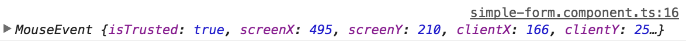
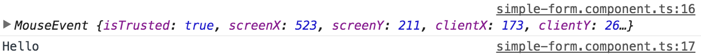

If you need to get the actual `MouseEvent`, you can use the `$Event` syntax, which is just the same way we did it in Angular 1, so that the Event will be passed along. 

**simple.form.component.ts**
``` javascript
@Component({
  selector: 'app-simple-form',
  template: `<div>

<input #myInput type="text">
<button (click)="onClick($event)">Click me!</button>
</div>`,
  styles: []
})
export class SimpleFormComponent implements OnInit {
  onClick(value) {
    console.log(value);
  }
  constructor() { }
  ngOnInit() {
  }
}
```
Now this value is the actual `MouseEvent`, so now when I click on this button, you'll see `MouseEvent` with all the properties you would expect from the `MouseEvent`.



After that Event, you can go ahead and type `myInput.value` and as well say that this is the `event`, and we want to log out the `event`, and then the `value`, so the `$Event` is here, the `myInput.value` is here, and we're logging out the `event` and the `value`. 

**simple.form.component.ts**
``` javascript
@Component({
  selector: 'app-simple-form',
  template: `<div>

<input #myInput type="text">
<button (click)="onClick($event, myInput.value)">Click me!</button>
</div>`,
  styles: []
})
export class SimpleFormComponent implements OnInit {
  onClick(event, value) {
    console.log(event);
    console.log(value);
  }
  constructor() { }
  ngOnInit() {
  }
}
```
Now when we click and I type something, `Hello`, and click, you'll see the `MouseEvent` and the value of `Hello`.



This will work on any DOM Event. If you were to say `mouseover` and hit save, now instead of `onClick`, every time I mouse over this button, you'll see those mouse events firing, and the value `Hello` of the form logging out as well.