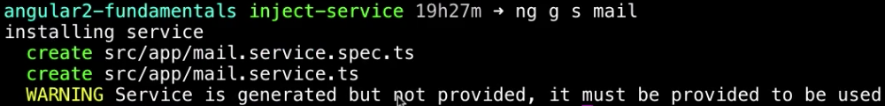

Use the **Angular CLI** to generate a service. Service can just be with `s` or the full word `service`. Then the name of the service. I'll call mine `mail`. Hit enter and you'll see it generates two files, our `mail.service` and the spec for that, and the warning that it's not provided.



Let's go ahead and provide it. Do that in your `app.module.ts`. In `providers` we'll say `MailService`, and I'm going to let WebStorm automatically import this for me. You'll see it's added up here.

**app.module.ts**
``` javascript
import { MailService } from './mail.service'

@NgModule({
  declarations: [
    AppComponent,
    SimpleFormComponent
  ],
  imports: [
    BrowserModule,
    FormsModule,
    HttpModule
  ],
  providers: [MailService],
  bootstrap: [AppComponent]
})
export class AppModule { }
```
Now that it's provided in this `app.module.ts`, if you go to your `app.component.ts`, you can inject it in the `constructor` of your `AppComponent`. I'm going to say `private mail:MailService`, and I'll inject that again. Make sure your import is pointing to the proper service, so importing mail from `mail.service`.

**app.component.ts**
``` javascript
import { MailService } from './mail.service'

@Component({
  selector: 'app-root',
  template: `<div>

<app-simple-form></app-simple-form>

</div>`
})
export class AppComponent {
  title = `Let's get started!`;

  constructor(private mail:MailService){}
}
```
Now whatever I put on `mail.service.ts`...If I navigate back to it, and say that I have a message and the message is, `You've got mail!`. 

**mail.service.ts**
``` javascript
import { Injectable } from '@angular/core';

@Injectable()
export class MailService {
  
  message = `You've got mail!`;

  constructor() { }
}
```
Then hop back over to your component. Underneath my simple form I can say `mail` -- which is my service -- `.message`. 

**app.component.ts**
``` javascript
@Component({
  selector: 'app-root',
  template: `<div>

<app-simple-form></app-simple-form>

{{mail.message}}

</div>`
})
```
Hit save and then this will refresh and you'll see the message, `You've got mail` underneath my simple form, the simple form with `You've got mail` underneath it.

