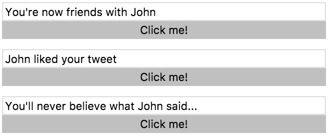
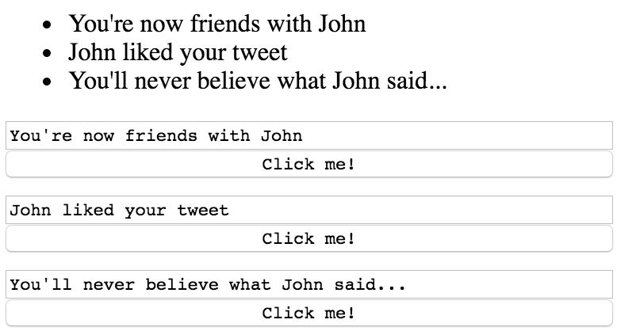
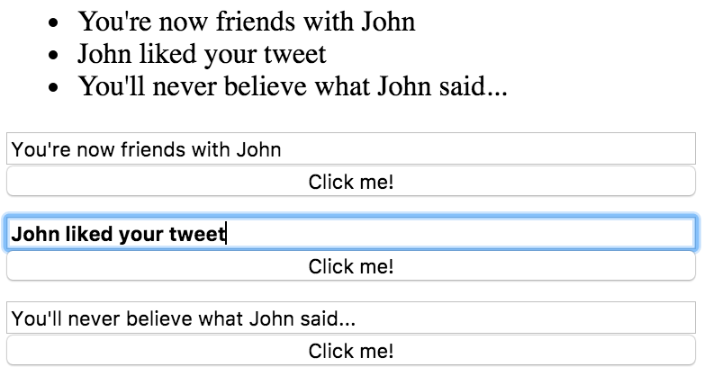

To understand how to style things, you have to understand how the DOM is set up. When we write an `app-simple-form` component, in the DOM you'll see `app-simple-form` and then nested inside of it you'll see a `div` and then inside of that `div` you'll see an `input` and a `button`.

Although you might be used to writing `div` inside of frameworks when you build a component to represent the outer element of that component, you actually don't need to do that because this input and button will be wrapped inside of this `app-simple-form`. We can add styles here, so we'll say `styles`. This is an array of strings.

Then I can add a style to `app-simple-form`. I'll just add a style of `margin-bottom: 10px`.

**app.component.ts**
``` javascript
@Component({
  selector: 'app-root',
  template: `<div>

  <ul>
    <li *ngFor="let message of mail.messages">{{message.text}}</li>
  </ul>

  <app-simple-form
    *ngFor="let message of mail.messages"
    [message]="message.text"
    (update)="onUpdate(message.id, $event.text)"
    >
    </app-simple-form>
</div>`,
  styles:[
    margin-bottom: 10px;
  ]
  
})
```
When I do this, you won't see anything change over here. There's no `margin-bottom` applied to it. That's because our component doesn't have any display to find. Meaning that on our `app-simple-form`, which we can reference in here through `:host`, we need to define a `display` such as `block` or I'm going to choose `flex`.

**simple-form.component.ts**
``` javascript
@Component({
  selector: 'app-simple-form',
  template: `
<input #myInput type="text" [(ngModel)]="message">
<button (click)="update.emit({text:message})">Click me!</button>`,
  styles: [`
:host{
  display: flex;
}
`]
})
```
Once I choose a display for my component, the type of display I want it to have, now it can represent that `margin-bottom` and it will know how to apply it based on this `display`. I also want this input and the button to be on top of each other, so I'm going to choose `flex-direction: column`. Hit save. Now these are on top of each other.

**simple-form.component.ts**
``` javascript
  styles: [`
:host{
  display: flex;
  flex-direction: column;
}
`]
```



You can see that inside of our component a `:host` will refer to our component, which in the DOM is represented by this `app-simple-form`. Outside of the component, `app-simple-form` can be selected by using the **element selector** of it or by giving it a class or any other traditional method of selecting it.

The other piece here I need to show is that if I want to select everything, every selector inside of my component and I wanted everything to have a `font-family` of `monospace` and I hit save. In a traditional page this would select every element inside and outside of this component. It would select it across your entire app.

**simple-form.component.ts**
``` javascript
  styles: [`
:host{
  display: flex;
  flex-direction: column;
}

*{
  font-family: monospace;
}
`]
```
You can see it's isolating this and this `font-family` to only the items, the `input`, and the `button` that are inside of my component. It's not affecting this stuff outside of my component.



The styles you define inside your component will be isolated to that component. If I wanted to say `input:focus`. When I focus, I want the `font-weight` to be `bold`. I can know and trust that only in these components and these inputs will the font turn bold when I click on them.

**simple-form.component.ts**
``` javascript
  styles: [`
:host{
  display: flex;
  flex-direction: column;
}

input:focus{
  font-weight: bold;
}
`]
```


Just a couple other things I want to clean up. I want the `outline` to be `none` and I want my `button`, `border` to be `none` just to make my components nice and clean.

**simple-form.component.ts**
``` javascript
  styles: [`
:host{
  display: flex;
  flex-direction: column;
}

input:focus{
  font-weight: bold;
  outline: none;
}

button{
  border:none;
}
`]
```