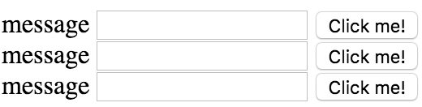

Instead of creating all these list elements, I can actually create our `app-simple-form` elements, the component that we used. I'll delete this `{{message}}` for a second. 

**app.component.ts**
``` javascript
@Component({
  selector: 'app-root',
  template: `<div>
<ul>
  <app-simple-form *ngFor="let message of mail.messages">
  </app-simple-form>
</ul>
</div>`
})
```
I'll hit save and you'll see that for each of these `messages`, it will create a new form in the browser. Inside of our form we can say that we have an input and this `@input` is the `message`.

**simple-form.component.ts**
``` javascript
@Component({
  selector: 'app-simple-form',
  template: `<div>
{{message}}
<input #myInput type="text">
<button (click)="onClick($event, myInput.value)">Click me!</button>
</div>`,
  styles: []
})
export class SimpleFormComponent implements OnInit {
  
  @Input() message;

  onClick(event, value){
    console.log(event);
    console.log(value);
  }

  constructor() { }
  ngOnInit() {

  }
}
```
Then we can display that `message` above the input. This message is going to be input and we use input with the square bracket syntax. We'll create another line here and say `[message]`. This needs to be wrapped in the square brackets so that when I pass in `message`, it will take this `message` off of the `mail.messages` and pass it into the input here. Then my component will receive that `message` and then display it in the template.

**app.component.ts**
``` javascript
@Component({
  selector: 'app-root',
  template: `<div>
<ul>
  <app-simple-form 
    *ngFor="let message of mail.messages"
    [message]="message"
  >
  </app-simple-form>
</ul>
</div>`
})
```
When I hit save, you'll see we have this message above each of the inputs, and that it created a component for each input. The difference between this (message) without the square brackets is when I hit save you'll see that it won't evaluate this `message`. It will treat this `message` as if it were a string. You'll see `message`, `message`, and `message`.



Any time you want to take a property on an element or an input on a component, make sure and wrap this with the square brackets so that it evaluates this to get the value of message versus treating it as the string of message. This can be named anything and this can be named anything.

Similarly, we could name this anything and name this anything and so on and so on. They don't have to both be named message. That's just the way they'll work out in this example. I'm just going to add the square brackets back, hit save, and we're back to having the message in each of our components.