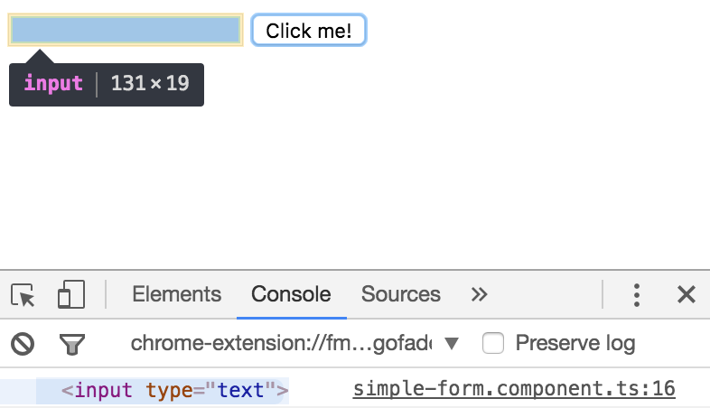

In my simple form I'm going to delete this entire `template`, replace it with a `div` that has an `input` and a `button` inside of it. The `button` will just say `Click me!` So when I hit save this will refresh, and we'll have an `input` and my `button`. 

**simple-form.component.ts**
``` javascript
@Component({
  selector: 'app-simple-form',
  template: `<div>

<input type="text">
<button>Click me!</button>

</div>`,
  styles: []
})
```
To handle a click on this button, you type parenths around the event name, like `(click)`, that you want to handle, and then you assign that to a method on your class which I'm going to call `onClick`.

**simple-form.component.ts**
``` javascript
<button (click)="onClick()">Click me!</button>
```
In my class, I'm going to come in here and say `onClick` and just write `console.log( 'clicked!' )`. I'll hit save. Once I start clicking this button, you'll see `clicked!` logged out in the console. 

**simple-form.component.ts**
``` javascript
export class SimpleFormComponent implements ngOnInit {
  onClick(){
    console.log('clicked!');  // clicked!
  }

  constructor() { }

  ngOnInit() { 
  }
}
```
This syntax of wrapping these parenths around event names, works with any dom event actually. Now on this input, I'm going to type a pound sign and then `myInput`. This is what is called a **ref**, or a reference to this input.

**simple-form.component.ts**
``` javascript
<input #myInput type="text">
<button (click)="onClick()">Click me!</button>
```
Meaning that I can access the values off of this input, and pass them into other places. To prove this I'm going to say `myInput.value`, and then pass this value into the click handler. 

**simple-form.component.ts**
``` javascript
<input #myInput type="text">
<button (click)="onClick(myInput.value)">Click me!</button>
```
I'll say value, and then log out that value. When I hit save now, the `myInput` is here. We're getting the value off the `input` which is passed in a handler, and then logged out in the console. If I type in here and click the `button`, you'll see that `type` is logged out.

**simple-form.component.ts**
``` javascript
  onClick(value){
    console.log(value);  // type
                         // something else
  }
```
If I delete this and type `something else`, and click again, you'll see `something else` is logged out. You got to prove that this is a ref to this actual `input`. If you delete this `.value` completely, you'll see that when I save and click the `button` now, it gives me this actual element. 



You'll see when I roll over it here, that it highlights in the dom in the page. So this combination of events and refs allow you to grab values off of elements, and handle them any way you need to.