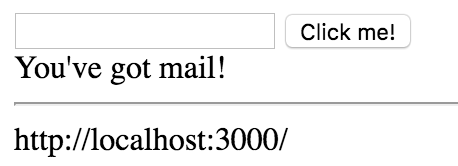

Now you'll notice in our `providers` that we provided the class `MailService` and then in our `AppComponent` we injected the `MailService` by the type over here. This matches with this here.

**app.module.ts**
``` javascript
@NgModule({
  declarations: [
    AppComponent,
    SimpleFormComponent
  ],
  imports: [
    BrowserModule,
    FomrsModule,
    HttpModule
  ],
  providers: [MailService],
  bootstrap: [AppComponent]
})
export class AppModule { }
```
**app.component.ts**
``` javascript
export class AppComponent {
  title = `Let's get started!`;

  constructor(private mail:MailService){ }
}
```
You can also do this by passing in an object, saying `provide` and then any value. I'm just going to say a string of `mail`, then say `useClass:MailService`. 

**app.module.ts**
``` javascript
providers: [{provide:'mail', useClass:MailService}]
```
Then back in my `AppComponent`, instead of injecting by type, I can actually use and inject decorator. Make sure to import that.

**app.component.ts**
``` javascript
export class AppComponent {
  title = `Let's get started!`;

  constructor(@Inject('mail') private mail){ }
}
```
Then I'm going to inject `mail` because this string matches with this `provide` string that I added here. It will know to use this class of `MailService`. When I switch back to my component, now we can actually delete this line where I import the class, and I no longer have a reference to it. It's just going to know to grab this as a class off the providers, create the instance, and then use it just as we did before. If I hit save, you'll see the exact same result over in the browser when it refreshes.

Providing with these objects is also very useful if I need to provide something like an API. I'll say Object `provide: 'api'`. Now I can say `useValue: 'http//localhost:3000/'` or wherever it would be. 

**app.module.ts**
``` javascript
providers: [
  {provide:'mail', useClass:MailService},
  {provide: 'api', useValue: 'http://localhost:3000/'}
  ],
```
Now we can inject this API where I use the same syntax. Now I inject `api`. I'll call this `api`, and then I'll just go ahead and show `{{api}}` on the page with a simple break between these two values. I'll hit save.

**app.component.ts**
``` javascript
@Component({
  selector: 'app-root',
  template: `<div>

<app-simple-form></app-simple-form>

{{mail.message}}
<hr>
{{api}}

</div>`
})
export class AppComponent {
  title = `Let's get started!`;

  constructor(
    @Inject('mail') private mail,
    @Inject('api') private api,
    ){ }
}
```
You can see we can now use this `api` string, this value, throughout our application and keep it consistent just by injecting this string which matches the key in our injector because we provided it here.

