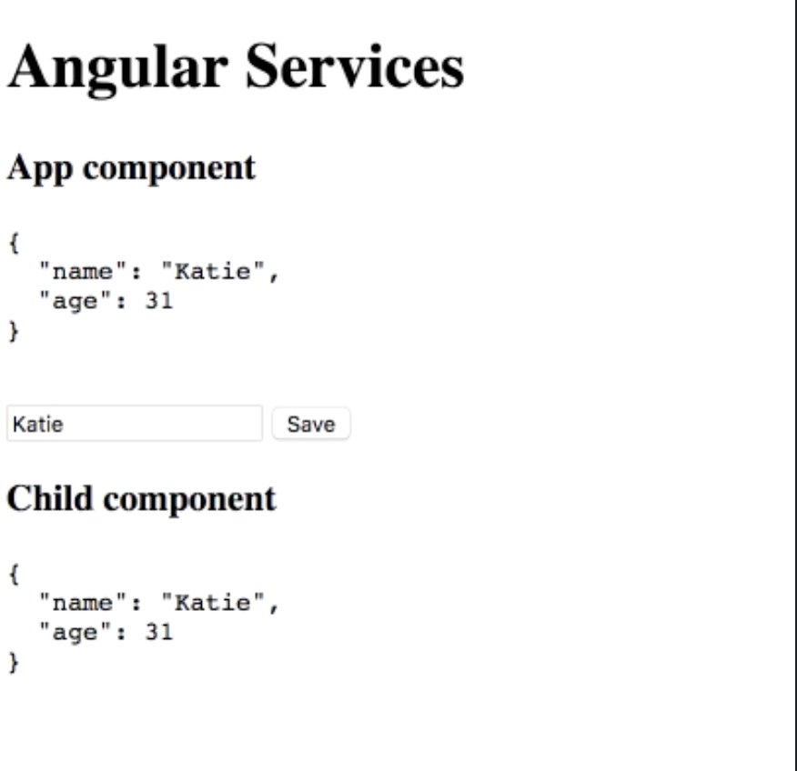
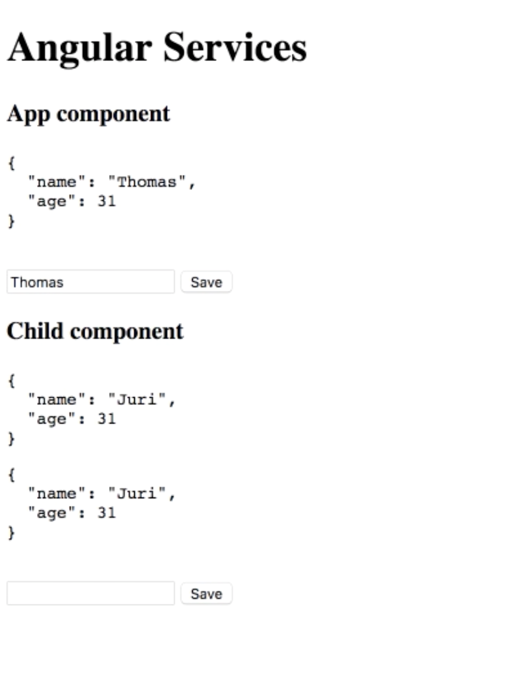

Here, we have our `AppComponent`, which is this one here and you can see it visualized here, which includes here a `PersonEditComponent`.

#### app.component.ts
```javascript
import { Component } from '@angular/core';

@Component({
  selector: 'app-root',
  template: `
    <h1>Angular Services</h1>

    <h3>App component</h3>
    <app-person-edit></app-person-edit>

    <app-child></app-child>
  `
})
export class AppComponent {}
```

If we take a look at that one, it gets here a `PersonService` in its `constructor()`. It visualizes a person here, which it gets from the `PersonService`.

#### person-edit.component.ts
```javascript
@Component({
  selector: 'app-person-edit',
  template: `
    <pre>{{ personService.getPerson() | json }}</pre>
    <br/>
    <input type="text" #personName />
    <button (click)="setPerson(personName.value)">Save</button>
  `,
  styles: []
})
export class PersonEditComponent implements OnInit {
  constructor(public personService: PersonServic) {}

  ngOnInit() {}

  setPerson(value: string) {
    this.personService.setPersonName(value);
  }
}
```

It has an input field which allows us to write in the name, and then it invokes that `setPerson()` method, which then calls on the `PersonService` to `setPerson()` method, which simply changes that name. As you can see, if I write here Thomas and I save it, you can see it changes.


What's interesting is that in that `AppComponent`, we also have an `<app-child>` component. That `<app-child>` component does similar things like that `PersonEditComponent`. It simply again imports that `personService.getPerson()`, via its `constructor()` and it visualizes it.

#### child.component.ts
```javascript
@Component({
  selector: 'app-child',
  template: `
    <h3>Child Component</h3>
    <pre>{{ personService.getPerson() | json }}</pre>
  `
})
export class ChildComponent implements OnInit {
  constructor(public personService: PersonService) {}

  ngOnInit() {}
}
```

You may have already noted that if I change this here and I save, both of them are in sync. The reason for that behavior is because once we register our service, in this case, the `PersonService`, in our `@NgModule` on the `provider` section, it is globally available on our application, and it is a single instance.



Whenever we add components, and we then inject that `PersonService` in those components, we will always get that same instance of that `PersonService`.

Consider we want to change that kind of behavior. For instance, here in our `ChildComponent`, let's add that `<app-person-edit>`. You can see, you get this put here below. Consider that we want for that `ChildComponent` and all its children, in this case, the `PersonEditComponent`, to have a different instance of that `PersonService`, and not the global one.

#### child.component.ts
```javascript
@Component({
  selector: 'app-child',
  template: `
    <h3>Child Component</h3>
    <pre>{{ personService.getPerson() | json }}</pre>

    <app-person-edit></app-person-edit>
  `
})
```

Luckily, this can be achieved by merely providing here in the `providers` property of the component, that same `PersonService`.

#### child.component.ts
```javascript
@Component({
  selector: 'app-child',
  template: `
    <h3>Child Component</h3>
    <pre>{{ personService.getPerson() | json }}</pre>

    <app-person-edit></app-person-edit>
  `,
  providers: [PersonService]
})
```

With that, we're telling the Angular dependency injector, whenever that component wants an instance of that `PersonService`, first look it up on your injector, which would be the definitions inside here, and then only go ahead and then into its parent injector to find that service.

The fact here is if we save here and we change that name, you can see it just changes now at the very global `PersonService` which is still available here in our `AppComponent`. Inside the `ChildComponent`, this is another `PersonService`, so the setName method won't affect this one.



Similarly also, if we now change that person's name here from that `<app-person-edit>`, which is included in that `<app-child>`, that will get us that `PersonService` here. If I write here Katie and I save, you can see it has just an effect on that subtree of our component tree here.

#### Child component output
```
Child component

{
  "name": "Katie",
  "age": 31
}
{
  "name": "Katie",
  "age": 31
}
```

We can see now that this `PersonService` lifetime is bound to that component tree. That also means that if I go to the `AppComponent` here, and let's say here `childVisible`, which is `true`, and I add here an `*ngIf`, that component will only be visible if this flag here is `true`. I'll add a button to toggle that flag.

#### app.component.ts
```javascript
import { Component } from '@angular/core';

@Component({
  selector: 'app-root',
  template: `
    <h1>Angular Services</h1>

    <h3>App component</h3>
    <app-person-edit></app-person-edit>

    <button (click)="childVisible = !childVisible">Toggle</button>
    <app-child *ngIf="childVisible"></app-child>
  `
})
export class AppComponent {
  childVisible = true;
}
```

Now you can see I changed the name on both. It will change just on `AppComponent`, as we expect. I write here Katie. I toggle that component, I re-visualize it, and you will see we get again the initial value which is saved in that app `PersonService`, Juri in this case.

#### person.service.ts
```javascript
@Injectable()
export class PersonService {
  name = 'Juri';

  getPerson() {
    return {
      name: this.name,
      age: 31
    };
  }

  setPersonName(value) {
    this.name = value;
  }
}
```

It demonstrates that the instance gets destroyed of that `PersonService`, and you get a new, fresh instance once that component comes to life again.

This hierarchical dependency injector feature of Angular is a really powerful one as it allows you to create caching services for a specified subtree of your component. As long as they are alive, they can then cache the data among them, and once they get destroyed, also the cached data will get destroyed.