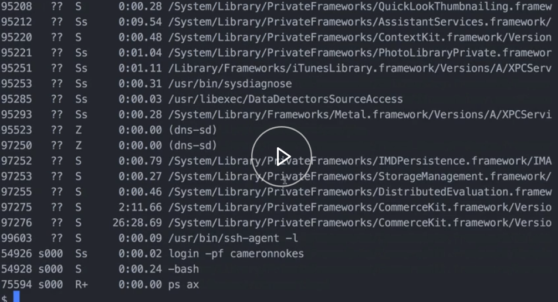
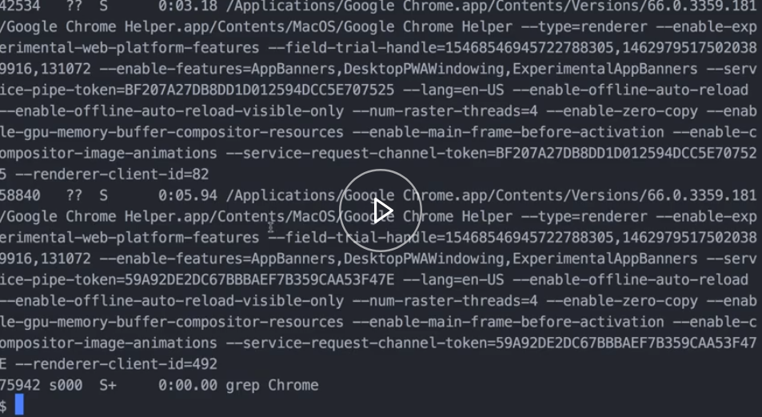

Pipes can be used to direct the output of one command to the input of another. Let's see what we mean by that. For example, if I wanted to check all of the running processes on my computer, I could use the `ps ax` command, and that would show that to me.



There's a ton of information here. We can see, here's an instance of Chrome running. If I wanted to see all Chrome processes that are running currently, it'd nice if I could grep in this screen. Let's see how we would do that.

We do `ps ax`, and then we pipe to the `grep` command. Normally, we `grep` in a file, but when we pipe it, we're basically saying take the output of this command, and pass it as the input to this next command. 

#### Terminal
```bash
$ ps ax | grep Chrome
```



If we run that, it's only showing us Chrome processes that are running.

We could take it even further, actually. We could pipe it again to `less`, if we wanted to view it in a different way. 

```bash
$ ps ax | grep Chrome | less
```

Another good example of pipes would be if I wanted to see the size of a file after it's been uglified and gzipped.

I've already installed the `uglifyjs` command globally via npm. I'm going to call that, and I'm going to pass the compress and mangle flags. Then we do two dashes, and then the file name that we want to compress.

```bash
$ uglifyjs -c -m -- index.js
```

From there, I'm going to pipe that to `gzip`. I'm going to the pass the `9` flag, which tells it to `gzip` on the maximum setting. 

```bash
$ uglifyjs -c -m -- index.js | gzip -9
```

From there, we need to know the file size of these two commands.  So from there, I'm going to pipe it to the `wc` command.

```bash
$ uglifyjs -c -m -- index.js | gzip -9 | wc
```

`wc` stands for word count. I will pass it the `c` flag, which tells it to give me not the word count, but the bye count of its input. 

```bash
$ uglifyjs -c -m -- index.js | gzip -9 | wc -c
```

Let's run that, and see what we get. 

We get `280` bytes, which will be the resulting file size after we `uglifyjs` and `gzip` the `index.js` file.

That's pretty cool. Note that if we `ls` here, that it didn't output another file for that. This all happened in memory, and it outputted the file size to us. 

Now, let's see how redirection works. When we run a command like `ls`, it outputs to the screen, which is also called standard out.

If we wanted to redirect that, we could use the angle bracket operator, and give it a file name. We'll call it `ls.txt`. 

```bash
$ ls > ls.txt
```

If we run that, basically what happened is that instead of outputting to the screen, it captured the output, and directed it into a file.

This file didn't exist, so it created it on the fly for us. If we output that now `$ cat ls.txt`, we can see that it outputs the index.js, which is from our `ls` before. It created the file before it redirected into it. That's why we have the `ls.txt` there.

```bash
$ cat ls.txt
index.js
ls.txt
```

We can also append to a file. Just using the `echo` command, I can `echo "hi"` Instead of outputting that to the screen, I can direct that and append to the `ls.txt` file. 

```bash
$ echo "hi" >> ls.txt
```

Then `cat` it out. We can see we have `hi` there at the end now.

```bash
$ cat ls.txt
index.js
ls.txt
hi
```

There are a lot of possibilities with input and output redirection and piping. See Bash's documentation for more details.