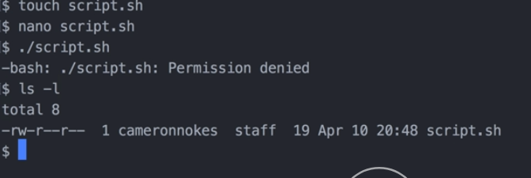
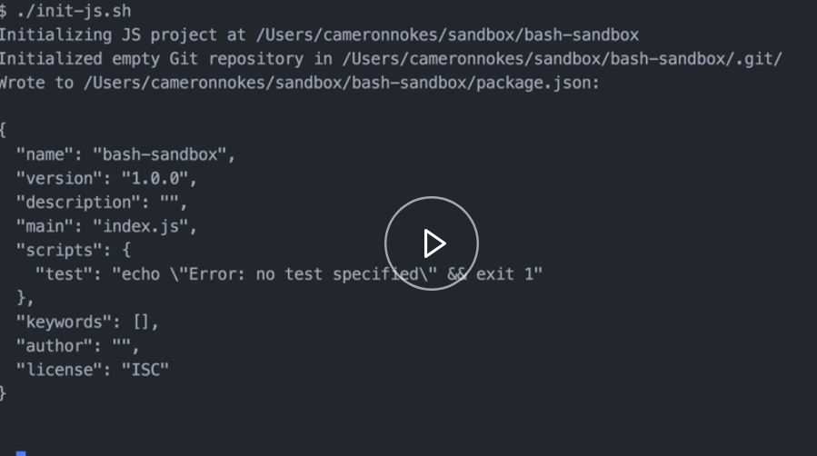
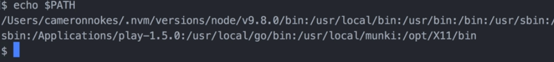

Let's start by creating our Bash script. I'll call mine `script.sh`. I'll just use `touch` to create that. 

#### Terminal
```bash
$ touch script.sh
```

I'm going to use `nano` to edit it. 

```bash
$ nano script.sh
```

Nano is a simple Bash text editor, but you can use whatever you want to create the `script.sh` file.

In here, I'm just going to do `echo "Hello World"`. To run a Bash script, we do `./` and then the script name, which is `script.sh`. 

```bash
$ ./script.sh
```
Let's try and run this and see what happens. 

```bash
-bash: ./script.sh: Permisssion denied
```
This is expected.

What's going on here? If we do a long listing, this means it's a file. The next 3, these are the user permissions. My user has permission to read and write to this file, but it doesn't have permission to execute. 



That might seem kind of weird because my user created the file. That's the default permission set up.

To fix that, we're going to run a command called change mode `chmod`. We're going to do `u+x`. The `u+x` means add to the user execute permissions and then we'll pass our file. 

```bash
$ chmod u+x script.sh
```

If we do that and then we long list it out now, we can see we have that little `x` there. That means we do have execute permissions.


Let's try to run it now again. 

```bash
$ ./script.sh
Hello World
```

You can see it works. Now, let's modify it to make it accept command line parameters. I'm going to jump back in here. The way variables work in Bash is that you reference a variable using the dollar sign `$` and then the variable name there.

We want to make the greeting here customizable. We'll reference our variable here. 

In Bash, you pass parameters to your scripts just like you pass parameters to any other command. They're just a space separated list after the command name. 

We reference each of those parameters that are passed by the argument number. To get the first argument that's passed to our scripts, we're going to use `$1`.

```bash
echo "$1 World"
```

Let's save that. Let's see. We do `script.sh` and then I'll do `Howdy`. 

```bash
$ ./script.sh "Howdy"
Howdy World
```

Yeah, it works. You can pass as many parameters to your scripts as you want and those will all be referenced by the number argument that they are.

Let's do something a little more realistic. Let's write a script that scaffolds out a new JavaScript project for us. 

We'll call it `init-js`. 

```bash
$ touch init-js.sh
$ nano init-js.sh
```

For our first line, let's do some logging. We'll do `echo "Initializing JS project at`. I want to pass the current working directory that this script is being run in.

To do that, I'm going to do dollar sign `$` because it's going to be a variable. What I'm going to do here print working directory `pwd` is a command that just outputs the current working directory of your Bash shell. If you do dollar sign and then the parentheses with a command in it, that is basically saying, "Execute this command and just put the output in inline."

```bash
echo "Initializing JS project at $(pwd)"
```

Now, I want to `git init` to initialize a git repository. I'll do `npm init`. `npm init` creates a package.json and the `-y` flag tells it to do it with just all the defaults and it doesn't prompt me for any input. 

Actually, we can make a note of that here. In Bash, you can leave a comment with the hashtag `#` symbol. I'll leave a comment here that says create package.json with all the defaults.

```bash
echo "Initializing JS project at $(pwd)"
git init
npm init -y # create package.json with all the defaults
```

I like to have a `src` directory in my projects, `mkdir src`. 

```bash
echo "Initializing JS project at $(pwd)"
git init
npm init -y # create package.json with all the defaults
mkdir src
```

We'll start things off with an `index.js` file in the src directory. If you have Visual Studio Code installed, it installs a command line tool called code. If you run `code` and you pass a directory it will open that in Visual Studio Code.

The current working directory can be referenced using the period character. This could be whatever you want. You could also open the `src/index.js` file using `open` and open that and just whatever your default application is for JavaScript files.

```bash
echo "Initializing JS project at $(pwd)"
git init
npm init -y # create package.json with all the defaults
mkdir src
touch src/index.js
code . # open src/index.js
```

This is looking pretty good. I'm going to save it. Let's add execute permissions to our scripts. `chmod u+x init-js.sh` and then if we run that, let's just run it in our current folder to see if it works. 

```bash
$ ./init-js.sh
```


It looks like it works and it opened up code for me. This is great, but what would make it better is if you could run this command at any folder on your file system that you wanted.

Right now if you wanted to run this in a different folder, you'd have to copy the script there and then execute it there and then probably remove the script afterwards. We can add the scripts to our `path`. By `path`, I mean that `$PATH`. 

That will make our scripts available to run in our Bash shell anywhere we want.

Let's see what a path is. If you do `echo $PATH`, it will output this big long string for you. 



What this is is a colon separated list of folders of where your shell looks for executables. 

For example, if I run `which node`, node meaning node.js. `which` is a command that just tells you where this executable lives. 

```bash
$ which node
/User/cameronnokes/.nvm/versions/node/v9.8.0/bin/node
```

You can see that it lives in this `.nvm` folder. You can see that that same folder is right here above. That's a place where Bash sees that that's an executable. When I run `node` it knows to run node.js.

There's a lot of different ways you can add something to your path to make it executable anywhere you want. I'm going to do what I think is the simplest, which is I'm just going to copy `cp` our `init-js.sh` file and I'm going to put it in `/usr/local/bin`. I'm just going to call it `init-js`. 

```bash
$cp init-js.sh /usr/local/bin/init-js
```

If we do `which init-js`, you can see now that it's seeing it in our user local bin folder which is on our path.

```bash
$ which init-js
/usr/local/bin/init-js
```

Let's create a test directory. We'll `cd` into it and let's do `init-js`. We can see that our script runs and it opens again in code there.


