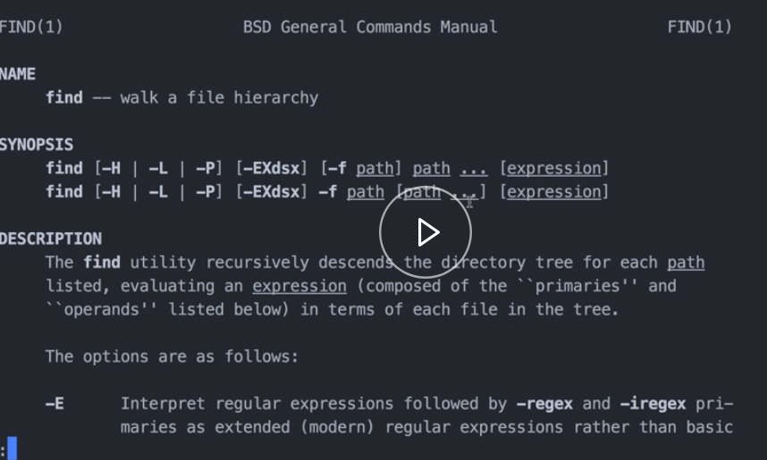

In my current working directory, I have an `images` folder. The `images` folder has several images in it, as you can see. 

#### Terminal
```bash
$ ls images
just-one-kitten.png     single-kitten.jpg
kitten-cuddles.JPG      two-kittens.png
```
Let's say that I wanted to find all of the PNGs in the folder. To do that, I would use the `find` command. I'll pass the `images` folder, and then I'll pass the `-name` flag, and I'll do `*.png`.

```bash
$ find images / -name "*.png"
```

This might look like a [regex](https://egghead.io/courses/regex-in-javascript), but it's not, actually. This is just a string that supports some special characters that do matching, so this will match any file name that ends with .png.

Let's run that. 

```bash
$ find images / -name "*.png"
images//two-kittens.png
images//just-one-kitten.png
```

We can see it finds those two PNG files. If we do the same thing for JPGs, we can see it just returns that one, but we have two JPEGs in there.

```bash
$ find images / -name "*.jpg"
images//single-kittens.jpg
```

Instead of using `name`, we can use `iname`. The `iname` is a case-insensitive name search. If we run that now, we can see this one is returned, as well.

```bash
$ find images / -iname "*.jpg"
images//single-kittens.jpg
images//kitten-cuddles.JPG
```

Another useful one, for example, is if we do `find`. If I just wanted to find all folders in my current working directory, I would pass `-type d`, and that'll return the images folder we just looked at.

```bash
$ find . -type d
.
./dist
./images
```
I have another folder in here called `dist`, so we can just confirm that with the list here. 

```bash
$ ls -G
dist    images
```
We can combine `type` with `name`. If I wanted to find all folders named `images`, that would work, and just returns the one here.

```bash
$ find . -type d -name "images"
./images
```

`find` also supports running an action on each match. For example, in my `dist` folder, I have two JS files, and then an image file.

```bash
$ ls dist/
kitten.png  main.built.js   vendor.built.js
```

Let's say that I wanted to delete all the JS files from the `dist` folder. 

I'll do `find dist`. I'll do `name`, and I'll do `*.built.js`, and then I'll pass the `-delete` flag. If we list it out, now we can see that it deleted my two JavaScript files in there.

```bash
$ find dist/ -name "*.built.js" -delete
$ ls dist/
kitten.png
```

If we want, we can get more custom, too. For example, if I wanted to run an image compression and optimization tool on each of the matching images, I could do that.

I do `find images`. I'll do `name`, and I'll just run this on the PNGs. I'll pass the `-exec` flag. That lets us run an arbitrary command on each match.

```bash
$ find images/ -name "*.png" -exec
```

I have a tool called `pngquant` that I have installed previously. `pngquant` just optimizes PNG files and makes them smaller.

```bash
$ find images/ -name "*.png" -exec pngquant
```

`find` supports this special character. The two curly braces stand further from each matching file.

```bash
$ find images/ -name "*.png" -exec pngquant {}
```

To end this little expression, you have to do your backslash, and then semicolon. 

```bash
$ find images/ -name "*.png" -exec pngquant {} \;
```

Its a strange syntax, but if we run that, and then let's list out images, we can see that it worked. Pngquant, has created these two optimized image files.

```bash
$ ls images/
just-one-kitten-fs8.png     kitten-cuddles.JPG      two-kittens-fs8.png
just-one-kitten.png         single-kitten.jpg       two-kittens.png
```

Find's a really handy tool. Refer to the documentation on it for more possibilities. The easy way to look at the documentation is if you run ` man find`. `man` stands for manual, and so this will bring up all of find's options right here in your terminal.

