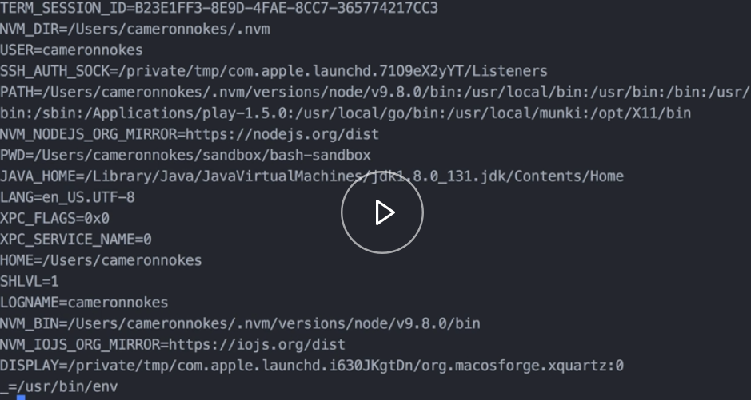
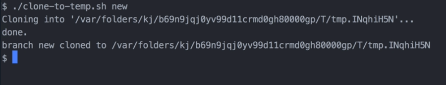

To set a variable in Bash, we just give it a name. Then we give it an equals sign, and then the value. 

#### Terminal
```bash
$ var=123
```

To inspect to value of that variable, the easiest way is to use `echo`. Then we reference the variable with the dollar sign and the variable name. Then there's our value.

```html
$ var=123
$ echo $var
123
```
Know that there cannot be any spaces. This is intentional. If we have spaces, like this, it's going to throw a syntax error. 

```html
$ test = 123
-bash: test: =: unary operator expected
```

The scope of the `var` variable that we defined is for this Bash session only. This `var` variable won't be visible to any scripts that are executed in the context of this shell.

Let's see that in action. Let's just create a simple script, and we'll just do `echo var`. Let's give it execute permissions. 

```bash
$ nano script.sh
$ chmod +x script.sh
$ ./script.sh

$
```

If we run that, we can see that it echoed something out here, but it was just an empty value.

In Bash, you can reference an undefined variable without any problems. It'll just be a blank value. It won't throw any errors, though. 

Let's see how we would make our `var` variable visible to our script. The way we do that is we use the `export` command, and we run `export var`.

```bash
$ export var
```

This will make the `var` variable visible to all child processes, to all commands, all scripts that are executed in the context of this shell. If we run script now, we can see that it's visible, and that it echoed it out correctly.

```bash
$ ./script.sh
123
```

We can also `unset` a variable in Bash. If we did `unset var`, and then we ran our script again, we can see that it's back to being empty. 

```bash
$ unset var
$ ./script.sh

$
```

Bash sets a lot of global environment variables that can be used. To see what all of those are, you run the `env` command, and it logs each of the variables out.



For example, a common one that's used is the `USER` variable. We can see that that's set to the currently logged in user. 

```html
USER=cameronnokes
```

You can also note that by convention, each of these variables are all uppercased. To reference a global environment variable, it's just the same as any other variable.

```bash
$ echo $USER
```

Let's see how we could use variables in a more realistic script. Let's say that we want to create a script that clones a branch of a local Git repository to a temporary folder. 

You could use something like this, for example, if you wanted to run some tests, or run a build on a different branch without interrupting your current workflow.

Let's create a script we'll call `clone-to-temp`. 

```bash
$ nano clone-to-temp.sh
```

The first thing we'll do is we'll create a `temp` variable. We'll use the command substitution syntax for that, because we're going to run a command in here. We're going to run `mktemp`, and we'll pass it the `-d` flag.

```bash
temp=$(mktemp -d)
```

`mktemp` will create a temporary file or folder. The file path to the temporary directory that we created will be stored in this temp variable. Now, we're going to run `git clone --branch`. This tells Git to clone from a branch or a tag.

For the branch or tag, we'll use user input. This'll be the first parameter that's passed to this script. Then we'll clone it from the current working directly. We'll use the `$PWD` global environment variable. This is always set to your current working directory.

```bash
temp=$(mktemp -d)
git clone --branch $1 $pwd
```

We're cloning from a local Git repository, not from a remote one, so that's why we're just passing in the current working directory here. Then we're going to clone it into our `temp` folder. Then let's just add an `echo` statement that just helps verify that it worked.

We'll say the `branch name was clonee to the temporary folder`.

```bash
temp=$(mktemp -d)
git clone --branch $1 $pwd
echo "branch $1 cloned to $temp"
```

At this point, in a more realistic scenario, maybe we would run some tasks here, tests, or something like that. Let's give this execute permissions. 

```bash
$ chmod +x clone-to-temp.sh
```

Now, let's try it out.

I do have a Git repository already initialized. Let's just add a commit, and then I'll create a branch that I'll just call `new`. 

```bash
$ git add . && commit -am "inital"
$ git branch new
```

Now, let's try it out and do a `clone-to-temp`. Then I'll say clone the `new` branch, and there you have it. It worked.

```bash
$ ./clone-to-temp.sh new
```

