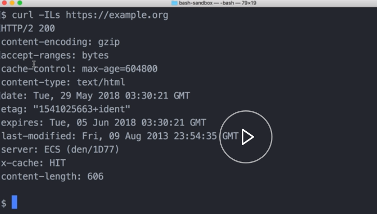

For this lesson, I've already created a script file, `conditionals.sh`, and I've given it execute permissions using the `chmod` command.

Conditionals in Bash take this basic form. We do `if`, two square brackets `[[ ]]` -- here is where our expression goes. I will come back to that -- do semicolon, and then we close it with a `fi` or a backwards if.

#### conditionals.sh
```sh
if [[  ]]; then

fi
```

Here, we can do all kinds of different checks. Let's check if the `$USER`, the global environment variable user, is equal to `cameronnokes` . If it's true, this is where we can execute whatever we want if this condition is true. 

I `echo "true"`. 

If it's false, we'll just do our `else` statement there before the closing `fi`. We'll do `echo "false"`.

```html
if [[ $USER = 'cameronnokes'  ]]; then
    echo "true"
else
    echo "false"
fi
```

We run that. 

#### Terminal
```bash
$ ./conditionals.sh
true
```

We can see that it's `true`. 

If we wanted to negate `!=` that up here, we can. 

#### conditionals.sh
```sh
if [[ $USER != 'cameronnokes'  ]]; then
    echo "true"
else
    echo "false"
fi
```

Let's run that. 

#### Terminal
```bash
$ ./conditionals.sh
false
```

That's `false`. There's a lot of different kinds of expressions that are supported here. Some of the syntax is different from most programing languages.

For example, if I wanted to do a numeric equality comparison, if I wanted to see if 1=1, I use this `-eq` these are called primaries. 

#### conditionals.sh
```sh
if [[ 1 -eq 1]]; then
    echo "true"
else
    echo "false"
fi
```

We see that's `true`, not equal is `-ne` , which is `false`. There's a lot of different primaries. Some are uniquely suited to Bash.

For example, to check if a file exists, you do `-e`, and then we'll check if our scripts here exist, which it should. 

```sh
if [[ -e conditionals.sh ]]; then
    echo "true"
else
    echo "false"
fi
```

#### Terminal
```bash
$ ./conditionals.sh
true
```

We see that's `true`. 

Another one we can do is `-z`, which checks if a variable is empty. If I check the `$USER` variable and run that, it should be false because it is set.

#### conditionals.sh
```sh
if [[ -z $USER ]]; then
    echo "true"
else
    echo "false"
fi
```

#### Terminal
```bash
$ ./conditionals.sh
false
```

Note that if everyone is an else/if statement, we do that using the `elif` keyword and then we put our conditional statement in here. 

Then `then`, and then this is where we execute code if that conditional is `true`. I'll just do `elif true`. Let's run that. 

#### conditionals.sh
```sh
if [[ -z $USER ]]; then
    echo "true"
elif [[ 1 -eq 1 ]]; then
    echo "elif true"
else
    echo "false"
fi
```

#### Terminal
```bash
$ ./conditionals.sh
elif true
```

Cool, it works.

Also, note that this conditional block can be used inline in a more ternary form. 

To see that in action, we could go up here. We'll say if `$USER` equal, we're going to do the double ampersand `&&` to say if that's true, and then we can do with the double pipe `||`, just like most programing languages, to add a false case to that. 

#### conditionals.sh
```sh
[[ $USER = 'cameronnokes' ]] && echo "yes" || echo "no"
```

Do that again. 

#### Terminal
```bash
$ ./conditionals.sh
yes
elif true
```

We can see that it's coming in there as `yes`.

Let's use conditionals in a more realistic scenario. Let's write a function that curls a URL and checks if that URL is responding with the 200 range status. 

Call that function, `check_status`.

The first thing we need to do is we'll create a local variable called `status`. We will set up a `curl` command in here that returns just the HTTP code of that `curl`.

To figure how to do that, it's helpful to jump over to the command line really fast. Let's do `curl`. Let's use some flags. We're going to do the include headers flag. This will include all the response headers and not the actual response of the URL, because we just want the status header.

We'll pass the `L`, the capital `L`, which tells it to follow redirects. Then we'll tell it to be silent `s` so that we're not getting progress bars and all that stuff that muddies up the output. Then we'll pass the URL. We'll do example.org.

#### Terminal
```bash
$ curl -ILs https://example.org
```



We see we're getting the response headers. What we specifically want is on this first row with the `200` here. Let's do it again. We'll pipe it to the `head` commands, and we'll tell it to return just that first row.

```bash
$ curl -ILs https://example.org | head -n 1
HTTP/2 200
```

Now we need to tell it we want it to cut out all of this part and just give the 200. To do that, we use the `cut` commands. We pass the `d` flag. It's just for delimiter. We're going to tell it to cut on empty spaces. It's going to split it right there.

Then we're going to tell it we want the second part. Refer to cut and heads documentation to see all the different possibilities here. 

```bash
$ curl -ILs https://example.org | head -n 1 | cut -d ' ' -f 2
200
```

If we run that, we see that it's working.

This is the command we want to plug in over here. 

#### conditionals.sh
```sh
check_status() {
    local status = $(curl -ILs https://example.org | head -n 1 | cut -d ' ' -f 2)
}
```

Now we want to do our `if` check. We're going to say if the status is less than `200` or greater than `299`, we're going to do `or`. This is our fail case. Lets log a statement explaining what happened.

`else`, it's succeeded. Let's do the same statement. I want it to say succeeded. 

Cool. Then up here, we'll return our `1` exit status.

```sh
check_status() {
    local status = $(curl -ILs https://example.org | head -n 1 | cut -d ' ' -f 2)
    if [[ $status -lt 200 ]] || [[ $status -gt 299 ]]; then
        echo "$1 failed with a $status"
        return 1
    else
        echo "$1 succeeded with a $status"
    fi
}

```

Let's go ahead and try this out. We'll call example.org again. That one should work. Let's call a URL that we know will fail. 

```sh
check_status https://example.org
check_status https://example.org/404
```

Let's check that and make sure it worked. 

#### Terminal
```bash
$ ./conditionals.sh
https://example.org succeeded with a 200
https://example.org/404 failed with a 404

```
Yes, it looks like it's working.