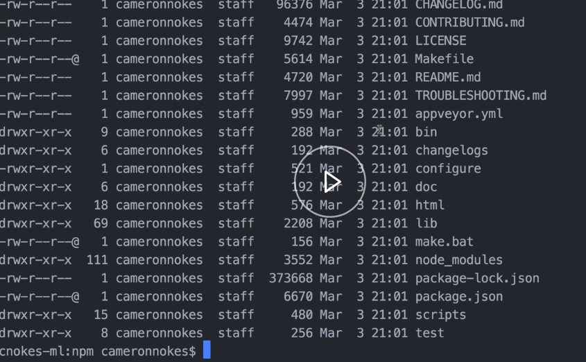
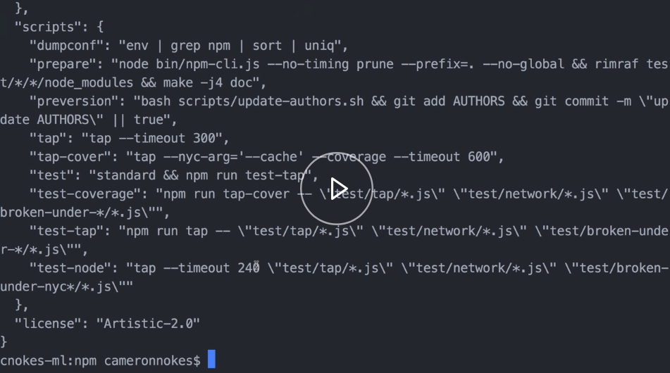
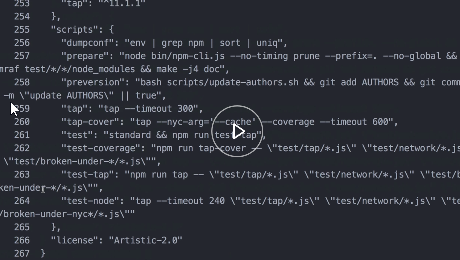
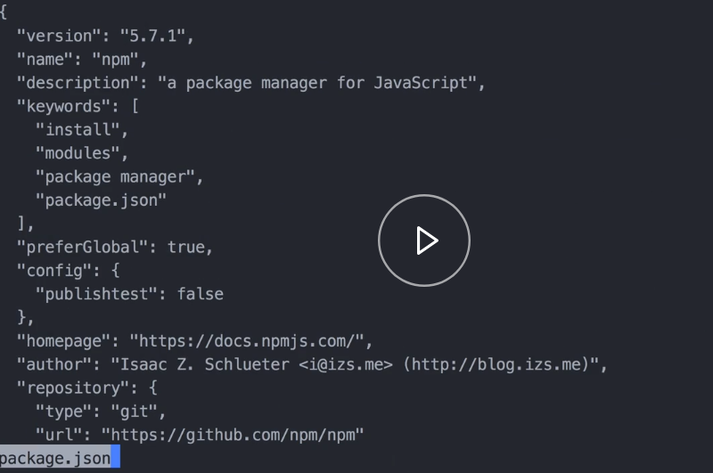
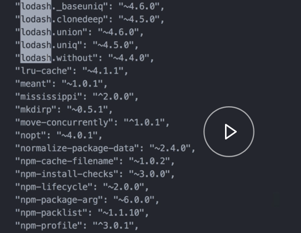
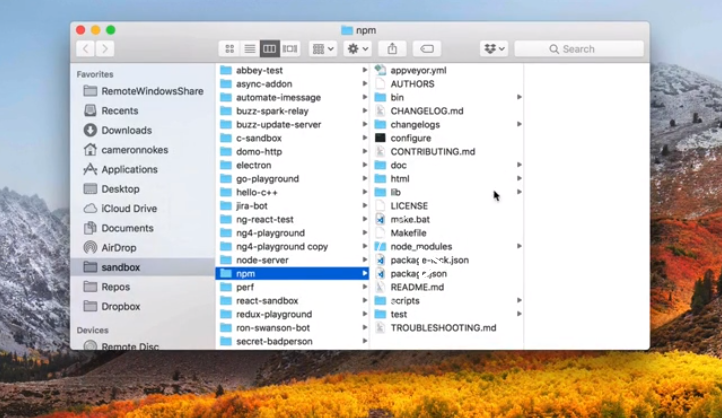
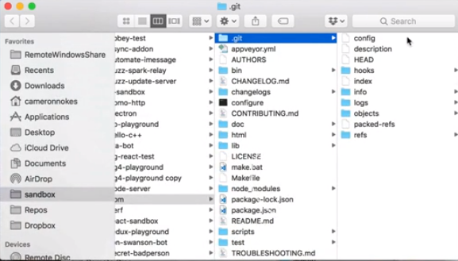
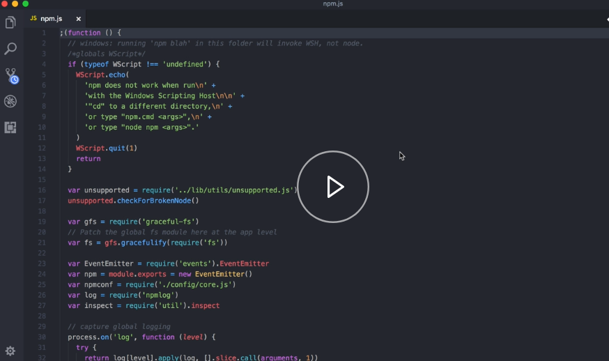

I have the npm repository pulled on my computer, and we're just going to browse through it during this lesson. 



You see there's a lot of files in here. Let's say we want to check out the `package.json` and see what's in there.

A really handy tool for that, for quick rechecking a file's contents, is called `cat`. We run cat package.json. We pass the filename, and it dumps the file contents out right onto our bash terminal here.

#### Terminal
```bash
cnokes-ml:npm cameronnokes$ cat package.json
```


We see it's a long file, we can scroll up through it and see there's a lot going on. One thing that can be useful sometimes is if you pass the `-n` parameter and the filename here again, this will show with the line numbers. Which is occasionally useful.

```bash
cnokes-ml:npm cameronnokes$ cat -n package.json
```



But we can see there's a lot. It's a big file, and if we scroll up too fast, then, we're back into our previous `cat`. It can get a little confusing to see where a file ends and begins.

A better command for browsing large files is called `less`. If we `less package.json`, we can see it changes the UI in our terminal. 



We don't see any previous commands or history from bash, that's the very top of the file. We can use our mouse and scroll through.

Less gives us some tools, while we're in it, to navigate the file. `Shift G` will jump us to the very end and `G` will take us back to the top. Another thing we can do with less is we can search in the file easily.

If you're at the top, you can do `/`. Let's say we want to see how many times lodash is used as a dependency. We enter, it jumps and highlights each of these matches. To exit it, we do `Q`, and that takes us back to our normal bash screen.

```bash
/lodash
```




Another handy tool for browsing files and folders is the `open` command. Let's say I want to view the current folder that I'm in, in the normal Finder UI. I pass a `.`, that stands for the current directory that I'm in. When you see it, that opens that folder.

```bash
cnokes-ml:npm cameronnokes$ open .
```



This is going to be especially handy for opening hidden files and folders. Like, if I do `open .git`, that shows it. You can see it's a little grayed out, because it's normally hidden folder.



You can also open a file. If I wanted to open this js file, I can run open on that. What it does is it opens the default application associated with the file extension. For me, that's Visual Studio code.

```bash
cnokes-ml:npm cameronnokes$ open lib/npm.js
```



You can also specify if you want a specific application to open it with. If I wanted to open that same file in TextEdit, for example, which is the really minimal editor, it will open that for me there, as well.

```bash
cnokes-ml:npm cameronnokes$ open lib/npm.js -a TextEdit
```

I don't do this very much, but it can be useful, for example, if you're opening a file that doesn't have an extension or has a strange extension, and there's no default application associated with it. Then you can tell it and open it in TextEdit, its pretty useful.