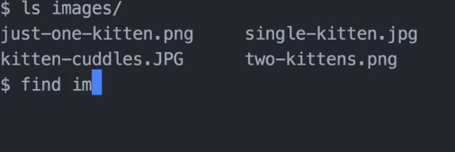

Bash may seem like a strange tool to invest time into learning. It's old, literally as old as I am, and doesn't have the sex appeal or learning that new framework that everyone's talking about. Whenever I've invested time into learning more about Bash, it's always paid off for me by increasing my productivity and enhancing my ability to contribute to my team network.

In this course, you'll learn the essentials of what every frontend developer should know about Bash. The topics we cover will give you confidence to doing things like creating billed scripts that run continuous integration servers, quickly testing and debugging an API with Corel and more.

The automation possibilities of Bash are endless. By the end of the course, you'll be able to use Bash to interact with a file system, search text patterns in files, create scripts, pipe and redirect output, and use variables and conditionals. I hope you enjoy it.