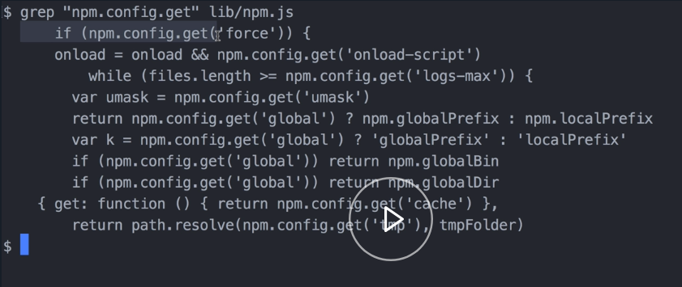
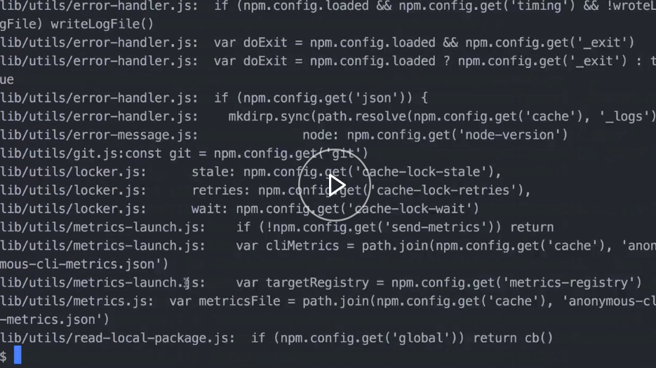
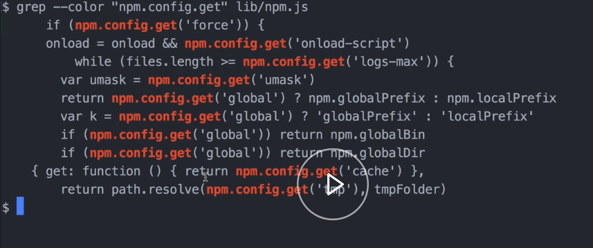
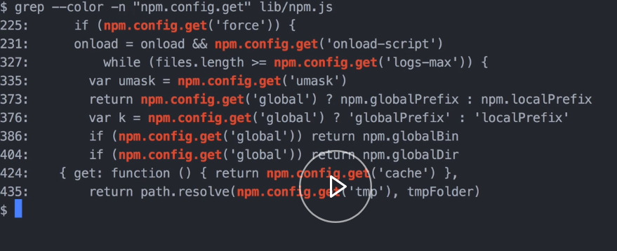
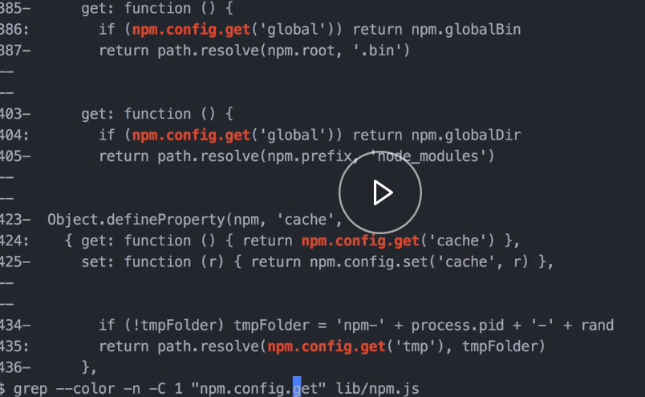
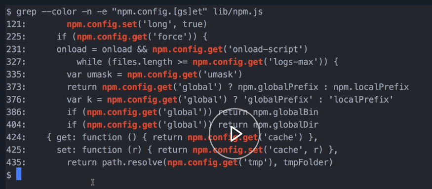

I've pulled npms repository here locally. Let's say I want to find all uses of `npm.config.get` and I just want to look for that in `lib/npm.js file`. 

#### Terminal
```bash
$ grep "npm.config.get" lib/npm.js
```



Each line is a match that was found on the file. These lines aren't necessarily next to each other in the file or anything. These might be totally different lines all over the file.

I can tell it to search multiple files as well. That was just one file. If I wanted to, say, search every JavaScript file in the `lib` parent folder, I could do that. 

```bash
$ grep "npm.config.get" lib/**/*.js
```


That will output a ton of files. The output's a little different when you're searching multiple files. You can see it has the file name here and then, there's a match. It's same file name there, and then there's the match there later.

That output is a little difficult to read. We can add more flags to `grep` to change the output and make it easier to read. Let's run this first one again.

If we add the `color` flag, that's the same thing, but it colorizes the match. 

```javasbashcript
$ grep --color "npm.config.get" lib/npm.js
```


Another useful one is the `end` flag. This will output the line number it's found on, which can be useful if you want to then go open the file in the text editor and jump right to the line. 

```bash
$ grep --color -n "npm.config.get" lib/npm.js
```



Another one that's useful is the `C` flag. This shows context around each match.

If I pass 1 to it, you can see it shows the match here and then, it shows the single line around the match. 

```bash
$ grep --color -n -C "npm.config.get" lib/npm.js
```


We can, of course, change that to whatever we want if we want more context. Also, notice in this display that it separates each matching block. 

Grep also supports regex. If we do `grep`, we will do `--color`, line numbers, and I will do `-e` for regex. Then, we'll do the same thing again.

There's a `config.get` and a `config.set` method. We'll do that. We'll use a regex to be tricky and look for both of them. We'll just search the `lib/npm.js` file. We can see that that is matching both of those methods there.

```bash
$ grep --color -n -C "npm.config.[gs]et" lib/npm.js
```


`grep` has tons of flags. Look at `man grep` to view all the options.