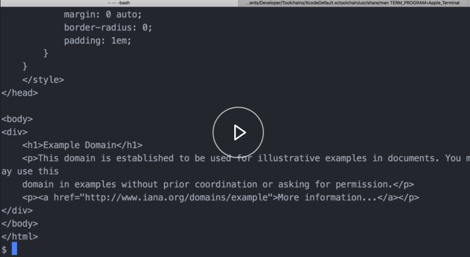
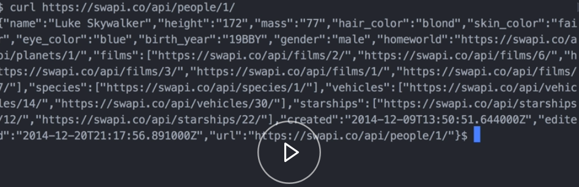
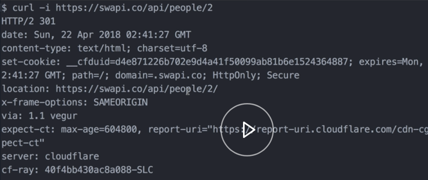
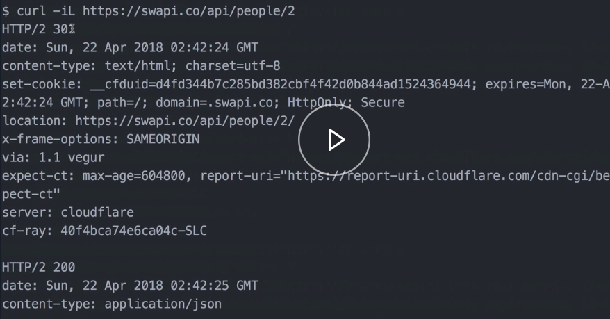
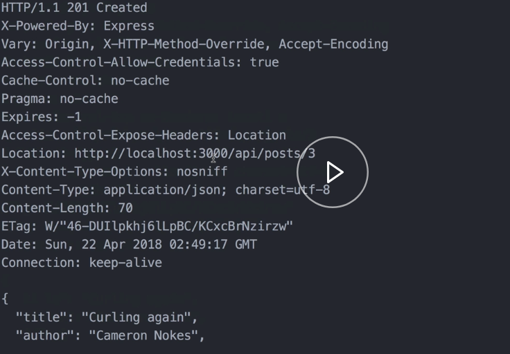
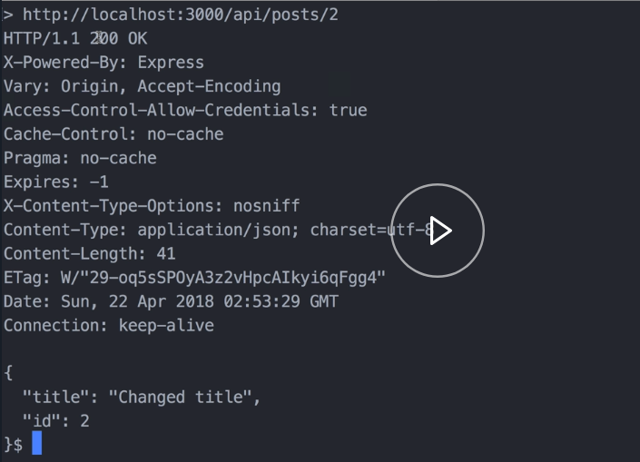
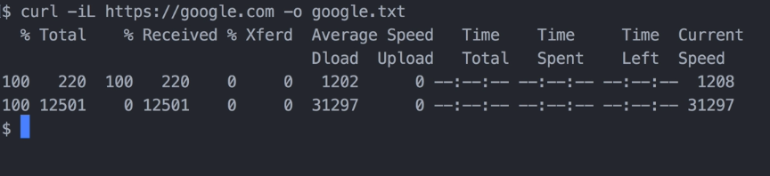
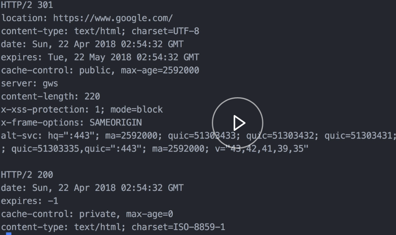
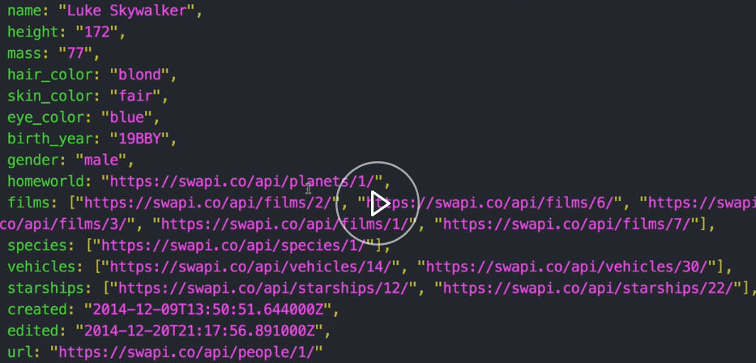

To make a get request to a website, we'll just do `curl` and then we'll pass the URL here as a parameter. 

#### Terminal
```bash
$ curl https://example.com
```


This is sort of curl's most basic form. Just by default, it does a get request and it takes the response body, which in this case is HTML, and it returns it to your standard out. Let's see what curling a JSON API might look like.

This is the Star Wars API. Let's see what that returns. 

```bash
$ curl https://swapi.co/api/people/1/
```


That just returns the JSON body right to my standard output. 

Sometimes it can be useful to inspect the headers of the response, as well. To do that, we're going to pass the `-i` flag. I stands for include, meaning include headers. Let's call the same Star Wars API. Let's try that and see what happens.

```bash
$ curl -i https://swapi.co/api/people/2
```


We were getting a 301. We can see that right there. If we look down here at the location header, it's telling us that it's trying to redirect us. 

Curl by default does not follow redirects like a browser might. If we make the same request again but we add this trailing slash `/`, it works. 

```bash
$ curl -i https://swapi.co/api/people/2/
```

We could also tell curl to follow redirects.

If we go back here, let's take off this slash so that it will redirect. If we add the capital `L` flag, that will tell it to follow redirects. 

```bash
$ curl -iL https://swapi.co/api/people/2
```


If we look at our output, we can see we get the 301 and then there's the 200 and the JSON response that we're expecting.

Let's jump into how to build more complicated HTTP requests. I have a server running locally in a separate tab here. The code for this server will be available in the description of this video. It's running locally at port 3000. 

Oftentimes, we need to pass an authorization header or a cookie to access a protected resource. We do that with the `H` flag, `H` is for header. Let's try that out.

Do `curl -H`. When doing a header flag, be sure to wrap it in quotes. Then this isn't a real API, so the token it's looking for is 123. Now, let's pass our URL, which is localhost:3000. This end point is expecting this authorization header. This will do a get request and return some fake blog post. We can see that worked.

```bash
$ curl -H "Authorization: Bearer 123" localhost:3000/api-protected/posts
```


Let's see how we change the request method of our HTTP request and see how we post JSON. We use the capital `X` flag to change the method, so we do a post. 

Then let's pass some headers. We'll do `Content-Type: application/json`. Then to pass a request body, we're going to use a lower case `d` flag. This is where we build our JSON string. I'm going to use single quotes because we need double quotes in JSON.

```bash
$ curl -X POST "Content-Type: application/json" -d
```

I'm just going to post a new blog post to my collection there. I'll give it a `title`, `author`, and then let's pass our URL. 

```html
$ curl -X POST "Content-Type: application/json" -d '{"title": "Curling", "author":"Cameron"}' http://localhost:3000/api/posts

{
    "title": "Curling",
    "author": "Cameron",
    "id": 2
}
```

Great, that worked. To verify it, we can just quickly do a get request. 

```html
$ curl http://localhost:3000/api/posts
{
    "title": "json-server",
    "author": "typicode",
    "id": 1
},
{
    "title": "Curling",
    "author": "Cameron",
    "id": 2
}

```

If they are both there, there's the new blog post.

Posting a URL in coded form is similar. `--data-urlencode`. Then we're going to pass the key. We'll do `title` and then the value here. 

Then to pass another field in the form, we do the same thing again, but we'll do `author` and then we'll pass our URL.

```bash
$ curl -i -X POST --data-urlencode title="Curling again" --data-urlencode author="Cameron Nokes" localhost:3000/api/posts
```


Great, we can see that worked because it returned a 201 HTTP status.

When you're building large curls, it can be useful visually to slit it into multiple lines. Let's do a PUT request on one of the blog posts that we just posted. 

Do `curl` and say `-i` to include the response headers. Set the method to `PUT`. To start going to another line, we just put the backslash character `\` and hit enter and it gives us another line to do stuff on.

```bash
$ curl -i -X PUT \
>
```

Let's do JSON. Do `-d` and then let's put our JSON string here. 
We'll just change the `title`. Then we want another line, we'll do a backslash `\` again and hit enter. 

```bash
$ curl -i -X PUT \
> -d '{"title": "Changed Title" }' \
>
```

Let's pass the content type header. Another line. 

```bash
$ curl -i -X PUT \
> -d '{"title": "Changed Title" }' \
> -H "Content-Type: application/json" \
```

Let's pass our URL. We'll do this on the second blog post that we created. 

```bash
$ curl -i -X PUT \
> -d '{"title": "Changed Title" }' \
> -H "Content-Type: application/json" \
> http://localhost:3000/api/posts/2
```



It looks like they work. We got a 200 back from our API.

In dealing with large output, it can be useful to dump the response in a file. We can do that with the `o` flag. 

If we do curl and I'll say include the response headers, follow redirects, and let's just do Google.com. Then we'll say `-o`, output that to a file that we'll call `google.txt`. It'll create that file on the fly.

```bash
$ curl -iL https://google.com -o google.txt
```


We don't get the normal output because it all went into that text file. Let's inspect that text file. 

```bash
$ less google.txt
```

You can see there's HTTP header information, we've got a 301 and then a 200 here. Here's the HTML response from Google.com.

When dealing with large JSON responses, it can sometimes be hard to read in just the default formatting. Like we saw earlier, if we do a `curl` against the Star Wars API, that's really hard to read. 

One thing we can do is we can pipe `|` the output of that curl into another command. I've installed a global node module called `jsome`. 

```bash
$ curl https://swapi.co/api/people/1/ | jsome
```

If we run that, it pipes the output to this Node.JS module and then formats it, it's a lot easier to read large JSON responses.


