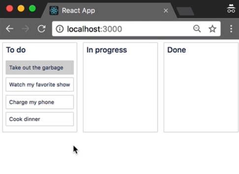

With `react-beautiful-dnd`, you have the ability to control what is able to be dragged and where it is able to be dropped. Controlling what is able to be dragged is done using the `Draggable` `isDragDisabled` prop.

#### task.jsx
```javascript
isDragDisabled={true}
```

When `isDragDisabled` is set to `true`, it will prevent a `Draggable` from being dragged.

```javascript
isDragDisabled={this.props.task.id === 'task-1'}
```

What I'm doing here is conditionally disabling the drag when the `task.id` is `'task-1'`. We can see that we are no longer able to drag the first task, but we are still able to drag other tasks.

I'm going to pull this out into a variable. I've pulled it out into a variable so that I can also apply it to our style component. I'm now using a nested ternary statement to conditionally set the `background-color` to `lightgrey` if a `Draggable` is disabled.

```javascript
const isDragDisabled = this.props.task.id === 'task-1';

<Draggable
....
isDragDisabled={isDragDisabled}
>

const Container = style.div`
....
background-color: ${props =>
props.isDragDisabled
? 'lightgrey'
: props.isDragging
? 'lightgreen'
: 'white');
}
`
```

That way, we can more easily see what things in our system are disabled.



`isDragDisabled` will prevent a `Draggable` from being dragged, but it will still be reorderable within the list.

How you populate the `isDragDisabled` prop is up to you. It could be based on some fairly complicated business logic. We'll now go to the `Column` component. There are two mechanisms available to control where a `Draggable` can be dropped.

The simplest mechanism is the `Droppable` `type` prop. You can provide an optional `type` to a `Droppable`. A `Draggable` can only be dropped into a `Droppable` that shares the same `type` as the `Droppable` that it started in.

Here I am conditionally assigning the `type` of the `Droppable` based on the `id` of the column. The third column will have a `type` of `done`, whereas the first two columns will have a `type` of `active`.

#### column.jsx
```javascript
<Droppable
type={this.props.column.id === 'column-3' ? 'done' : 'active'}>
```

This configuration will allow me to move tasks between the `To do` and `In progress` columns. I will not be able to move that task into the `Done` column. A second mechanism for controlling what can be dropped on a `Droppable` is the `Droppable` `isDisabled` prop.

```javascript
<Droppable
isDropDisabled={this.props.isDropDisbaled}
```

If `isDropDisabled` is set to `true`, then no `Draggable` will be able to drop onto it, even if it is of the same `type`. You can dynamically change this prop as much as you like, even during a drag.

I have set up our column so that it now has an `isDropDisabled` prop that is passed straight through to the `Droppable`. Using this prop, we can enforce that tasks can only move to the right of where they started.

I'm creating an `onDragStart` function to capture the `index` of the column that we start dragging from.

#### index.js
```javascript
onDragStart = start => {
  const homeIndex = this.state.columnOrder.indexOf(start.source.droppableId);
};
```

I am then recording this index in our component `state`. While I'm here, I'll make sure that I clear this index when a drag finishes.

```javascript
this.setState({
  homeIndex
});

onDragEnd = result => {
  this.setState({
    homeIndex: null
  });
};
```

I'm now going to bind our `onDragStart` function to the `DragDropContext`.

```javascript
<DragDropContext
onDragStart = {this.onDragStart}
>
```

I'm getting the `index` of the column from our `map` function.

```javascript
<Container>
    {this.state.columnOrder.map((columnId, index) => {
    const column = this.state.columns[columnId];
```

I'm now creating a variable called `isDropDisabled`.

`isDropDisabled` will be set to `true` when the `index` of our `map` function is less than the `index` of the column that we started a drag in. This will prevent dragging backwards between the columns.

```javascript
const isDragDisabled = index < this.state.homeIndex;
```

I'm now going to pass this on to the column.

```javascript
<Column
 key={column.id} 
 column={column} 
 tasks={tasks}
 isDropDisabled={isDropDisabled}
>
```

I can move a task from `To do` to `In progress`, but I'm no longer able to move a task from `In progress` to `To do`. I can only move a task from `In progress` to `Done`.
