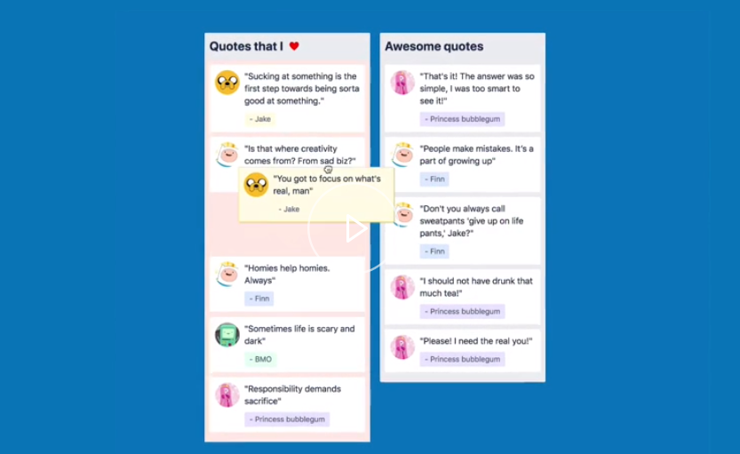
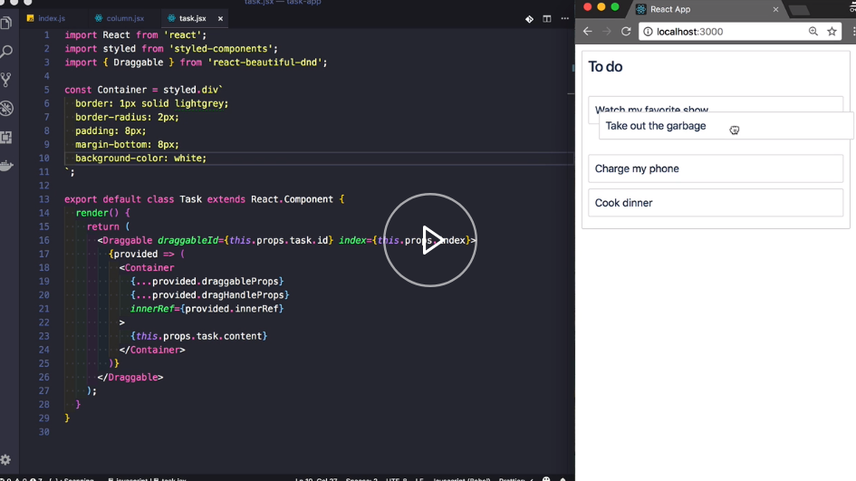

`react-beautiful-dnd` enables beautiful and accessible drag and drop experiences for lists with React. 

My name is Alex, and I'm the creator of `react-beautiful-dnd`. In this course, I will step you through creating a highly interactive task management application from scratch.

You will be introduced to the building blocks of `react-beautiful-dnd`, and you will learn how you can use these building blocks to add powerful drag and drop experiences to your own projects. The task management application we will be building will support reordering of tasks, moving tasks between columns, conditional movement, and the reorder of columns.

All of these features will work on desktop and mobile, as well as for users who want to drive the entire experience using only a keyboard and a screen reader.